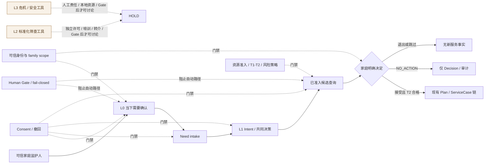

# 家庭支持需要与服务偏好确认子系统
## Assessment Governance Subsystem：架构与 Gate 草案 001

> **状态：`DRAFT_FOR_ASSESSMENT_APP_GATE_DECISION_INPUT`。**
>
> 本文不是“成长测评系统”设计，也不授予任何实现权限。它只定义一个受治理的家庭支持确认子系统：在可信家庭范围内，让监护人表达当下服务需要、确认支持偏好、查看已准入候选，并由家庭明确决定继续或 `NO_ACTION`。

## 1. 系统命名、目的与绝对边界

### 1.1 正式名称

**家庭支持需要与服务偏好确认子系统**（**Assessment Governance Subsystem**）。

“Assessment”在此仅指对**服务需要、服务偏好和共同决策条件**的受治理确认，不指儿童能力测验、家庭评分、临床/心理诊断、成长预测或人物画像。

### 1.2 第一阶段服务目的

第一阶段只回答四个问题：

1. 这个家庭此刻希望先理清什么服务需要？
2. 这个家庭愿意先看哪一类已准入支持？
3. 当前是否有安全、适格且可展示的候选？
4. 家庭是否明确选择继续，还是选择 `NO_ACTION`？

> **核心产品句：** “平台展示当前已准入候选，家庭明确决定是否继续或 `NO_ACTION`。”

### 1.3 永久禁止的产物

| 禁止产物 | 不允许的原因 |
|---|---|
| Family Total Score、家庭 Ranking、儿童成长分 | 将家庭或儿童转化为可比较、可营销、可竞争的分数。 |
| 风险等级、心理/临床结论、AI 诊断 | 把家庭表达升级为专业判断或预测。 |
| 儿童/家长画像、永久标签、公开档案 | 破坏家庭私有与可撤回边界。 |
| 跨家庭比较、推荐、聚类、排行榜 | 超出家庭数据所有权与当前授权。 |
| 标准化工具题项、算法、cutoff、常模或报告模板复制 | 未获许可，且不能绕过适龄/培训/解释/转介条件。 |
| E1 自家材料或 FollowUp 作为效果证明 | E1 只能证明来源；主观回访只是服务过程感受。 |

## 2. 系统边界图

图中的 `Need`、`Intent`、`Decision`、`NO_ACTION`、候选准入、Plan、ServiceCase 与 FollowUp 均指现有 Family 可信编排语义；本草案不新增表、对象、DTO、API 或运行时。

## 3. L0/L1 模块架构

| 模块 | 输入来源 | 允许状态上限 | Named Action / 审计上限 | Consent 与撤回 | 文本等价路径 |
|---|---|---|---|---|---|
| M1 可信入口 | 服务端 Account → ACTIVE binding → ACTIVE membership → family scope | 当前可信 actor/family/role；不保存画像 | 已有认证/上下文审计；无新动作 | 无可信上下文即拒绝 | 纯文本说明“当前无法确认家庭范围”。 |
| M2 L0 当下需要确认 | 当前监护人的可选短文本和跳过选择 | **Need**；空输入不能虚构 Need | 候选 `RequestHelp`；保持幂等与审计 | 仅在有效 SERVICE consent；撤回后停止复用 | 页面 0/1 的纯文本说明、输入、跳过、退出。 |
| M3 L0 支持偏好 | 家庭选择的支持方向，或“暂不选择” | **Intent**；不是能力/风险类别 | 候选 `ConfirmIntent`；保持幂等与审计 | 撤回/退出不生成新内容；已撤回则空投影 | 文本选项、解释、返回、退出。 |
| M4 已准入候选展示 | admitted Resource candidate 与服务端资格门 | 只读候选；不生成事实 | 候选 `Recommend` 是已有限定动作；展示本身零 Decision/Plan/Case | consent 缺失、资源降级或 T1 不合格即不显示 | 候选类型、来源/准入摘要、无候选说明均文本可读。 |
| M5 L1 共同决策 | 家庭明确选择或明确拒绝 | **Decision** 或 **NO_ACTION** | 候选 `Decide`；服务端审计/幂等 | 选择后仍可按服务过程暂停或撤回服务用途 | 明确“继续 / 暂不行动 / 返回”的文字路径。 |
| M6 声明式服务衔接 | 已接受且 T2 合格的家庭决定 | 仅沿既有链产生 **Plan / ServiceCase** | 既有编排动作、审计与 outbox | consent 撤回后不复用上下文 | 无法执行时显示安全停止，不给替代承诺。 |
| M7 主观回看 | 家庭自愿表达的服务感受 | **FollowUp** 主观过程事实 | 候选 `SubmitFollowUp`；保持幂等 | 撤回后 Context Reuse 默认空投影 | “是否有帮助”文本表达；不显示成长分/结果。 |

### 3.1 Need / Intent 与事实、诊断、效果结论的严格区分

| 表达类别 | Family 可以保存的含义 | Family 不得推导的含义 |
|---|---|---|
| Need | “监护人表示此刻想先理清亲子沟通。” | “孩子沟通能力不足”或“家庭存在沟通风险”。 |
| Intent | “家庭希望先查看亲子沟通方向的支持。” | “系统判断沟通是最重要问题”。 |
| Decision | “家庭选择继续某个已准入候选。” | “该服务已经交付、有效或适合所有家庭”。 |
| NO_ACTION | “家庭现在选择暂不行动。” | “家庭不需要支持”或“系统完成评估”。 |
| FollowUp | “家庭主观感到这一步有/无帮助。” | “孩子成长结果改善”“工具有效”“证据升级”。 |

## 4. Consent、撤回与数据可见性

| 控制点 | L0/L1 必须行为 | 禁止行为 |
|---|---|---|
| 开始前说明 | 解释为什么问、不会怎么用、如何退出/撤回 | 默认勾选、捆绑同意或模糊收集目的。 |
| SERVICE consent | 以既有有效 SERVICE consent 作为服务过程门禁 | 用营销、训练、研究或第三方同意替代。 |
| 跳过/退出 | 允许不填写、返回、结束；不影响基础访问 | 以完成为条件换权益、商品、会员或服务资格。 |
| 撤回 | 已撤回后 Context Reuse 默认返回空投影；后续自动流程停止 | 删除审计历史、继续把内容用于推荐/训练/营销。 |
| 数据最小化 | 只记录本次服务需要、偏好、决定的最小事实 | 上传儿童音视频、学校资料、通讯录、定位、第三方信息。 |
| 可见性 | 严格 family scope；服务端派生 actor/subject/family | 前端提交/伪造 family、actor、child 范围。 |

## 5. 风险路由与 Human Gate

L0/L1 不负责判断高风险，也不负责处置风险。它的责任是识别哪些请求**不能进入自动服务路径**，并安全停止。

| 触发类别 | 示例（只作边界说明） | 系统自动路径 | Human Gate / 继续条件 |
|---|---|---|---|
| 诊断/临床/心理结论请求 | 要求判断疾病、心理状态、能力缺陷 | 不诊断、不计分、不推荐专业结论 | 只有经另行授权的专业责任与工具 Gate 才可讨论。 |
| 危机/安全 | 需要即时安全处置、家庭暴力、儿童安全疑虑等 | L0/L1 停止；不收集更多敏感细节、不自动外发 | L3 独立 Gate；需人类责任、本地资源、私密协议。 |
| 真人服务/转介 | 要求顾问、班主任、治疗师、线下机构介入 | 不派单、不预约、不承诺时限 | 服务提供者、授权、组织访问、支付/服务交付均独立 Gate。 |
| 外部资源/第三方数据 | 学校报告、医疗资料、外部链接、他人隐私 | 不上传、不抓取、不共享 | 独立 Consent、数据协议、来源准入与 Human Gate。 |
| 儿童直接作答 | 儿童回答感受、行为或任务 | L0/L1 不向孩子直接采集 | 儿童参与与同意机制另立 Gate。 |
| 未知自由文本边界 | 无法安全判定的内容 | 安全停止或仅提示家庭自行选择退出/另行寻求适当支持 | 不调用模型、不作推断；人工路径未获授权即不建立。 |

## 6. Fail-Closed 规则与负例验收

| 编号 | 负例 | 必须结果 |
|---|---|---|
| AGS-01 | 无 Account、binding、membership 或有效 family scope | 不显示 L0/L1 内容；零 Need/Intent/Decision 写入。 |
| AGS-02 | account disabled 或 family context ambiguous | 明确拒绝；不得默认选择身份或家庭。 |
| AGS-03 | SERVICE consent 缺失/已撤回 | 不创建/复用 Need、Intent、候选、Plan、Case 或 FollowUp；Context Reuse 为空。 |
| AGS-04 | 空文本直接继续 | 允许跳过或退出，但不得虚构 Need。 |
| AGS-05 | 选择 `NO_ACTION` | 仅显式 NO_ACTION Decision；零 Intent、Plan、ServiceCase、任务、提醒。 |
| AGS-06 | 未准入/风险降级/版权不清/无 executor 的资源 | 不显示或不可选择；不得兜底展示。 |
| AGS-07 | 候选展示但家庭未明确决定 | 零 Decision、Plan、ServiceCase。 |
| AGS-08 | 将 Need/Intent/FollowUp 显示成分数、诊断、风险、画像、成长结论 | 设计/静态审查失败；不得进入候选发布面。 |
| AGS-09 | 同幂等键重复或不同内容冲突 | 重放零重复；冲突显式拒绝。 |
| AGS-10 | 诊断、危机、真人、外部、第三方或儿童直接作答请求 | Human Gate 或安全停止；零自动处理、零外发、零模型调用。 |
| AGS-11 | 图片/动效/多模态/模型不可用 | 纯文本路径仍能完成 L0/L1 或安全退出。 |
| AGS-12 | 尝试跨家庭比较、公开分享、会员/支付/广告再利用 | fail-closed；数据仅限当前家庭服务目的。 |

## 7. L2/L3 HOLD 注册表

| HOLD 模块 | 允许本阶段做什么 | 不允许做什么 | 未来独立 Gate 的最低前提 |
|---|---|---|---|
| L2 标准化发展、社会情绪、家长压力或亲子互动工具 | 登记工具名称、用途、权利人、适用人群、证据与待核验条件 | 复制题项、计分、cutoff、常模、电子表单、报告、AI 解释或自动转介 | 正版/数字化/翻译授权、适龄适用性、培训/解释资格、隐私、撤回、转介网络、Human Gate、独立 App Gate。 |
| L3 危机/安全工具 | 登记本地资源与责任模型尚缺失 | 普通产品题目、风险分、自动报警、自动外发、危机承诺 | 人类责任主体、本地资源协议、升级时限、法律/隐私审查、最小数据、人工演练、独立 App Gate。 |

## 8. 最小可行 L0/L1 任务契约：待裁决问题

1. 是否确认子系统正式命名为“家庭支持需要与服务偏好确认子系统 / Assessment Governance Subsystem”，并禁止“成长测评/诊断/评分”命名？
2. 是否只授权 L0/L1 进入下一轮**任务契约设计**，且只复用既有 Need、Intent、admitted candidates、Decision/NO_ACTION、Plan/Case/FollowUp 语义？
3. 是否确认第一实现候选不新增儿童直接作答、标准化量表、分数、雷达图、AI、真人服务、外部资源、支付、会员、分享或排行榜？
4. 是否确认每页必须有跳过、返回、退出或 NO_ACTION，且退出不影响基础支持？
5. 是否确认 L0/L1 高风险、危机、诊断、第三方、真人、外部资源等输入只允许 Human Gate / fail-closed？
6. 是否确认候选展示只能使用“当前已准入候选，由家庭决定是否继续”，禁止“最佳方案”“精准推荐”“效果承诺”？
7. 是否确认在没有独立实现 Gate 前，不得修改页面、DTO/API、数据库、Web/App/小程序 runtime，也不得启动真实 DB/E2E 或浏览器体验验证？
8. 是否确认 L2/L3 继续 HOLD，逐工具执行 Intake Governance Matrix，而不因研究、PPT 或 E1 材料自动放行？

## 9. 参考与依赖

[1] `governance/FAMILY_ASSESSMENT_APP_GATE_DECISION_PACKET_002.md`。
[2] `governance/FAMILY_ASSESSMENT_TOOL_INTAKE_GOVERNANCE_MATRIX_DRAFT_001.md`。
[3] `architecture/FAMILY_L0_CURRENT_NEED_SERVICE_PREFERENCE_UX_GATE_DRAFT_001.md`。
[4] `architecture/FAMILY_LAYERED_FAMILY_SUPPORT_ASSESSMENT_GATE_INPUT_001.md`。
[5] `governance/PR36_P0_RUNTIME_TRUST_DETAILED_EVIDENCE_INDEX_001.md`。

---

**作者：Manus AI**
**日期：2026-08-16（GMT+8）
