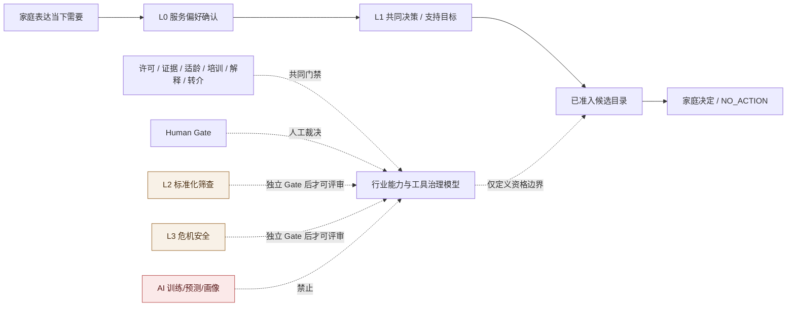
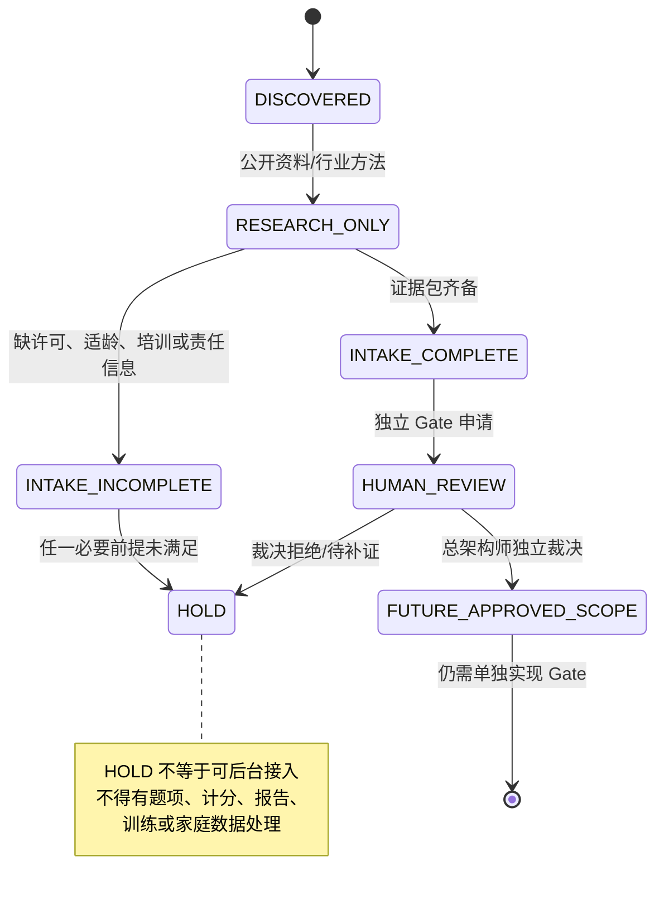

# 家庭成长支持行业能力与工具治理模型
## Family Growth Support Industry Capability & Tool Governance Model（草案 001）

> **状态：`DRAFT_FOR_ARCHITECTURE_AND_GATE_DECISION_INPUT`。**
>
> 本模型是一个静态、可审计的行业知识与治理框架，用来回答“某一领域能力或第三方工具在什么条件下才可能进入 Family”。它不是 AI 行业模型、预测模型、成长评分模型、训练语料库、家庭画像或生产运行时。

## 1. 三类“模型”的明确区分

| 模型类型 | 定义 | 当前状态 |
|---|---|---|
| **行业能力与工具治理模型** | 将学科领域、服务能力、工具、证据、适用范围、许可、培训、解释、转介、风险和 Gate 静态登记为可审阅的知识图谱/目录。 | **可做架构草案**。 |
| **家庭私有服务过程模型** | 当前家庭表达的 Need、Intent、Decision、NO_ACTION、Plan/Case、FollowUp 等服务事实。 | 已有可信底座；只能受 family scope 和 Named Action 管理。 |
| **AI/训练/预测行业模型** | 使用真实或衍生家庭数据进行训练、打分、预测、推荐、标签或画像的模型。 | **HOLD**；不得建立、训练、外呼或自学习。 |

> 行业模型只回答“某种能力或工具是否具备未来准入条件”；它永远不回答“这个孩子怎样”“这个家庭风险多高”“哪种方案最好”。

## 2. 北极星：从家庭表达走向受治理服务选择

## 3. 行业能力域

下表不是儿童/家庭分类法，而是 Family 需要管理的**服务能力域**。任何域都不能自动导出分数、诊断或服务资格。

| 能力域 | 服务要回答的问题 | L0/L1 可做的最小能力 | L2/L3 或未来专业能力 | 当前禁止产物 |
|---|---|---|---|---|
| 家庭需要与服务规划 | 家庭此刻希望获得什么支持？ | 需要表达、偏好确认、共同目标、NO_ACTION | FANS/CANS 等专业需要/优势工具的合规准入评审 | 家庭问题分、支持需求排名。 |
| 亲子沟通与关系支持 | 家庭是否希望先看沟通支持？ | 选择支持方向、查看已准入候选、家庭决定 | 受训观察工具、真人协作、专业咨询 | 沟通能力分、父母/孩子标签。 |
| 日常节奏与养育支持 | 家庭希望调整哪些日常安排？ | 主观优先事项、可暂停下一步 | 有证据的家庭服务方案、专业指导 | 家庭执行力分、连续打卡排名。 |
| 学习与发展支持 | 家庭是否希望进一步了解学习/发展支持路径？ | 说明偏好与边界、展示已准入内容 | ASQ/SWYC 等筛查工具，须独立许可/解释/转介 Gate | 发展年龄、能力预测、儿童成长分。 |
| 社会情绪与行为支持 | 家庭是否希望了解适当的支持方向？ | 仅说明需要与选择，不判断状态 | ASQ:SE-2、SDQ、PSC 等 L2 工具与专业解释 | 心理结论、风险等级、行为标签。 |
| 家长压力与家庭福祉 | 家庭是否想讨论养育压力和支持偏好？ | 可表达希望获得支持，不做量表 | PSI/PSS 等 L2 工具、专业解释和安全路由 | 家长胜任力评级、家庭质量分。 |
| 亲子互动观察 | 是否需要受训人员观察互动并提供反馈？ | 仅解释目前没有自动观察服务 | NCAST-PCI/PICCOLO、培训、督导、服务协议 | 自拍/视频 AI 评分、互动标签。 |
| 安全与危机 | 是否出现普通服务流程不能处理的安全议题？ | 安全停止、说明平台不自动处理 | L3 危机责任体系、本地资源、SOP、人工值守 | 自动诊断、自动报警、自动转介。 |

## 4. 静态工具治理对象模型

行业模型不记录家庭数据。它只登记候选能力和工具的准入信息。

| 静态对象 | 最小字段（概念性） | 允许用途 | 禁止用途 |
|---|---|---|---|
| **CapabilityDomain** | 名称、服务问题、L0/L1/L2/L3 定位、禁止产物 | 说明服务边界和能力空缺 | 将家庭归类到某能力域。 |
| **ToolMethodProfile** | 工具/方法名称、权利人、版本、工具类别、原始用途 | 工具 Intake 与审计 | 复制题项、算法、cutoff、常模、报告模板。 |
| **EvidenceProfile** | 公开来源、适用人群、局限、证据状态、E1/外部来源区分 | 判断“是否值得审查” | 用 E1 或主观回访证明效果。 |
| **LicenseProfile** | 纸质/电子/翻译/计分/报告/存储许可状态、到期与地域 | 判断是否可进入独立审查 | 假定公开可见即免费可用。 |
| **ProfessionalRequirement** | 培训、认证、解释责任、督导、争议处理 | 判断 Human Gate 与责任链 | 将专业责任替换为 AI 或普通客服。 |
| **ReferralReadiness** | 本地资源、服务范围、交接协议、随访责任 | 判断 L2/L3 是否具备服务闭环 | 自动外发家庭数据或假装已有转介。 |
| **RiskRoute** | 触发类型、自动停止规则、人工路径、缺失前提 | fail-closed 设计 | 自动风险分或公开预警。 |
| **GateRecord** | App/Data/Human/Legal/Architecture Gate、裁决、证据包、有效期 | 审计准入状态 | 用一个历史通过替代新的版本审查。 |

## 5. 准入状态机

## 6. L0/L1、L2、L3 的行业模型使用边界

| 层级 | 行业模型在该层能做什么 | 不能做什么 |
|---|---|---|
| L0 | 提供服务领域词汇、禁止文案、需要确认方式和可展示的已准入资源边界。 | 选择“最佳方案”、判断问题、把家庭归类或打分。 |
| L1 | 提供共同决策的解释框架、目标确认边界、家庭暂停/退出条件。 | 用“行业最佳实践”覆盖家庭自身偏好。 |
| L2 | 登记标准化工具的未来 Intake 条件、证据和权利/责任缺口。 | 工具接入、题项呈现、计分、报告或解释。 |
| L3 | 登记危机安全体系的最低责任与资源要求。 | 自助危机筛查、自动报警/外发/转介。 |

## 7. 最小治理能力包

### 7.1 首阶段（可作为架构/设计候选）

| 能力 | 最小交付 | 证明材料 |
|---|---|---|
| 术语与文案治理 | “支持需要确认/服务偏好确认”词表；禁用“测评/成长分/最佳方案”等高风险文案。 | UX/Gate 草案、文本等价审查。 |
| 工具 Intake 治理 | 工具目录、授权状态、适龄、培训、解释、转介、退出字段。 | Assessment Tool Intake Governance Matrix。 |
| 证据分级 | E1 自家材料与外部工具证据/许可严格分开。 | Evidence Profile 与审计规则。 |
| 候选资源治理 | admitted candidate 只读展示；家庭明确 Decision 或 NO_ACTION。 | PR36 Runtime Trust 证据、资源准入 Gate。 |
| 安全停止 | 前提缺失/高风险/第三方/真人/外部请求触发 Human Gate 或 fail-closed。 | 负例矩阵与风险路由设计。 |

### 7.2 未来专业能力（独立 HOLD）

| 能力 | 必须先具备的条件 |
|---|---|
| 标准化筛查接入 | 正版/数字化/翻译权、适龄、本地化、培训、解释责任、转介网络、privacy/DPIA、独立 App Gate。 |
| 专业互动观察 | 受训观察者、督导、许可、观察协议、服务责任、儿童和监护人隐私边界、独立 Gate。 |
| 危机安全路径 | 法律/伦理审查、人工责任人、本地资源、紧急升级 SOP、误报/漏报管理、演练证据、独立 Gate。 |
| AI/智能辅助 | 外部模型、训练、数据处理、解释责任、测试和 Model Gateway 的独立授权；当前全部 HOLD。 |

## 8. 未来数据与模型 Gate

即使行业模型只登记静态信息，以下事项仍必须单独裁决：

| Gate | 必问问题 |
|---|---|
| 工具许可 Gate | 权利人是否书面允许指定版本、语言、数字化/小程序、计分、报告、存储与地域用途？ |
| 专业责任 Gate | 谁完成培训、解释结果、处理异议、对转介/危机负责？ |
| 数据 Gate | 是否最小化、家族范围、撤回、保留、导出、加密、审计和第三方限制均已满足？ |
| 安全 Gate | 前提缺失、误用、版本到期、资源不可用、误报/漏报如何 fail-closed？ |
| App Gate | 页面、文本等价、用户旅程、API/DB 影响、真实 DB/E2E 负例、退出条件是否明确？ |
| AI/模型 Gate | 是否存在模型外呼、训练、自学习、预测、评分或画像？存在即需要新的总架构师授权。 |

## 9. 最终不变量

1. **行业知识目录不等于家庭数据模型。** 目录中不出现真实家庭、儿童或家长的个人状态。
2. **工具存在不等于工具可用。** 许可、适龄、培训、解释、转介、隐私与 Human Gate 缺一不可。
3. **家庭表达不等于专业事实。** Need/Intent/Decision 只记录家庭服务选择。
4. **主观回访不等于教育效果。** 它不能提升为工具证据、模型标签或商业结论。
5. **静态模型不等于 AI 模型。** 不训练、不预测、不画像、不跨家庭推荐。
6. **条件列齐不等于自动解冻。** 每个 L2/L3 工具及任何 AI/数据能力都需要独立 Gate 和总架构师裁决。

## 10. 待裁决问题

1. 是否接受“行业能力与工具治理模型”作为 Family 的静态架构资产，并明确禁止将其解释为 AI 行业模型？
2. 是否确认 L0/L1 仅使用该模型的服务边界、文案、候选资格和 Human Gate 信息，不建立分数、画像或自动方案选择？
3. 是否确认 L2/L3 持续以 `RESEARCH_ONLY` / `HOLD` 状态登记，任何工具均不得因列入目录而接入？
4. 是否要求为每个未来工具建立标准 Intake、证据包、版本有效期、退出计划和 Human Gate 签字页？
5. 是否确认真实家庭数据、外部模型、训练/自学习、预测和跨家庭推荐继续 HOLD，需另行架构授权？

## 参考与依赖

[1] `governance/FAMILY_ASSESSMENT_TOOL_INTAKE_GOVERNANCE_MATRIX_DRAFT_001.md`。
[2] `architecture/FAMILY_ASSESSMENT_GOVERNANCE_SUBSYSTEM_GATE_DRAFT_001.md`。
[3] `governance/FAMILY_ASSESSMENT_APP_GATE_DECISION_PACKET_002.md`。
[4] American Academy of Pediatrics, *Shared Decision Making*，https://www.aap.org/en/practice-management/providing-patient--and-family-centered-care/shared-decision-making/ 。
[5] Minnesota Department of Health, *Family Home Visiting Screening and Assessment Recommendations*，https://www.health.state.mn.us/communities/fhv/screening.html 。

---

**作者：Manus AI**
**日期：2026-08-16（GMT+8）
