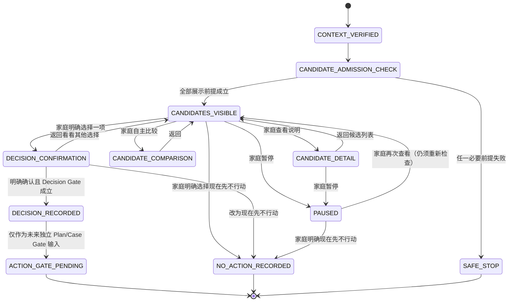

# L1「共同决策与已准入候选」UX / Gate 草案
## Shared Decision & Admitted Candidates（草案 001）

> **状态：`DRAFT_FOR_APP_GATE_DECISION_INPUT`。**
>
> 本文是 L1 家庭共同决策的体验、文案与治理草案。它不授权业务代码、Gateway、模型调用、API、DTO、数据库、App/Web/小程序运行时、真实 DB/E2E、试点、生产、外部模型、训练或商业化。

## 1. 目的、范围与核心承诺

L1 是“家庭表达过 Need/Intent 后，查看已经通过当前准入检查的候选，并由家庭自行决定是否选择、返回、暂停或 `NO_ACTION`”的受治理流程。它不是测评、推荐、自动服务编排或交易流程。

> **核心产品句：** “以下是当前可安全展示的候选。平台不对它们排序；是否继续、返回、暂停或现在先不行动，由你的家庭决定。”

| L1 可做 | L1 不可做 |
|---|---|
| 展示服务端已准入、资格完整、可在当前家庭范围显示的候选。 | 展示未准入、资格不完整、风险路由不清、版权/许可不清或 executor 缺失的候选。 |
| 用中性、等量、文本等价方式说明候选来源、类型、当前准入边界和可选动作。 | 评价候选效果、教育价值、适配度、专业正确性，或把 E1 材料作为效果证据。 |
| 让家庭查看、比较、明确选择、返回、暂停或 `NO_ACTION`。 | 按最佳/最适合排序；强迫选择；替家庭生成 Decision。 |
| 在家庭明确选择时，形成**候选 Decision**。 | 因候选展示或点击查看而创建 Decision、Plan、ServiceCase、任务、预约、支付或外发。 |
| 明确说明 Decision 与后续 Action 的差别。 | 把 Decision 表述为服务已开始、已经有效、已经交付或必须继续。 |

## 2. L1 在整体流程中的位置

### 2.1 状态解释

| 状态 | 含义 | 最大允许写入 | 明确禁止 |
|---|---|---|---|
| `CONTEXT_VERIFIED` | 服务端已确认 Account → ACTIVE binding → ACTIVE membership → role → family scope，且不存在歧义。 | 无。 | 前端自行传入或切换 family/actor/subject。 |
| `CANDIDATE_ADMISSION_CHECK` | 服务端对当前可展示候选进行门禁检查。 | 无。 | 用客户端缓存、历史推荐或模型推断替代准入检查。 |
| `CANDIDATES_VISIBLE` | 只读显示 admitted candidates。 | 无。 | 候选曝光即生成 Decision 或任何服务事实。 |
| `CANDIDATE_DETAIL` / `CANDIDATE_COMPARISON` | 家庭查看一项或多项候选的等量说明。 | 无。 | 排名、星级、效果比较、稀缺提示、付费引导。 |
| `DECISION_CONFIRMATION` | 家庭准备确认“选择这个下一步”。 | 无。 | 自动确认、自动 Plan/Case 或自动执行。 |
| `DECISION_RECORDED` | 家庭以明确动作确认一项候选，且 Decide 的已有可信服务端门禁全部成立。 | **Decision**。 | 直接等同于 Plan、ServiceCase、预约、真人服务或结果。 |
| `PAUSED` | 家庭暂时离开当前浏览/比较；不构成服务停止结论。 | 无。 | 以暂停为拒绝、失败、家庭不配合或生成标签。 |
| `NO_ACTION_RECORDED` | 家庭明确选择现在先不行动。 | **NO_ACTION**。 | Intent、Plan、ServiceCase、任务、提醒、营销或惩罚性标签。 |
| `SAFE_STOP` | 当前无法安全展示或继续。 | 无；仅最小审计。 | 兜底给出未准入候选、外部链接、真人预约或专业建议。 |
| `ACTION_GATE_PENDING` | Decision 已存在，但未来是否进入 Plan/Case 仍需独立 Action Gate。 | 无新增写入。 | 自动执行任何后续服务。 |

## 3. 交互步骤、输入输出与状态上限

| 步骤 | 页面/交互目的 | 允许输入 | 输出给家庭 | 允许领域状态上限 | 允许动作 | 明确禁止 |
|---|---|---|---|---|---|---|
| L1-0 | 进入前说明与上下文确认 | 已有可信家庭上下文、有效 SERVICE consent、既有 Need/Intent（可为空但不得虚构）。 | 为什么展示候选、不会如何使用、可返回/退出/撤回说明。 | 无。 | 返回；退出。 | 收集儿童直接回答、外部资料、完整对话或敏感补充。 |
| L1-1 | 候选展示 | 服务端仅提供当前 `ADMITTED` 且资格完整的候选摘要。 | 无排序候选卡或“当前不可提供”安全停止。 | **只读 admitted candidates**。 | 查看说明；返回；暂停；现在先不行动；退出。 | 曝光写 Decision/Plan/Case；展示未准入候选。 |
| L1-2 | 查看候选说明 | 单一候选的名称、类型、来源/准入摘要、适用边界、可选动作。 | “为什么能展示”“从哪里来”“它不证明什么”。 | **只读 admitted candidates**。 | 返回候选列表；暂停；现在先不行动；退出。 | 效果承诺、最适合、专业结论、稀缺/付费催促。 |
| L1-3 | 家庭比较 | 家庭自主打开的多个候选说明；所有可比字段按同一顺序、同一粒度展示。 | 并列、等量的候选信息；不显示默认推荐或排序。 | **只读 admitted candidates**。 | 查看说明；返回；暂停；现在先不行动；退出。 | 打分、星级、算法排序、跨家庭口碑、预测效果。 |
| L1-4 | 明确选择确认 | 家庭主动选择的一项候选；重新读取该候选资格、T2、executor、consent、风险路由与审计前提。 | Decision 解释与“并非 Action”提示；可改选/返回/NO_ACTION。 | 无，直到明确确认通过。 | 确认选择；返回看看其他选择；现在先不行动；退出。 | 自动确认；先写 Plan/Case 后补检查。 |
| L1-5 | 候选 Decision 记录 | 明确确认、当前 `Decide` Named Action 前提及幂等要求全部满足。 | “已记录本次选择；是否进入后续服务仍须满足独立条件。” | **Decision**。 | 查看 Decision；暂停；按未来独立 Gate 继续。 | 声称服务已开始/有效；自动创建 Plan/Case。 |
| L1-6 | 暂停 | 家庭主动点击暂停或离开比较。 | “你可以之后再看；当前没有新增服务过程。” | 无。 | 返回；退出。 | 自动 NO_ACTION、自动提醒、行为评价。 |
| L1-7 | 明确 NO_ACTION | 家庭主动选择“现在先不行动”，必要说明确认。 | 中性确认、重新进入入口的说明、零服务过程承诺。 | **NO_ACTION**。 | 返回；退出。 | 创建 Intent/Plan/Case、任务、跟进、营销或负面标签。 |
| L1-8 | 安全停止 | 任一展示或确认门禁失败。 | 固定中性停止说明；返回/NO_ACTION/退出。 | 无。 | 返回；现在先不行动；退出。 | 让家庭补充敏感信息、给出替代推荐或外部资源。 |

## 4. admitted candidates 准入检查清单

候选被呈现给家庭之前，必须同时满足**全部**清单项。任何一项未知、缺失、过期、矛盾或无法验证，候选即不可展示/不可选择；不得以“先给家庭看看”作为例外。

| 检查域 | 必须为真 | 不满足时的 fail-closed 结果 |
|---|---|---|
| 家庭可信范围 | Account、ACTIVE binding、ACTIVE membership、角色、family scope 全部有效且唯一。 | 不进入 L1；显示“当前无法确认可用家庭服务上下文”。 |
| SERVICE consent | 当前服务用途 consent 有效、未撤回；无歧义的最小化可见性。 | 不复用 Need/Intent/候选，不展示个性化内容。 |
| Resource admission | 候选资源/服务/实践当前处于已准入状态，版本有效，不在降级/撤销/暂停状态。 | 候选不可见且不可选；不显示缓存或历史快照。 |
| 证据与来源 | 来源、版权/授权、证据等级、适用边界与风险标记可被当前准入规则解释。E1 仅可说明来源/版权，不得作为效果证明。 | 候选不可见；不以“内部经验”补足。 |
| T2 / PRACTICE | 若候选涉及实践或后续服务，满足已定义的 T2/PRACTICE 前提。 | 可在既有定义允许的范围内保持只读，或整体不可见；绝不进入可执行选择。 |
| executor | 后续执行责任、可用性和边界完整；无 executor 时不得形成可执行选择。 | 显示“当前还不能继续”或不展示；零 Plan/Case。 |
| 风险路由 | 风险标记已存在明确路由；未路由、未知或属于 L2/L3/Human Gate 的请求不得自动进入。 | 安全停止；零专业解释、零自动转介。 |
| 工具治理 | 非标准化工具、专业工具、生物特征、ADT 等必须已被独立准入；当前 ADT 与所有 L2/L3 工具均为 HOLD。 | 不展示、不收集、不解释、不要求补充资料。 |
| 版本一致性 | CandidateAdmission、CopyPolicy、Consent、资格与风险策略版本一致且可审计。 | 停止展示；不使用过期缓存。 |
| 文本等价 | 候选的关键说明、状态与所有操作都能以完整文本展示。 | 不显示依赖图像/色彩/动效才可理解的候选。 |

## 5. fail-closed 分支与固定安全文案

L1 不负责判断危机或专业问题；它只决定当前自动流程不能继续。停止时不索取更多敏感信息、不声称判断风险、不自动外发、不承诺真人支持。

| 触发情况 | 展示行为 | 固定中性文案 | 状态上限 |
|---|---|---|---|
| 无已准入候选 | 不显示伪候选。 | “现在没有可安全展示的支持选择。你可以返回修改需要，或现在先不继续。” | 无或 NO_ACTION。 |
| 候选未准入、过期、撤销或版权/证据状态不完整 | 不显示该候选。 | “这个选择当前无法安全展示。你可以返回查看其他已准入选择，或现在先不继续。” | 只读其他合格候选或无。 |
| T2/PRACTICE/executor 缺失 | 不允许进入选择确认。 | “这个选择当前还不能继续。你可以返回查看其他已准入选择，或现在先不继续。” | 只读 admitted candidates。 |
| consent 缺失/撤回 | 不展示家庭特定候选。 | “当前服务同意不可用，因此不会继续使用相关服务信息。你可以退出，或在适当条件具备后再次确认。” | 无。 |
| 家庭 context 不可信或歧义 | 不显示候选或先前家庭信息。 | “当前无法确认可用的家庭服务上下文，因此不会继续。你可以退出后稍后再试。” | 无。 |
| 危机、安全、诊断、专业工具、儿童直接作答 | 不进入 L1 解释/选择路径。 | “当前无法在这个流程中继续。你可以停止本次确认，并在适当渠道寻求支持。” | 无；`Human Gate`。 |
| ADT/指纹/图像/生物特征请求 | 不收集、不展示、不解释。 | “当前无法处理或展示该工具。” | 无；`Human Gate`。 |
| 第三方外发、真人服务、组织访问 | 不外发、不预约、不共享。 | “当前流程不会向第三方发送信息、安排真人服务或共享家庭内容。你可以返回或退出。” | 无；`Human Gate`。 |
| 输入、政策或候选版本不一致 | 不显示可能过期的信息。 | “当前信息版本不完整，因此不会继续展示说明。你可以返回或退出。” | 无。 |
| 文本等价不可用 | 不依赖视觉或音频降级。 | “当前无法提供完整的文字说明，因此不会继续。你可以返回或退出。” | 无。 |

## 6. L1 文案规范

### 6.1 必须解释的五件事

| 文案主题 | 可使用表达 | 设计目的 |
|---|---|---|
| 为什么展示 | “以下内容已通过当前服务范围的准入检查。是否继续由你的家庭决定。” | 告知显示依据，不暗示效果或推荐。 |
| 候选从哪里来 | “这些是当前在此服务范围内可以展示的已准入资源、服务或实践候选。页面只显示其来源、类型和当前边界。” | 说明候选由服务端准入，不来自模型猜测或广告。 |
| 如何比较 | “你可以逐项查看候选的说明、来源和适用边界。平台不对候选排序，也不替你的家庭作选择。” | 提供可比较信息，避免默认推荐。 |
| 可返回/暂停/NO_ACTION | “你可以返回看看其他选择、先暂停，或选择现在先不行动。上述选择不会给家庭打分。” | 建立无惩罚退出路径。 |
| 如何撤回 | “选择前可随时返回或退出；如已保存服务用途记录，可在家庭数据与同意设置中撤回服务用途，系统将停止复用相关上下文。” | 说明撤回对象和后果，不承诺删除审计事实。 |

### 6.2 页面级微文案

#### 页面 L1-0：进入说明

| 元素 | 文案 |
|---|---|
| 标题 | **查看当前可选的支持方式** |
| 主文案 | “这里展示的是当前可以安全提供说明的候选。平台不会判断哪一个最好，也不会替你的家庭作选择。” |
| 为什么展示 | “为了让家庭自主查看与此前确认的服务需要和偏好有关的、已准入的候选。” |
| 不会怎么用 | “不会把浏览、比较或暂停变成家庭评分、成长结论、公开画像或商业推送。” |
| 如何撤回 | “你可以随时返回或退出；如已保存服务用途记录，可在家庭数据与同意设置中撤回服务用途。” |
| 按钮 | `查看候选` / `现在先不行动` / `返回` / `退出` |

#### 页面 L1-1：候选列表

| 元素 | 文案 |
|---|---|
| 标题 | **当前可以查看的候选** |
| 主文案 | “以下候选均按相同方式展示。它们不是排序结果，也不代表效果承诺。” |
| 卡片固定字段 | `名称`、`类型`、`来源与当前准入说明`、`适用边界`、`查看说明`。 |
| 候选说明 | “当前可展示”只表示已通过当前准入检查；不表示对每个家庭都相同，也不表示一定产生结果。 |
| 按钮 | 每项 `查看说明`；页面级 `返回` / `先暂停` / `现在先不行动` / `退出`。 |

#### 页面 L1-2：候选详情与比较

| 元素 | 文案 |
|---|---|
| 标题 | **查看这个候选的说明** |
| 来源说明 | “该候选的来源与当前准入边界如下。此说明不构成效果证明或专业结论。” |
| 比较说明 | “你可以返回后查看其他候选的相同字段。平台不会把它们排出先后。” |
| 选择前提示 | “如果你考虑选择这个下一步，请先查看‘选择意味着什么’。是否确认由你的家庭决定。” |
| 按钮 | `查看选择说明` / `返回候选列表` / `先暂停` / `现在先不行动` / `退出`。 |

#### 页面 L1-3：选择确认

| 元素 | 文案 |
|---|---|
| 标题 | **这一步由你的家庭决定** |
| 主文案 | “选择这个下一步只表示你的家庭希望保留本次候选 Decision。它不代表服务已开始、已经完成或一定有效。” |
| 条件提示 | “是否可以进入后续 Plan 或服务过程，还需另行满足实践、执行责任、服务同意、风险路由和审计条件。” |
| 不会怎么用 | “不会自动扣费、预约真人、发送外部信息、创建公开档案或生成成长结论。” |
| 撤回说明 | “确认前可以返回看其他选择；确认后可按服务流程暂停，或撤回服务用途。” |
| 按钮 | `确认选择这个下一步` / `返回看看其他选择` / `现在先不行动` / `退出`。 |

#### 页面 L1-4：Decision、暂停与 NO_ACTION

| 状态 | 文案 |
|---|---|
| Decision 已记录 | “已记录你们家庭本次选择。它只是一个候选 Decision；后续是否进入服务过程仍需满足独立条件。” |
| 暂停 | “你们暂时停止查看候选。当前没有新增计划或服务过程；以后可以重新查看。” |
| NO_ACTION | “你们选择了现在先不行动。此选择不会创建计划、服务过程、任务或提醒，也不表示家庭没有需要。” |
| 无候选/安全停止 | “当前没有可安全提供的下一步。平台不会用未经确认的内容、服务或自动判断来替代。” |

### 6.3 禁止话术与受控替代表达

| 禁止话术/语义 | 合规替代表达 |
|---|---|
| 最佳、最适合、最优、精准推荐、系统建议你 | “展示当前已准入候选，由你的家庭决定是否继续。” |
| 必须做、错过机会、限时名额、马上开始 | “你可以查看说明、返回、暂停或现在先不行动。” |
| 家庭目标完成率、成长进度、达标、改善率 | “本次服务过程说明；不代表成长结论或效果。” |
| 保证效果、帮助孩子改善、已证明有效 | “候选说明不构成效果承诺；E1 材料仅说明来源/版权边界。” |
| 专业诊断、风险提示、能力不足、家庭类型 | “当前流程只确认支持需要与服务偏好，不提供诊断或标签。” |
| 其他家庭都在选、同龄家庭排名、口碑第一 | “平台不进行跨家庭比较或排序。” |
| 开会员解锁、购买后继续、积分奖励、分享得权益 | “当前确认流程不包含付费、会员、积分、分享或推广引导。” |

## 7. Decision 与后续 Action 的明确分界

| 问题 | Decision | 后续 Action / Plan / ServiceCase |
|---|---|---|
| 谁作出 | 家庭通过明确的可信 Named Action 作出。 | 仅在未来独立 Gate、既有编排条件及服务端动作均满足时才可能发生。 |
| 表示什么 | “家庭希望保留这一候选作为下一步。” | “系统在明确权限和资格下创建了后续服务过程事实。” |
| 最多写入什么 | `Decision` 或 `NO_ACTION`。 | `Plan`、`ServiceCase` 或既有后续服务事实。 |
| 能否自动发生 | 不能；浏览、比较、停留、模型文本均不构成 Decision。 | 不能；Decision 也不自动触发 Action。 |
| 必要前提 | 可信家庭范围、有效 consent、已准入候选、家庭明确确认、`Decide` 动作与审计/幂等前提。 | 另行确认 T2/PRACTICE、executor、有效 consent、风险路由、审计、后续 Named Action 与独立 Gate。 |
| 当前授权状态 | 仅为 L1 Gate 草案，未授权实现。 | HOLD；不得因本文形成、执行或测试。 |

> **不变量：** `Decision ≠ Action`；`Decision ≠ Plan`；`Decision ≠ ServiceCase`；`NO_ACTION → 0 Plan / 0 ServiceCase / 0 Task / 0 Reminder`。

## 8. 负例验收清单

| 编号 | 负例 | 必须结果 |
|---|---|---|
| L1-NEG-01 | 无可信 Account、ACTIVE binding、ACTIVE membership、角色或 family scope。 | 不进入 L1；零候选、零 Decision、零 NO_ACTION。 |
| L1-NEG-02 | context ambiguous、账户 disabled 或 family chain 不唯一。 | fail-closed；不得默认选择家庭或成员。 |
| L1-NEG-03 | SERVICE consent 缺失、无效或已撤回。 | 不展示/不复用家庭特定候选；零 Decision/Plan/Case。 |
| L1-NEG-04 | admitted candidates 为空。 | 只显示无候选停止状态；不得幻觉资源、外部链接或真人服务。 |
| L1-NEG-05 | 候选未准入、过期、降级、版权/证据不清。 | 候选不可见/不可选；不得用历史缓存或 E1 效果表述替代。 |
| L1-NEG-06 | T2/PRACTICE 不合格或 executor 缺失。 | 不得进入可执行选择；零 Plan/Case。 |
| L1-NEG-07 | 风险路由未知、涉及危机/诊断/L2/L3/儿童直接作答。 | 安全停止/Human Gate；零收集、零解释、零自动转介。 |
| L1-NEG-08 | 家庭只浏览、比较或查看详情，未明确确认。 | 零 Decision、零 Plan、零 ServiceCase。 |
| L1-NEG-09 | 页面存在默认选中、候选排序、星级、默认推荐或“最适合”。 | 设计验收失败；该页面不得进入候选实现。 |
| L1-NEG-10 | 家庭选择“现在先不行动”。 | 只可写 NO_ACTION；零 Intent、Plan、Case、Task、Reminder、营销触达。 |
| L1-NEG-11 | 候选说明中出现效果承诺、成长结论、诊断、分数、标签、跨家庭比较。 | 文案/策略验收失败；候选不展示。 |
| L1-NEG-12 | 尝试自动创建 Plan/Case、预约真人、支付、会员/权益或第三方外发。 | fail-closed；仅保留 Decision 上限或无写入。 |
| L1-NEG-13 | 同一幂等键重复提交，或同键不同候选/NO_ACTION 冲突。 | 重放零重复；冲突明确拒绝；审计可追溯。 |
| L1-NEG-14 | 图片、色彩、动效或模型不可用。 | 完整文本路径仍可查看、返回、暂停、NO_ACTION 或安全退出。 |
| L1-NEG-15 | 已确认 Decision 后，条件变化（consent 撤回、候选降级、executor 缺失、风险路由变化）。 | 不自动进入 Action；后续 Action Gate 重新检查并 fail-closed。 |
| L1-NEG-16 | 试图把浏览/暂停/NO_ACTION 用作模型训练、画像、商业推荐或跨家庭统计。 | 拒绝；仅保留必要服务/审计边界，不作其他用途。 |

## 9. 独立 App Gate 必问问题

1. 是否确认 L1 的范围仅为 **admitted candidates 的展示、比较、家庭明确选择、返回、暂停与 NO_ACTION**，不含推荐、排序、支付、Enrollment/Delivery、真人服务或自动 Action？
2. 是否确认每个候选都必须在**展示前**通过家庭范围、SERVICE consent、资源准入、证据/版权、T2/PRACTICE、executor、风险路由、版本一致性和文本等价检查？
3. 是否确认候选卡采用等量字段、无默认排序、无默认选中、无星级/热度/稀缺/商业提示，且“当前可展示”绝不等同于效果证明？
4. 是否确认 `Decision` 只是家庭明确表达的候选选择，任何 `Plan`/`ServiceCase` 仍须经过 T2/PRACTICE、executor、consent、风险路由、审计和独立后续 Gate？
5. 是否确认 `NO_ACTION` 必须是尊重性的显式选择，且严格满足 `0 Plan / 0 ServiceCase / 0 Task / 0 Reminder`？
6. 是否确认无候选、资格缺失、consent 撤回、context 歧义、风险路由不清、L2/L3、ADT/生物特征、儿童直接作答、第三方外发全部 fail-closed，不索取更多敏感信息？
7. 是否确认页面在 App-first 体验下仍须支持纯文本、屏幕阅读器、低带宽和无模型路径；图像/动效仅可作补充，不能承载关键决策信息？
8. 是否确认当前草案未授权代码、DTO/API/数据库、Web/App/小程序 runtime、真实 DB/E2E、模型/Gateway、试点、生产、商业化、外发或训练？
9. 若未来批准实现，是否要求提交独立任务契约：页面范围、复用的既有 Named Actions、DTO/API/迁移影响、真实 DB/E2E 验证矩阵、幂等策略、日志/审计字段、退出条件与持续 HOLD 项？

## 10. 最终不变量

1. L1 的核心是**家庭共同决策**，而不是平台推荐或自动服务。
2. 所有候选必须是当前已准入、可解释、可审计、资格完整的输入；任何不确定即 fail-closed。
3. 比较是家庭自主查看相同字段，不是系统排序、预测或效果判断。
4. `Decision` 只表示家庭明确选择；它不是 Action，也不自动创建 Plan 或 ServiceCase。
5. `NO_ACTION` 是同等受尊重的明确结果，永远不触发 Plan、Case、任务、提醒、营销或标签。
6. L1 必须在无模型、无图片、无动效、无多模态能力时仍可完整运行或安全退出。
7. 本文仅是 Gate 裁决输入；所有运行时、数据、模型和商业化相关 HOLD 继续有效。

## 参考与依赖

[1] `architecture/FAMILY_ASSESSMENT_GOVERNANCE_SUBSYSTEM_GATE_DRAFT_001.md`。
[2] `architecture/FAMILY_L0_CURRENT_NEED_SERVICE_PREFERENCE_UX_GATE_DRAFT_001.md`。
[3] `architecture/FAMILY_L0_NEED_PREFERENCE_UX_COPY_GOVERNANCE_DRAFT_001.md`。
[4] `architecture/FAMILY_SUPPORT_ASSISTANT_AI_MODEL_GATE_ASSET_INDEX_001.md`。
[5] `governance/FAMILY_ASSESSMENT_APP_GATE_DECISION_PACKET_002.md`。
[6] `governance/AUTHORIZATION_REGISTRY.yaml`。

---

**作者：Manus AI**
**日期：2026-08-17（GMT+8）
