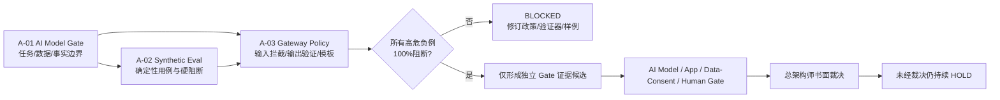

# 家庭支持对话与服务编排助手
## AI Model Gate 三份资产索引摘要
### Asset Index（草案 001）

> **状态：`DRAFT_FOR_AI_MODEL_GATE_DECISION_INPUT`。**
>
> 总架构师已接受本索引所列三份文件作为后续 Gate 的**架构/策略输入草案**。该接受不构成 Gateway 实现、模型调用、运行时接入、真实数据处理、训练、App/Web 改动、试点或生产授权。

## 1. 索引目的

本索引把 A「家庭支持对话与服务编排助手」当前三份互相约束的草案放在同一治理视图中：第一份定义**助手能做什么、绝不能做什么**；第二份定义**如何用纯合成样例证明它不会越权**；第三份定义**未来 Gateway 必须如何在输入前和输出后阻断越权行为**。

三份文件共同服务于 L0/L1 的“解释与自主选择”边界。它们不创建新的产品能力，不修改 Family V3 事实链，也不替代任何独立 Gate。

## 2. 三份资产清单

| 编号 | 资产 | 文件路径 | 当前状态 | 已接受范围 | 在组合中的作用 |
|---|---|---|---|---|---|
| A-01 | AI Model Gate 草案 | `architecture/FAMILY_SUPPORT_CONVERSATION_ORCHESTRATION_ASSISTANT_AI_MODEL_GATE_DRAFT_001.md` | `DRAFT_FOR_AI_MODEL_GATE_DECISION_INPUT` | 架构/策略草案 | 约束任务、输入/输出、事实隔离、数据边界、Human Gate 与未来证据包。 |
| A-02 | Synthetic Eval & Negative Test Suites | `architecture/FAMILY_SUPPORT_ASSISTANT_SYNTHETIC_EVAL_NEGATIVE_TEST_SUITES_DRAFT_001.md` | `DRAFT_FOR_AI_MODEL_GATE_DECISION_INPUT` | 架构/策略草案 | 用正例、负例、确定性 Judge 和 100% 硬阈值验证不越权与 fail-closed。 |
| A-03 | Gateway Interception & Refusal Policy | `architecture/FAMILY_SUPPORT_ASSISTANT_GATEWAY_INTERCEPTION_AND_REFUSAL_POLICY_DRAFT_001.md` | `DRAFT_FOR_AI_MODEL_GATE_DECISION_INPUT` | 架构/策略草案 | 定义未来单一入口的输入前拦截、输出后验证、固定模板、最小审计与阻断闭环。 |

## 3. 共同状态

三份资产均已被总架构师接受为**未来 AI Model Gate 的裁决输入**，但仅停留在文档、架构和策略设计层。它们共同确认 A 助手的候选定位是：在服务端已经确认的 L0 Need、L1 Intent 和 admitted candidates 之上，生成中性、可退出、文本等价的解释草稿；它不拥有家庭事实链写入权，也不替家庭决定。

| 共同状态 | 明确含义 |
|---|---|
| `DRAFT_FOR_AI_MODEL_GATE_DECISION_INPUT` | 可被用于审查、追溯、评测设计和后续 Gate 输入；不是运行时能力授权。 |
| `DESIGN_ONLY` | 可继续完善政策、合成样例、拒绝模板和审计字段；不得实现 Gateway 或接入模型。 |
| `SYNTHETIC_ONLY` | 评测只可使用人工或程序构造的合成样例；不使用或改写真实家庭、儿童、家长、对话或服务过程数据。 |
| `DENY_BY_DEFAULT` | 未来 Gateway 的默认行为为拒绝；只有白名单输入、有效 consent、可信家庭上下文和已准入候选同时满足时，未来才可能生成受控解释草稿。 |
| `NO_RUNTIME_AUTHORIZATION` | 当前没有模型、Gateway、App/Web/小程序、API、DTO、数据库、试点或生产运行时授权。 |

## 4. 共同禁止项

以下禁止项对三份资产同时生效。任何一项均不得通过“草案已被接受”“评测平均分较高”或“用户感觉有帮助”而绕过。

| 禁止类别 | 共同禁止事项 |
|---|---|
| 模型与运行时 | 不实现 Gateway；不调用任何模型；不接入运行时；不启用外部模型外呼；不接入 App/Web/小程序。 |
| 数据与训练 | 不处理真实家庭/儿童/监护人数据；不采集或回放真实对话；不训练、微调、蒸馏、自学习、长期记忆或跨家庭学习。 |
| 事实链与行动 | 不写入、不自动生成或声称已写入 Need、Intent、Decision、NO_ACTION、Plan、ServiceCase、FollowUp、资源准入或审计事实；不自动执行服务。 |
| 决策与推荐 | 不进行最佳/最适合推荐、候选排序、强制选择、效果预测、成长结论或跨家庭比较。 |
| 评分与专业结论 | 不生成分数、等级、雷达图、风险判断、诊断、画像、长期标签；不解释 L2/L3 专业工具。 |
| 高敏感输入 | 不收集或处理 ADT、指纹、图像、面部/声纹或其他生物特征；不处理儿童直接作答、危机细节或未准入工具内容。 |
| 外发与商业化 | 不向第三方外发家庭内容；不联系真人顾问、不预约/转介；不涉及支付、会员、权益、营销、推广或商业诱导。 |
| 资源与证据 | 不展示未准入、资格不完整、过期或 executor 缺失的资源；不把 E1 自家材料、案例或主观回访作为效果证据。 |

## 5. 三份资产的联动关系

| 资产 | 对另外两份的输入 | 不能替代的事项 |
|---|---|---|
| A-01 AI Model Gate | 限定 Eval 的允许输入输出与 Gateway 的最小职责。 | 不能证明实现正确、模型安全或数据合规。 |
| A-02 Synthetic Eval | 为 Gateway 策略提供高危负例和确定性阻断阈值。 | 不能替代 Gateway 独立验证，也不等同于真实家庭试验。 |
| A-03 Gateway Policy | 将 A-01 的边界和 A-02 的负例转化为未来输入/输出控制与固定模板。 | 不能替代模型选择、Data/Consent、App、Human 或总架构师 Gate。 |

## 6. 解锁前置条件

下表是**未来申请受限运行时 Gate 之前**至少需要完成的前置证据。列齐仅表示可以进入审查，不表示自动解锁任何 HOLD。

| 前置条件 | 最低证据要求 | 仍不可推断为 |
|---|---|---|
| 合成 Eval 全通过 | 全部高危负例 100% 被拦截；无未处置失败；正例、边界例、consent 撤回、文本等价均可回放。 | 模型可上线或可接触真实家庭。 |
| Gateway 独立验证 | 单一入口、默认关闭、输入白名单、输出验证、固定模板、审计、紧急关闭和仅合成回放能力均被独立证明。 | 已授权实现 Gateway 或外部模型调用。 |
| 模型任务闭合 | 确认任务仅限 L0/L1 解释；输入/输出/状态上限、供应商/版本、故障策略与退出机制完整。 | 已批准任意模型/供应商。 |
| 数据与 Consent 闭合 | 目的限制、最小化、撤回、保留/删除、访问控制、零训练与零真实数据评测边界形成证据。 | 可采集真实对话或家庭资料。 |
| App 体验闭合 | 页面文案、文本等价、NO_ACTION、停止模板、家庭自主决定和真实 DB/E2E 负例方案完成独立审查。 | 可上线 App/Web 或启动试点。 |
| 人工责任闭合 | 具名责任人、版本审批、高风险停止、投诉/误用、紧急关闭和 L2/L3 专业责任 SOP 完整。 | 已提供人工服务、自动转介或危机处置。 |
| 总架构师书面裁决 | 明确列出本次许可范围、排除项、退出条件和持续 HOLD 项。 | 对其他能力的一般性授权。 |

## 7. 仍需的独立 Gate

| 独立 Gate | 必问问题 | 不可由三份草案代替的裁决 |
|---|---|---|
| AI Model Gate | 使用哪个模型/提供者/版本？任务与输入输出是否闭合？是否默认关闭、可关闭、可审计？ | 是否可进行任何受限模型调用。 |
| Assessment App Gate | 哪些 L0/L1 页面、文案、文本路径和退出动作可出现？是否仍由家庭明确决定？ | 是否可改 App/Web 体验或进行真实 DB/E2E 验证。 |
| Data/Consent Gate | 为何处理、最少处理什么、如何撤回、保留多久、谁可访问、如何证明零训练？ | 是否能处理真实家庭数据或上下文。 |
| Human Gate | 谁具名负责版本、停止、投诉、误用、专业边界与紧急关闭？ | 是否可处置高风险、专业工具、儿童输入或真人服务。 |
| Tool Intake / Professional Gate | L2/L3 工具是否具备版权/许可、适龄、培训、解释、转介和危机 SOP？ | 是否可引入、解释或数字化任何专业/标准化工具。 |
| Security & Runtime Gate | 身份链、家庭范围、最小权限、日志、密钥、供应商控制和故障关闭是否完整？ | 是否能部署 Gateway、模型或运行时。 |
| 总架构师裁决 | 是否明确批准某一有限范围？其他 HOLD 是否仍保留？ | 任何 Gate 的最终授权或 HOLD 解冻。 |

## 8. 给后续 L1 的边界提示

L1「Shared Decision & Admitted Candidates」应独立于 A 助手而存在。即使未来助手未获授权、Gateway 保持关闭，L1 仍必须提供完整的确定性文本路径：候选展示、无排序比较、家庭明确选择/返回/暂停/NO_ACTION、候选准入 fail-closed，以及 Decision 与后续 Action 的清晰分界。

> 因此，**A 助手是未来可选解释层；L1 是不依赖模型的家庭自主决策流程。**

## 9. 最终不变量

1. 三份草案是相互约束的 Gate 输入，不是实现任务单。
2. 任何模型输出只能是受控解释草稿，绝不拥有 Family V3 核心事实或行动权限。
3. 高危负例任一漏过即为 `BLOCKED`，不得通过平均分、人工印象或业务压力抵消。
4. 真实家庭数据、训练、外呼、运行时、试点、生产和商业化均保持 HOLD，直至所有独立 Gate 与总架构师书面裁决完成。
5. L1 的基础家庭决策体验必须可在无模型条件下成立，并服从 admitted candidates 与家庭自主决定边界。

## 参考与依赖

[1] `architecture/FAMILY_SUPPORT_CONVERSATION_ORCHESTRATION_ASSISTANT_AI_MODEL_GATE_DRAFT_001.md`。
[2] `architecture/FAMILY_SUPPORT_ASSISTANT_SYNTHETIC_EVAL_NEGATIVE_TEST_SUITES_DRAFT_001.md`。
[3] `architecture/FAMILY_SUPPORT_ASSISTANT_GATEWAY_INTERCEPTION_AND_REFUSAL_POLICY_DRAFT_001.md`。
[4] `architecture/FAMILY_ASSESSMENT_GOVERNANCE_SUBSYSTEM_GATE_DRAFT_001.md`。
[5] `architecture/FAMILY_L0_NEED_PREFERENCE_UX_COPY_GOVERNANCE_DRAFT_001.md`。

---

**作者：Manus AI**
**日期：2026-08-17（GMT+8）
