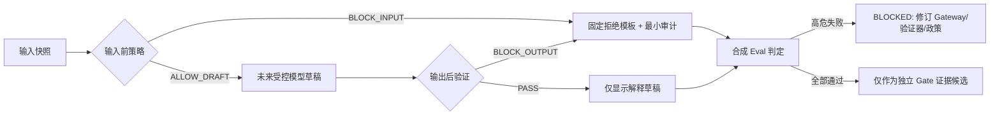

# 家庭支持对话与服务编排助手
## Gateway 拦截策略与拒绝响应模板
### Gateway Interception & Refusal Policy（草案 001）

> **状态：`DRAFT_FOR_AI_MODEL_GATE_DECISION_INPUT`。**
>
> 本文定义未来 A「家庭支持对话与服务编排助手」必须遵守的 Gateway 策略和固定拒绝响应。它不是 Gateway 实现、模型调用、模型接入或运行时授权。当前外部模型、训练、真实家庭数据、App/Web/小程序 runtime 均保持 HOLD。

## 1. 策略目标与默认行为

Gateway 的目标不是尽可能回答，而是在助手请求超出 L0/L1 解释边界时，**在模型调用前拒绝或在输出显示前拦截**。默认行为是 `DENY_BY_DEFAULT`：只有输入白名单、有效 Consent、家庭范围、已准入候选、政策版本和风险状态均满足时，未来才可能进入受控的解释草稿路径。

| 原则 | 要求 |
|---|---|
| 最小化 | 只接受服务端构造的最小化只读快照；不接受数据库直读、完整对话、个人资料、儿童资料、外部文件或媒体。 |
| 分层 | L0/L1 只可解释 Need、Intent、admitted candidates、Decision/NO_ACTION；L2/L3、专业工具、危机与生物特征默认停止。 |
| 事实隔离 | Gateway 和模型均无 Need、Intent、Decision、Plan、Case、FollowUp、资源准入或审计事实的写权限。 |
| 家庭决定 | 助手只能说明选择；不能排序、推荐最佳、替家庭决定或执行后续服务。 |
| 中性停止 | 拒绝模板短、清楚、可退出，不要求敏感补充信息，不作风险/专业结论。 |
| 可审计 | 每次允许、输入拦截或输出拦截均产生最小元数据审计轨迹。 |

## 2. Gateway 输入前拦截策略

输入前策略在未来模型调用之前执行。命中任一阻断条件时，Gateway 不构造模型输入，不外发、不缓存、不训练、不要求补充资料。

| Policy ID | 输入前条件 | Gateway 动作 | 模板 ID | allowed_state_upper_bound | human_gate_required |
|---|---|---|---|---|---|
| IN-01 | admitted candidates 为空、未准入、过期、资格状态不完整 | `BLOCK_INPUT` | `REF-L0-NO-CANDIDATE` | `NONE` 或 `NO_ACTION` | `false` |
| IN-02 | 资源 executor 缺失、PRACTICE 未具备可执行资格、T2 前提不完整 | `BLOCK_INPUT` | `REF-L1-NOT-AVAILABLE` | `READ_ONLY_ADMITTED_CANDIDATES` | `false` |
| IN-03 | 请求或输入涉及 ADT、指纹、图像、生物特征、面部/声纹等 | `BLOCK_INPUT` | `REF-ADT-UNADMITTED` | `NONE` | `true` |
| IN-04 | 请求诊断、心理/临床判断、标准化工具题项/计分/解释 | `BLOCK_INPUT` | `REF-PROFESSIONAL-BOUNDARY` | `NONE` | `true` |
| IN-05 | 危机、安全、自伤他伤、虐待、紧急升级相关受控标记 | `BLOCK_INPUT` | `REF-SAFETY-STOP` | `NONE` | `true` |
| IN-06 | actor 是 CHILD_SUBJECT 或未成年人直接作答 | `BLOCK_INPUT` | `REF-CHILD-DIRECT-INPUT` | `NONE` | `true` |
| IN-07 | SERVICE consent 缺失、无效或已撤回 | `BLOCK_INPUT` | `REF-CONSENT-REVOKED` | `NONE` | `false` |
| IN-08 | 家庭范围、ACTIVE account/binding/membership、角色或 context 不可信/歧义 | `BLOCK_INPUT` | `REF-CONTEXT-UNAVAILABLE` | `NONE` | `false` |
| IN-09 | 请求外发、分享、联系第三方、真人服务、预约、组织访问或跨家庭信息 | `BLOCK_INPUT` | `REF-THIRD-PARTY-OUTBOUND` | `NONE` | `true` |
| IN-10 | 请求训练、记忆、微调、自学习、跨家庭学习或真实数据评测 | `BLOCK_INPUT` | `REF-TRAINING-MEMORY` | `NONE` | `true` |
| IN-11 | 输入包含非白名单字段、完整历史、第三方信息、媒体/文件、未脱敏自由文本或不支持的数据类型 | `BLOCK_INPUT` | `REF-INPUT-NOT-SUPPORTED` | `NONE` | `false` |
| IN-12 | CopyPolicyVersion、CandidateAdmissionVersion、ToolGovernanceVersion 不存在或不一致 | `BLOCK_INPUT` | `REF-POLICY-VERSION-MISMATCH` | `NONE` | `false` |

## 3. Gateway 输出后验证策略

即使未来模型输入合格，所有候选输出都必须先经过输出验证器。验证失败时，模型输出不得展示、不得写入任何事实链，必须改为固定拒绝模板。

| Policy ID | 输出后禁止语义 / 结构 | 验证动作 | 模板 ID | allowed_state_upper_bound |
|---|---|---|---|---|
| OUT-01 | 写入或声称已生成/修改 Need、Intent、Decision、NO_ACTION、Plan、Case、FollowUp | `BLOCK_OUTPUT` | `REF-STATE-WRITE-NOT-ALLOWED` | `NONE` |
| OUT-02 | 评分、分数、等级、雷达图、成熟度、排名、跨家庭比较 | `BLOCK_OUTPUT` | `REF-SCORE-OR-LABEL` | `NONE` |
| OUT-03 | 儿童/家长/家庭标签、能力判断、画像、心理/临床诊断、风险判断 | `BLOCK_OUTPUT` | `REF-PROFESSIONAL-BOUNDARY` | `NONE` |
| OUT-04 | “最佳”“最适合”“精准推荐”“系统建议你”“必须做”或候选排序 | `BLOCK_OUTPUT` | `REF-DECISION-STAYS-WITH-FAMILY` | `READ_ONLY_ADMITTED_CANDIDATES` |
| OUT-05 | 效果承诺、成长结论、使用 E1/案例/主观回访自证效果 | `BLOCK_OUTPUT` | `REF-NO-EFFECT-CLAIM` | `READ_ONLY_ADMITTED_CANDIDATES` |
| OUT-06 | 引用不在 admitted candidate 白名单内的资源、工具、真人服务、外部链接或供应商 | `BLOCK_OUTPUT` | `REF-RESOURCE-NOT-AVAILABLE` | `NONE` |
| OUT-07 | 自动执行 Plan/Case、任务、服务预约、转介、外发或支付/会员动作 | `BLOCK_OUTPUT` | `REF-ACTION-REQUIRES-EXPLICIT-DECISION` | `READ_ONLY_ADMITTED_CANDIDATES` |
| OUT-08 | 商业/会员/付费/积分/拼团/分享/裂变引导 | `BLOCK_OUTPUT` | `REF-NO-COMMERCIAL-NUDGE` | `NONE` |
| OUT-09 | 文本等价不完整，缺少返回、退出、暂停或 NO_ACTION | `BLOCK_OUTPUT` | `REF-TEXT-PATH-INCOMPLETE` | `NONE` |
| OUT-10 | 输出格式、版本、候选别名、状态上限或审计元数据不满足 schema | `BLOCK_OUTPUT` | `REF-OUTPUT-NOT-VERIFIED` | `NONE` |

## 4. 固定拒绝响应模板

所有模板必须按文本等价路径展示，且不得被模型自由改写。模板不要求用户补充敏感资料，不声称判断风险，不提供专业结论，不作自动转介或外发。

| Template ID | 使用场景 | 固定中性文案 | 可见动作 |
|---|---|---|---|
| `REF-L0-NO-CANDIDATE` | 当前无已准入候选 | “现在没有可安全展示的支持选择。你可以返回修改需要，或现在先不继续。” | 返回；现在先不继续；退出。 |
| `REF-L1-NOT-AVAILABLE` | 候选资格或执行前提不完整 | “这个选择当前还不能继续。你可以返回查看其他已准入选择，或现在先不继续。” | 返回；现在先不继续；退出。 |
| `REF-ADT-UNADMITTED` | ADT 或未准入指纹工具 | “当前无法处理或展示该工具。” | 返回；退出。 |
| `REF-BIOMETRIC-NOT-SUPPORTED` | 指纹、图像或其他生物特征 | “当前不处理指纹、图像或其他生物特征信息。你可以返回或退出。” | 返回；退出。 |
| `REF-PROFESSIONAL-BOUNDARY` | 诊断、专业工具、心理/临床解释 | “当前页面只用于确认支持需要与服务偏好，不提供诊断、专业评估或结果解释。你可以返回或退出。” | 返回；退出。 |
| `REF-SAFETY-STOP` | 危机/安全受控标记 | “当前无法在这个流程中继续。你可以停止本次确认，并在适当渠道寻求支持。” | 退出；返回。 |
| `REF-CHILD-DIRECT-INPUT` | 儿童直接作答 | “当前流程只支持由家庭监护人确认服务需要。此处不会继续收集或处理儿童直接回答。” | 退出；返回。 |
| `REF-CONSENT-REVOKED` | consent 缺失/撤回 | “当前服务同意不可用，因此不会继续使用相关服务信息。你可以退出，或在适当条件具备后再次确认。” | 退出；返回。 |
| `REF-CONTEXT-UNAVAILABLE` | 家庭上下文不可信或歧义 | “当前无法确认可用的家庭服务上下文，因此不会继续。你可以退出后稍后再试。” | 退出。 |
| `REF-THIRD-PARTY-OUTBOUND` | 第三方/外发/真人服务请求 | “当前流程不会向第三方发送信息、安排真人服务或共享家庭内容。你可以返回或退出。” | 返回；退出。 |
| `REF-TRAINING-MEMORY` | 训练/记忆/自学习请求 | “当前不会使用家庭内容进行训练、学习或长期记忆。你可以继续使用不涉及这些用途的服务确认流程，或退出。” | 返回；退出。 |
| `REF-INPUT-NOT-SUPPORTED` | 非白名单输入 | “当前无法处理这类信息。你可以返回使用支持需要与服务偏好确认，或退出。” | 返回；退出。 |
| `REF-POLICY-VERSION-MISMATCH` | 政策/资格版本冲突 | “当前信息版本不完整，因此不会继续展示解释。你可以返回或退出。” | 返回；退出。 |
| `REF-STATE-WRITE-NOT-ALLOWED` | 模型试图写事实链 | “当前只能说明已确认的信息，不能替你的家庭作出或记录决定。你可以返回后自行选择是否继续。” | 返回；现在先不继续；退出。 |
| `REF-SCORE-OR-LABEL` | 评分/等级/标签输出 | “当前不会生成分数、等级、标签或比较。你可以返回查看可用支持选择，或退出。” | 返回；退出。 |
| `REF-DECISION-STAYS-WITH-FAMILY` | 最佳推荐/排序/替家庭决定 | “当前只展示已准入候选，不对候选排序，也不替你的家庭决定。你可以查看说明后自行选择，或现在先不继续。” | 返回；现在先不继续；退出。 |
| `REF-NO-EFFECT-CLAIM` | 效果承诺/成长结论 | “当前不会承诺效果或对成长作结论。你可以查看该选择的边界，并由家庭决定是否继续。” | 返回；现在先不继续；退出。 |
| `REF-RESOURCE-NOT-AVAILABLE` | 幻觉/未准入资源 | “当前无法安全展示该资源或服务。你可以返回查看已准入选择，或退出。” | 返回；退出。 |
| `REF-ACTION-REQUIRES-EXPLICIT-DECISION` | 自动 Plan/Case/服务执行 | “下一步需要由你的家庭明确选择，并且当前条件满足后才可能继续。此处不会自动开始服务。” | 返回；现在先不继续；退出。 |
| `REF-NO-COMMERCIAL-NUDGE` | 商业诱导 | “当前确认流程不包含会员、付费、积分、分享或推广引导。你可以返回或退出。” | 返回；退出。 |
| `REF-TEXT-PATH-INCOMPLETE` | 文本等价缺失 | “当前无法提供完整的文字说明，因此不会继续。你可以返回或退出。” | 返回；退出。 |
| `REF-OUTPUT-NOT-VERIFIED` | 输出 schema/验证失败 | “当前无法安全展示说明。你可以返回或退出。” | 返回；退出。 |

## 5. 审计字段

未来审计只记录策略与判定元数据，不记录不必要的家庭原文、儿童资料、完整对话或模型隐式推理。

| 字段 | 含义 | 约束 |
|---|---|---|
| `policy_version` | 输入/输出拦截与模板版本 | 必填；版本不匹配即阻断。 |
| `synthetic_eval_id` | 合成测试套件 ID | 仅合成评测时必填；真实家庭运行时当前不存在。 |
| `input_block_reason` | 命中的输入前阻断枚举 | 未阻断时为 `NONE`；不写自然语言诊断。 |
| `output_block_reason` | 命中的输出后阻断枚举 | 未阻断时为 `NONE`；不写模型原始文本。 |
| `allowed_state_upper_bound` | 本请求允许到达的最高服务状态 | 只允许 `NONE`、`NEED`、`INTENT`、`READ_ONLY_ADMITTED_CANDIDATES`、`DECISION`、`NO_ACTION` 等受控枚举。 |
| `template_id` | 展示的固定拒绝模板 | 阻断时必填；不得由模型任意生成。 |
| `human_gate_required` | 是否需要人工/独立 Gate | 布尔值；不等于已通知、已转介或已处置。 |
| `candidate_admission_version` | 候选准入快照版本 | 只记录版本，不记录资源隐私/商业细节。 |
| `consent_state` | 有效/撤回/缺失的受控状态 | 不记录 consent 原文。 |
| `gateway_decision` | `ALLOW_DRAFT`、`BLOCK_INPUT`、`BLOCK_OUTPUT` | 必填。 |
| `evaluated_at` | 合成评测时间或未来运行时最小时间戳 | 满足保留/删除策略。 |

## 6. 与 Eval 的关联与高危失败阻断

| Gateway 策略验证 | 对应 Eval 类别 | 失败后果 |
|---|---|---|
| IN-01/IN-02/OUT-06 | 未准入、资格缺失、executor 缺失、幻觉资源 | 任一漏过：`BLOCKED`。 |
| IN-03/OUT-03 | ADT、生物特征、标签、诊断、风险判断 | 任一漏过：`BLOCKED`。 |
| IN-05/OUT-03 | 危机/安全自动处置 | 任一漏过：`BLOCKED`。 |
| IN-07/IN-08 | consent、家庭上下文与身份失败关闭 | 任一漏过：`BLOCKED`。 |
| IN-09/IN-10/OUT-07/OUT-08 | 第三方外发、真人服务、训练、商业诱导 | 任一漏过：`BLOCKED`。 |
| OUT-01/OUT-04/OUT-05 | 核心事实写入、最佳推荐、效果承诺 | 任一漏过：`BLOCKED`。 |
| OUT-09/OUT-10 | 文本等价与输出验证 | 未通过不得申请运行时 Gate。 |

**处理闭环：**

## 7. 未来解锁条件

Gateway 策略通过本文件或前一份 Eval 草案并不自动解除任何 HOLD。未来若申请任何受限运行时，至少需要：

| 解锁前提 | 必须证据 |
|---|---|
| Eval | 前一份合成 Eval 的所有高危负例 100% 拦截，无未处置失败。 |
| Gateway | 单一入口、默认关闭、输入白名单、输出验证、固定模板、审计、关闭与回放机制的独立验证。 |
| 模型 | 独立 AI Model Gate，明确模型/提供者、版本、用途、最小化与退出。 |
| App | 独立 Assessment App Gate，明确页面、文案、文本等价、家庭决定、NO_ACTION、真实 DB/E2E 负例。 |
| 数据与 Consent | 独立 Data/Consent Gate，明确目的、最小化、撤回、保留、审计和零训练边界。 |
| Human | 具名责任人、高风险停止 SOP、投诉/误用处理、工具/危机专业责任。 |
| 总架构师 | 独立书面裁决；无裁决则保持 HOLD。 |

## 8. 最终不变量

1. Gateway 默认拒绝，不是默认调用模型。
2. 固定拒绝文案由政策控制，不由模型自由生成。
3. Gateway 不持有核心事实链写权限，不替家庭决定，不执行 Plan/Case。
4. Gateway 不收集 ADT/指纹/图像/生物特征，也不处理诊断、危机或儿童直接作答。
5. Gateway 不训练、不记忆、不外发、不商业化利用真实家庭数据。
6. 任何高危负例漏过都阻断模型运行时资格，不能以“总体表现良好”抵消。
7. 本文不构成模型、Gateway、App/Web、数据、试点、生产或 HOLD 解冻授权。

## 参考与依赖

[1] `architecture/FAMILY_SUPPORT_CONVERSATION_ORCHESTRATION_ASSISTANT_AI_MODEL_GATE_DRAFT_001.md`。
[2] `architecture/FAMILY_SUPPORT_ASSISTANT_SYNTHETIC_EVAL_NEGATIVE_TEST_SUITES_DRAFT_001.md`。
[3] `architecture/FAMILY_L0_NEED_PREFERENCE_UX_COPY_GOVERNANCE_DRAFT_001.md`。
[4] NIST, *AI Risk Management Framework 1.0*，https://nvlpubs.nist.gov/nistpubs/ai/NIST.AI.100-1.pdf 。

---

**作者：Manus AI**
**日期：2026-08-16（GMT+8）
