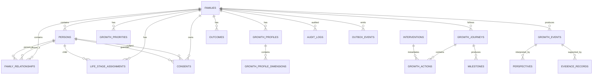

# Family ER Diagram V0.1



## 聚合边界

### Family Aggregate
- families
- persons
- family_relationships
- life_stage_assignments
- consents

### Growth Aggregate
- growth_profiles
- growth_profile_dimensions
- growth_priorities

### Journey Aggregate
- growth_journeys
- growth_actions
- growth_events
- milestones
- outcomes

### Cross-cutting
- audit_logs
- outbox_events
- evidence_records
- perspectives
- interventions
```
