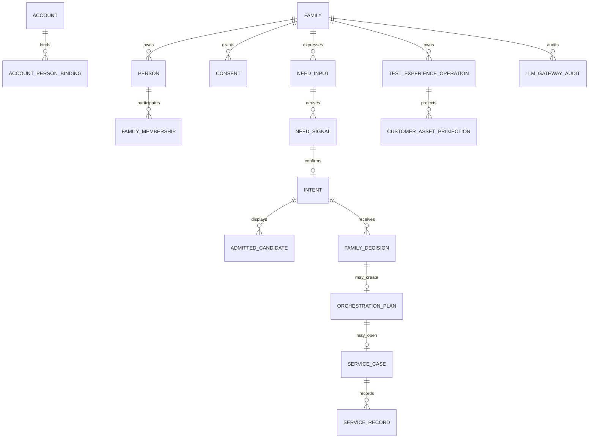

# Family / 伐木累 34 页统一数据对象与结构设计

> 本文是 34 页前后端一致实现的对象级契约。它把 UI、API、DTO、PostgreSQL、Named Action、审计和 LLM Context 连接到同一对象关系上。DEV/TEST 可以使用固定 fixture 和隔离数据库，但对象结构不使用一次性页面字段替代；生产仅切换数据源、密钥和外部适配器，不重写产品对象。

## 1. 设计原则

Family 的数据所有权根是 `Family`。所有对象必须能沿 `family_id` 回溯到家庭，所有写操作必须具有明确 `actor_person_id`、`Named Action`、`idempotency_key`（如适用）、`source`、`environment`、`created_at` 与审计关联。家庭表达的 Need/Intent、家庭明确 Decision、资源/服务候选、过程回执和事实/诊断结论必须严格分层；前两者可以是家庭表达，后者不能由 LLM 或前端自行生成。

> **LLM 只读取最小化 Context Snapshot，输出候选解释、文本等价或停止理由；LLM 不直接写入核心对象，不决定状态，不创建订单/预约/社区内容，不生成诊断、评分、永久标签或跨家庭比较。**

## 2. 对象层级与关系

`CUSTOMER_ASSET_PROJECTION` 是读模型，不是真相表；它由 `TEST_EXPERIENCE_OPERATION`、后续正式订单/权益/服务记录对象派生。`NEED_SIGNAL` 是非 canonical 的服务层信号，不能升级为永久家庭事实；`INTENT` 必须来自家庭明确确认；`ORCHESTRATION_PLAN` 只有在明确 Decision 之后产生，`NO_ACTION` 不得产生 Plan/Case/Task/Reminder。

## 3. 核心对象契约

| 对象 | 所有权根 | 关键字段 | 状态上限 | 来源与可见性 | 持久化/读模型 | 允许写入者 |
|---|---|---|---|---|---|---|
| `Family` | 自身 | `family_id`, `display_name`, `status` | `ACTIVE` 等账户状态 | 家庭私有；服务端派生 scope | `families` | 既有家庭授权动作 |
| `Person` | `family_id` | `person_id`, `person_type`, `display_name`, `birth_date` | 成员状态 | 家庭私有；儿童字段最小化 | `persons` | 受保护家庭动作 |
| `AccountBinding` | `family_id` | `account_id`, `person_id`, `status` | ACTIVE/INACTIVE | 认证真相；不可由客户端提交 | `accounts`, binding 表 | 认证系统 |
| `FamilyMembership` | `family_id` | `person_id`, `role`, `status` | ACTIVE/REVOKED | 权限与范围 | membership 表 | 授权动作 |
| `Consent` | `family_id` | `purpose`, `status`, `policy_version`, `granted_at`, `revoked_at` | GRANTED/REVOKED | 权限前置；撤回立即 fail-closed | consents | 监护人动作 |
| `NeedInput` | `family_id` | `subject_person_id`, `actor_person_id`, `data_class`, `raw_ref` | CAPTURED/RETRACTED | 家庭表达；原文最小保存 | `growth_need_inputs` | L0 Named Action |
| `NeedSignal` | `family_id` | `source`, `raw_ref`, `inferred_need_type`, `canonical_family_fact=false` | 服务层信号 | 不得作为事实、标签或诊断 | `growth_need_signals` | 服务编排受控动作 |
| `Intent` | `family_id` | `need_type`, `goal_text`, `required_capability_keys`, `confirmed_by`, `status` | OPEN/CLOSED/CANCELLED | 家庭明确确认；可撤回 | `growth_intents` | L0/L1 Named Action |
| `AdmittedCandidate` | `family_id` + `intent_ref` | `candidate_ref`, `source`, `admission`, `risk`, `version`, `executor_ref` | SHOWN/EXPIRED/SUPERSEDED | 只读候选；不自动排序 | recommendation/candidate projection | 资源准入系统 |
| `FamilyDecision` | `family_id` | `intent_ref`, `candidate_ref`, `decision_type`, `actor_person_id` | SELECTED/DISMISSED/NO_ACTION | 仅记录家庭决定，不是执行 | `family_service_decisions` | 监护人 Named Action |
| `OrchestrationPlan` | `family_id` | `accepted_by_decision_ref`, `steps`, `version`, `status` | DRAFT/PROPOSED/ACCEPTED/SUPERSEDED | 仅在明确选择后 | `orchestration_plans` | 受控服务动作 |
| `ServiceCase` | `family_id` | `intent_ref`, `plan_ref`, `owner`, `status` | OPEN…COMPLETED/CANCELLED | 执行真相；非 LLM 决定 | `service_cases` | Steward/受控服务动作 |
| `ServiceRecord` | `family_id` | `case_ref`, `kind`, `status`, `source`, `occurred_at` | RECORDED/CANCELLED | 过程记录，不等于效果 | `service_contributions`/projection | 受控服务动作 |
| `CatalogItem` | 平台；展示时带 family scope | `item_ref`, `version`, `admission`, `evidence`, `risk`, `price_ref` | ADMITTED/EXPIRED | 只读；服务端派生金额与资格 | DEV catalog read model | 准入登记动作 |
| `TestExperienceOperation` | `family_id` | `operation_id`, `page_id`, `operation_kind`, `fixture_ref`, `fixture_version`, `status`, `external_effect=false` | CREATED/CONFIRMED/CANCELLED | DEV/TEST 固定 fixture；不代表真实外部事实 | `test_experience_operations` | 受保护 Named Action |
| `CustomerAssetProjection` | `family_id` | `operation_id`, `kind`, `status`, `created_at` | 只读投影 | 当前家庭可见；不叫真实订单/权益 | SQL projection | 系统派生 |
| `LLMGatewayAudit` | `family_id` | `trace_id`, `model_id`, `policy_version`, `fixture_ref`, `decision`, `allowed_state_upper_bound`, `hashes`, `human_gate_required` | ACCEPTED/BLOCKED/ERROR | 不保存 key、原 prompt、原 response | `family_llm_gateway_audits` | Gateway 服务端 |

## 4. 34 页对象绑定

| UI 范围 | 读取对象/投影 | 写入对象或动作 | 当前对应 API | 统一状态回执 |
|---|---|---|---|---|
| UI-01–UI-02 | `Family`, `Person`, `NeedInput` 最小快照 | 无；UI-02 只请求解释 | `/home`, `/test-loop/llm/draft` | `READ_ONLY` / `BLOCK_CONFIGURATION` |
| UI-03 | `NeedInput`, `NeedSignal`, `Intent` | `CAPTURE_NEED`, `CONFIRM_INTENT`, `NO_ACTION` | `/test-loop/need`, `/intent`, `/decisions` | `OPEN`, `CONFIRMED`, `NO_ACTION` |
| UI-04–UI-05 | `Intent`, `AdmittedCandidate`, `FamilyDecision`, `OrchestrationPlan` | 只有家庭明确选择后允许创建 Plan | candidates/decision/plan projection | `SHOWN`, `SELECTED`, `PAUSED` |
| UI-06–UI-12 | `ServiceCase`, `ServiceRecord`, private family progress | 任务完成/回顾必须 Named Action；成长结果/排名禁止 | service projection | `RECORDED`, `PAUSED`, `CANCELLED` |
| UI-13–UI-18 | `CatalogItem`, `TestExperienceOperation`, `CustomerAssetProjection` | UI-15 `CREATE_INVITE`; UI-16 `CREATE_GROUP`; 其他先读 | `/experience/operations`, `/customer-projection` | `CONFIRMED`, `CANCELLED`, `external_effect=false` |
| UI-19–UI-24 | admitted `Provider/Activity` read model、`ServiceRecord` | UI-21 `CREATE_BOOKING`; UI-23 `CREATE_EVENT` | `/experience/operations` | `CONFIRMED`, `CANCELLED` |
| UI-25–UI-28 | private/community fixture read model | UI-26 `PUBLISH_TEMPLATE`; 不做真实外发 | `/experience/operations` | `RECORDED`, `CANCELLED` |
| UI-29–UI-34 | private `ServiceRecord`, `CustomerAssetProjection`, `FamilyProfileSnapshot` | 只允许家庭私有回顾/撤回 | projection APIs | `READ_ONLY`, `RECORDED`, `CANCELLED` |

## 5. DTO 约束

所有 DTO 分为 `ReadProjectionDto`、`IntentCaptureDto`、`DecisionDto`、`NamedActionDto`、`GatewayRequestDto`、`GatewayResponseDto` 六类。写 DTO 禁止接收 `family_id`（由可信上下文派生）、模型名、API key、价格、provider 联系方式、外部 URL、任意自由文本核心状态、跨家庭 id 或客户端计算的状态。读 DTO 必须标识 `source`, `visibility`, `version`, `status`；LLM Context 只接收 `snapshot_ref`, `page_id`, `allowed_state_upper_bound`, `candidate_refs` 和最小结构化家庭表达。

## 6. 统一审计字段

每一次写入至少记录 `family_id`, `actor_person_id`, `named_action`, `correlation_id`, `idempotency_key`, `policy_version`, `source`, `environment`, `consent_ref`, `created_at` 与结果状态。LLM 审计额外记录 `model_id`, `gateway_version`, `fixture_ref`, `prompt_hash`, `response_hash`, `input_block_reason`, `output_block_reason`, `human_gate_required`；严禁保存真实 API key、Authorization header、原始 prompt、provider 原文输出或真实家庭数据。

## 7. 对象级验收

只有当 UI 显示字段能从明确 DTO/投影取得、写动作能定位到 Named Action、状态能在 PostgreSQL 中重放、family scope/consent 能被负例阻断、LLM Context 与 UI 状态上限一致、文本等价可用且浏览器路径可复现时，页面才可标记为 `E2E_READY`。`GATE_BOUNDARY` 页面必须有清晰的只读或安全停止路径，不得为了数量完成而伪造支付、诊断、排名、真人服务或社区外发。
