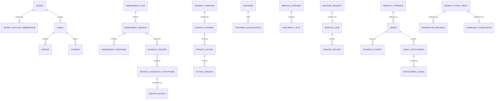
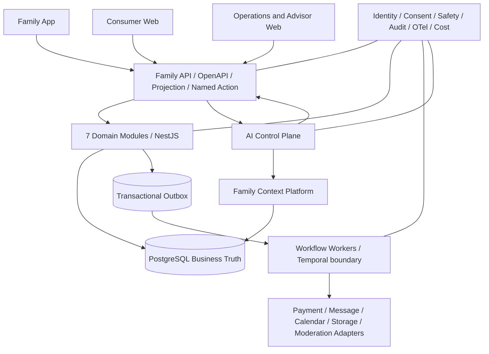

# Family 业务运行蓝图 V1

```text
DOC_KIND = BUSINESS_RUNTIME_EXECUTION_BASELINE
STATUS = EXECUTION_BASELINE_DRAFT
DATE = 2026-08-23
MACHINE_SSOT = governance/FAMILY_BUSINESS_RUNTIME_MODEL_V1.yaml
VALIDATOR = pnpm run validate:business-runtime
```

## 1. 目标与裁决

本蓝图把已有 3 份 PPT、当前 consumer UI baseline、历史六闭环、V4.1 六循环、主数据目录、数据库与代码资产统一为一条实施链：

```text
业务场景
→ 角色与触发
→ 业务流程/状态机
→ 业务规则
→ 数据对象/结构/关系
→ App/Web 功能组件
→ API/领域/工作流/AI/数据架构
→ 可运行纵切
→ 测试、审计与发布门禁
```

核心裁决：

1. PPT 是产品和商业场景输入，证据等级上限 E1，不证明真实效果或运行能力。
2. `GROWTH / PLAN / ASSESSMENT / SERVICE / COMMERCE / COMMUNITY` 是唯一业务循环词汇。
3. Consumer UI baseline 是体验投影，不拥有业务真相；业务必须先落成状态机和对象，再由 App/Web 消费。
4. NestJS + PostgreSQL 是唯一业务真相；AI、客户端、投影和工作流不得越权写事实。
5. 先让系统可运行，再让业务可运营；先完成真实纵切，不以页面数量判断完成度。
6. 3 份 PPT 与 consumer UI baseline 是联合基线：PPT 目标必须落实到 UI、场景、对象、Named Action 与测试；UI 实现也必须回溯到 PPT 目标。机器追踪门禁见 `FAMILY_PPT_UI_DELIVERY_TRACEABILITY_V1.yaml`。

## 2. 材料收敛关系

| 已有材料 | 保留内容 | 统一处理 |
|---|---|---|
| 3 份 PPT | 家庭长期经营、21/90 天产品、会员、专家、活动、社区、裂变和数据平台愿景 | 转为业务场景与假设，不直接转为事实表或生产承诺 |
| Consumer UI Baseline | 页面、用户语言、入口、主动作和投影 | 映射到 11 个业务场景、6 个循环、7 个领域 |
| 历史六闭环 | 核心服务、增长、商城、名师沙龙、社区、客户后台 | 只作为场景来源，归并到 V4.1 的 6 个 canonical loops |
| 主数据/对象目录 | 目录、家庭、过程、交易、权益、AI 与审计对象 | 统一为 46 个运行模型对象，区分 Master/Fact/Ledger/Projection/AI/Audit |
| V4.1 架构 | 六平面、七领域、控制面、Outbox、Temporal、AI Control Plane | 作为 IT/AI 架构边界 |
| 当前代码与迁移 | 家庭核心、成长、测试服务/商业、移动与 Web 原型 | 作为现状证据，不抬高为生产完成 |

## 3. 业务场景总图

| 场景 | 循环 | 主要角色 | 起点 | 成功业务结果 | UI |
|---|---|---|---|---|---|
| SCN-001 家庭建档与同意 | GROWTH | 家长、系统 | 已认证账户 | 获得可信 FamilyContext | 01、33 |
| SCN-101 家庭测评 | ASSESSMENT | 家长、系统 | 选择测评 | 提交可追溯会话和证据输入 | 02、07 |
| SCN-102 成长解读 | ASSESSMENT | 家长、AI、系统 | 测评提交 | 家庭确认成长意图 | 03、08 |
| SCN-201 今日行动 | GROWTH | 家长、孩子、系统、AI | 当日可执行任务 | 行动和家庭回读被记录 | 01、09、10、11、29 |
| SCN-301 21/90 天计划 | PLAN | 家长、顾问、系统、AI | 已确认成长意图 | 计划可执行、复盘、暂停和恢复 | 04、05、35 |
| SCN-401 服务发现 | SERVICE | 家长、顾问、AI | 请求专业支持 | 选择合格服务或 NO_ACTION | 19、20 |
| SCN-402 服务履约 | SERVICE | 家长、顾问、专家 | 选择服务与时段 | 预约、履约、反馈可回读 | 21–24、31、34 |
| SCN-501 购买与权益激活 | COMMERCE | 家长、运营、系统 | 选择商品与价格 | 订单、支付、权益分别成立 | 13、14、16、18、30、32 |
| SCN-502 权益使用与续费 | COMMERCE | 家长、顾问、运营 | 拥有可用权益 | 核销、余额、资产、续费可回读 | 06、17、18、30、32 |
| SCN-601 私有成长故事 | COMMUNITY | 家长、AI、系统 | 保存家庭时刻 | 私有内容跨设备可回读 | 12、26、28 |
| SCN-602 审核发布与邀请 | COMMUNITY | 家长、审核、运营 | 申请公开分享 | 审核、发布、撤回、邀请可追溯 | 15、25、27、28 |

35 个 UI 已全部映射到至少一个业务场景，校验器会阻止新增 UI 变成无流程、无对象、无规则的孤立页面。

## 4. 六循环的业务流程

### 4.1 ASSESSMENT：问题进入到成长意图

```text
测评目录
→ 创建会话
→ 保存结构化回答
→ 提交会话
→ 形成 Evidence
→ AI/规则生成 Hypothesis
→ 输出验证与边界说明
→ 家庭确认或拒绝
→ GrowthIntent
```

关键规则：AI 解读不是 Fact；测评工具固定版本；儿童参与需单独同意；允许退出且退出不创建计划。

### 4.2 GROWTH：行动到回读

```text
今日行动可用
→ 开始/跳过
→ 完成或部分完成
→ 保存 Perspective 反思
→ 生成过程回读
→ 下一步提示
```

关键规则：行动完成不等于成长结果；不生成总分或排名；孩子输入最小化且可见性受限。

### 4.3 PLAN：成长意图到阶段复盘

```text
GrowthIntent
→ 选择 JourneyTemplate 版本
→ 计划草稿
→ 家庭确认
→ Task 实例化
→ 定时/提醒/执行
→ StageReview
→ 继续/调整/暂停/人工复核
→ 完成
```

关键规则：模板与实例分离；长期等待、计时、重试和人工节点由工作流承担；PostgreSQL 保存业务事实。

### 4.4 SERVICE：需要到履约

```text
Need
→ Capability
→ 合格 Provider/Offering
→ 适配说明
→ Family Decision
→ Slot
→ BookingRequest
→ 人工确认
→ ServiceCase
→ ServiceRecord
→ Feedback/FollowUp
```

关键规则：Provider 必须具备有效 Qualification；服务发生不等于家庭改善；真实联系与通知经 Adapter。

### 4.5 COMMERCE：商品到权益

```text
ProductOffering + PricePlan
→ Order
→ PaymentAttempt
→ AdapterReceipt
→ PaymentSettled
→ EntitlementPolicy
→ FamilyEntitlement
→ Usage Ledger
→ Refund/Renewal
```

关键规则：目录、订单、支付和权益四者分离；移动端不保存支付秘密；退款与权益回收必须对账。

### 4.6 COMMUNITY：私有内容到受控传播

```text
GrowthStoryDraft（默认私有）
→ 家庭确认
→ 去标识化
→ 分享同意
→ ModerationDecision
→ CommunityPublication
→ Invitation/Attribution
→ Withdraw
```

关键规则：默认私有；儿童信息最小化；审核、撤回和可见性优先于互动与增长。

## 5. 业务规则体系

机器模型登记 16 条全局规则，分为六类：

| 类别 | 规则 | 实施位置 |
|---|---|---|
| 身份与数据权 | 范围可信链、Consent/Purpose、未成年人安全 | Guard、Policy、Repository scope、审计 |
| 状态写入 | Named Action、幂等、乐观并发、可退出 | Domain Service、Command Handler、数据库约束 |
| 事实边界 | Fact/Perspective/Evidence/Recommendation/Outcome 分离 | Schema、DTO、投影、UI 文案与测试 |
| 外部副作用 | Adapter、Receipt、环境隔离、失败恢复 | Integration Port、Workflow、Audit |
| 商业与服务 | 供给准入、目录事实分离、支付权益分离 | Catalog、Service OS、Commerce Domain |
| AI治理 | AI 无事实写权、最小上下文、输出验证、Human Gate | AI Use Case Registry、Gateway、Validator、Eval |

具体规则编号与引用关系以 `FAMILY_BUSINESS_RUNTIME_MODEL_V1.yaml` 为准。

## 6. 数据对象、结构与关系

### 6.1 对象分层

| 层 | 代表对象 | 数据性质 |
|---|---|---|
| 可信根 | Tenant、Account、TenantAccountMembership、Family、Person、Membership、Relationship、Consent | 主数据与授权事实 |
| 评估 | AssessmentToolDefinition、Session、Response、Evidence、Hypothesis、GrowthIntent | 版本化目录、家庭事实和 AI 产物 |
| 成长计划 | JourneyTemplate、TaskTemplate、GrowthJourney、GrowthAction、Checkin、StageReview | 模板与实例分离的长期过程事实 |
| 供给与服务 | Capability、Provider、Qualification、Offering、Slot、Booking、ServiceCase、ServiceRecord | 目录、容量、履约事实 |
| 商业权益 | ProductOffering、PricePlan、Order、PaymentAttempt、Entitlement、Usage、Refund | 目录、交易、账本 |
| 社区内容 | CommunitySpace、StoryDraft、ModerationDecision、Publication、Invitation | 私有内容、审核与公开事实 |
| AI/控制 | AiUseCase、ContextSnapshot、AiRun | 控制主数据、最小上下文与审计 |
| 横向对象 | OutboxEvent、AuditEvent、AdapterReceipt | 事件、审计与外部回执 |

### 6.2 统一字段结构

所有家庭事实至少包含：

```text
id / ref
tenant_id
family_id
status
row_version（可编辑对象）
actor / created_by
correlation_id
idempotency_key（命令对象）
environment
source_ref / source_version
created_at / updated_at
```

关键范围、状态和金额不得藏在 JSONB；低频、非关键扩展属性才允许进入带 Schema 和命名空间的 `attributes`。

### 6.3 核心关系



## 7. 应用功能组件

### 7.1 App

App 是家庭日常运行入口：身份与家庭切换、今日行动、测评、21/90 天执行、回读、私有故事、服务进度、权益与资产。App 只持有安全缓存和未同步草稿，不拥有第二套业务数据库或服务端。

### 7.2 消费者 Web

消费者 Web 负责内容获客、轻量测评、报告预览、账号登录、产品购买、支付返回和 App 引导。登录后与 App 使用同一账户、FamilyContext、权限和 API。

### 7.3 运营/顾问 Web

运营与顾问 Web 负责：

- 家庭服务队列和 Human Gate；
- Journey/Task 内容编排与版本发布；
- Provider/Qualification/Offering/Slot 管理；
- 预约确认、履约记录、反馈和跟进；
- Product/Price/Entitlement、退款和对账；
- 内容审核、撤回、举报和邀请归因；
- 经营漏斗、服务质量、安全、AI 成本和审计查询。

### 7.4 服务端组件

```text
Family API
├─ Identity / Tenant / Family Scope
├─ Projection API
├─ Named Action API
├─ Family Core
├─ Growth Intelligence
├─ Growth Journey
├─ Resource Network
├─ Service OS
├─ Commerce & Entitlement
├─ Content & Community
├─ Outbox / Workflow Workers
├─ AI Control Plane
├─ External Effect Adapters
└─ Observability / Audit / Governance
```

## 8. IT 架构



实施约束：模块化单体优先，不拆微服务；CQRS-light 而非全 Event Sourcing；Temporal 只用于长流程；PostgreSQL 保存业务真相。

## 9. AI 架构

```text
App/Web 请求
→ Authentication
→ Tenant + Family Authorization
→ Consent + Purpose + Data Class
→ AI Use Case Registry
→ Skill Resolver
→ Permissioned Context Snapshot
→ Model Provider Gateway
→ Structured Output Validator
→ Safety / Eval / Cost Policy
→ AiRun Audit + Derived Artifact
→ 家庭/人工确认
→ Named Action
→ Domain + PostgreSQL
```

AI 的实现对象必须包含 `AiUseCase`、`ContextSnapshot` 和 `AiRun`。每个 AI 用例必须声明允许技能、所需同意、数据级别、输出 Schema、人工确认、成本预算、评测集和运行授权。AI 不直接调用数据库或外部业务工具。

## 10. 从“系统能跑”到“业务能运行”的纵切顺序

| 顺序 | 纵切 | 系统运行标准 | 业务运行标准 |
|---:|---|---|---|
| 0 | VS-00 可信根 | PG、迁移、认证、范围、Consent、审计、E2E | 真实测试账户和家庭可安全进入 |
| 1 | VS-01 测评到今日行动 | App/Web/API/DB/AI草稿/回读全链通过 | 家庭能完成测评、确认解读、行动并重启回读 |
| 2 | VS-02 21天计划 | 定时、暂停、恢复、阶段复盘、Outbox 可回放 | 顾问能编排，家庭能连续执行 |
| 3 | VS-03 服务履约 | 供给、时段、预约、人工确认、履约、反馈 | 服务团队能排班、交付和复盘 |
| 4 | VS-04 交易权益 | sandbox 支付、退款、权益、核销对账 | 运营能售卖、退款、履约和续费 |
| 5 | VS-05 社区发布 | 私有草稿、同意、审核、发布、撤回 | 内容团队能安全运营传播与邀请 |

不得跳过 VS-00。VS-01 通过前，不扩建更多页面；每个纵切先 TEST/SANDBOX，生产外部副作用单独 Gate。

## 11. 验收与下一步

当前模型校验结果：

```text
6 loops
11 scenarios
46 data objects
21 relationships
10 application/architecture components
16 global rules
6 runtime slices
Consumer UI baseline fully mapped
```

运行：

```bash
cd 50_开发_dev
pnpm run validate:business-runtime
pnpm run validate:arch:v4.1
pnpm run validate:consumer-ui
```

下一阶段只进入 VS-00 与 VS-01 的差距分析：把现有数据库表、API、App/Web 页面、测试和本模型逐项对照，输出 `EXISTS / PARTIAL / MISSING / CONFLICT`，随后形成第一批实施任务与迁移脚本。服务、商业、社区继续保持设计态，不提前打开生产副作用。
