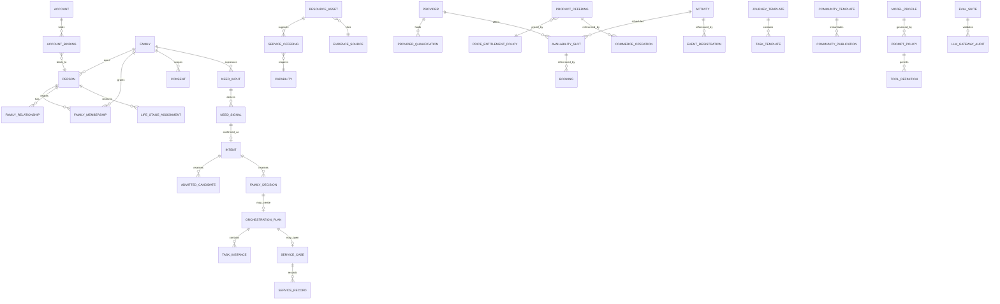

# Family / 伐木累主数据关系与所有权模型 V1

## 1. 建模结论

Family 采用“**平台目录主数据 + 家庭私有主数据 + 交易事实 + 读模型 + AI 控制平面**”五层结构。主数据定义稳定对象，交易事实记录发生过什么，读模型回答某个页面现在应该显示什么，AI 控制平面决定模型在什么边界内工作。五层不能互相冒充。

当前 V1 固定 **22 个主数据对象**：18 个业务主数据对象、4 个 AI 控制主数据对象。`Account`、`AccountBinding`、`IdentitySession`、`AuditLog` 和 `OutboxEvent` 属于平台基础设施或治理对象，不计入 22 个业务主数据，但必须作为运行时底座存在。

## 2. 五层结构

| 层 | 所有权 | 典型对象 | 写入方式 | 页面能否直接写 |
|---|---|---|---|---|
| 平台目录主数据 | Family 平台 | ResourceAsset、ServiceOffering、Provider、ProductOffering、Activity、EvidenceSource | 准入/目录 Named Action | 否，页面只读 |
| 家庭私有主数据 | Family | Family、Person、Membership、Relationship、LifeStage、Consent | 家庭授权动作 | 仅经服务端动作 |
| 交易/事实 | Family + 平台过程 | Need、Intent、Decision、Plan、Case、Booking、Registration、Publication、TaskInstance、ServiceRecord | Named Action + 幂等 | 否，页面提交动作意图 |
| 读模型 | 系统派生 | Home、Journey、Catalog、Assets、LLM Context | SQL/服务投影 | 否 |
| AI 控制平面 | 平台治理 | ModelProfile、PromptPolicy、ToolDefinition、EvalSuite | 发布/治理动作 | 否 |

## 3. 主数据关系图

图中的 `RESOURCE_ASSET`、`SERVICE_OFFERING`、`CAPABILITY`、`EVIDENCE_SOURCE`、`PROVIDER`、`PROVIDER_QUALIFICATION`、`AVAILABILITY_SLOT`、`PRODUCT_OFFERING`、`PRICE_ENTITLEMENT_POLICY`、`ACTIVITY`、`JOURNEY_TEMPLATE`、`TASK_TEMPLATE`、`COMMUNITY_TEMPLATE` 是平台目录主数据；当前 DEV 中已有的 `family_admitted_catalog_items`、`family_service_provider_catalog`、`family_activity_catalog` 是这些对象的测试版实现，不代表最终生产目录已完成。

## 4. 主数据主键与边界

### 4.1 家庭私有根

所有家庭私有对象必须包含 `family_id`，并且通过服务端可信上下文派生，不能接受客户端提交的家庭范围。`Person` 不能脱离 Family 存在；`FamilyMembership` 和 `Consent` 负责把身份和授权连接到 Family。`Person` 的 `display_name`、出生日期和关系仅作为家庭私有资料，不能自动转换为画像或永久标签。

### 4.2 平台目录根

平台目录对象不属于单一家庭，但每次展示都必须经过准入、版本、证据、风险、资格和适用范围检查，再生成带 `family_id` 的只读候选投影。页面不得直接修改平台目录，模型不得创建新目录对象。

### 4.3 交易事实根

交易事实同时保存 `family_id` 和来源对象引用。任何状态变化必须有 `actor_person_id`、`named_action`、`correlation_id`、`idempotency_key`、`environment`、`source`、`policy_version` 和 `external_effect`。`NO_ACTION` 只产生 Decision 记录，不产生 Plan、Case、Task、Reminder 或外部事件。

## 5. 生命周期标准

### 5.1 主数据生命周期

主数据使用 `DRAFT → ADMITTED/ACTIVE → EXPIRED → ARCHIVED`，平台目录必须保留版本；过期对象不删除历史引用，但不再展示为当前候选。家庭主数据使用 `ACTIVE → SUSPENDED/REVOKED → ARCHIVED`；撤回 Consent 后相关能力立即 fail-closed。

### 5.2 交易事实生命周期

交易事实使用对象专属状态，但必须满足以下共同规则：创建后不可通过客户端直接改成任意状态；只能由 Named Action 推进；取消/撤回保留审计记录；跨家庭对象引用永远失败；失败关闭不得产生半成品业务写入。

### 5.3 投影生命周期

投影不拥有独立业务真相。投影可以缓存或通过 SQL view 实时计算，但必须能由主数据和事实重建。`CustomerAssetProjection` 不叫真实订单或权益，除非正式订单/权益对象和生产适配器另行通过 Gate。

## 6. 字段模板

| 对象类别 | 必备字段 | 不能出现的字段 |
|---|---|---|
| 平台目录主数据 | `object_id`, `object_ref`, `version`, `status`, `source_ref`, `evidence_level`, `risk_flags`, `qualification_ref`, `valid_from/to` | 家庭标签、模型生成效果、客户端价格 |
| 家庭私有主数据 | `object_id`, `family_id`, `visibility`, `status`, `version`, `source`, `consent_ref`, `created_by`, `created_at`, `withdrawn_at` | 公开画像、跨家庭排名、永久成长结论 |
| 交易事实 | `fact_id`, `family_id`, `actor`, `named_action`, `correlation_id`, `idempotency_key`, `status`, `environment`, `external_effect`, `created_at` | 客户提交 family_id、模型名、API key、任意外部 URL |
| 读模型 | `projection_id`, `family_id`, `source_refs`, `computed_at`, `visibility`, `state_upper_bound` | 投影作为新事实、无来源的推荐结论 |
| AI 控制对象 | `policy_id`, `version`, `model_ref`, `allowed_pages`, `allowed_tools`, `state_upper_bound`, `eval_ref` | 真实 key、原始家庭对话、自由模型权限 |

## 7. 34 页数据对象分区

| UI | 主要主数据 | 主要事实 | 主要投影 |
|---|---|---|---|
| UI-01–UI-03 | Family、Person、Membership、Consent、NeedType、Capability | NeedInput、NeedSignal、Intent | FamilyHomeProjection |
| UI-04–UI-12 | ResourceAsset、ServiceOffering、JourneyTemplate、TaskTemplate | Candidate、Decision、Plan、TaskInstance、ServiceRecord | GrowthJourneyProjection |
| UI-13–UI-18 | ProductOffering、PriceEntitlementPolicy、EvidenceSource | CommerceOperation | AdmittedCatalogProjection、CustomerAssetProjection |
| UI-19–UI-24 | Provider、ProviderQualification、AvailabilitySlot、Activity | Booking、EventRegistration、ServiceRecord | Catalog/ServiceProjection |
| UI-25–UI-28 | CommunityTemplate、Provider/ServiceOffering | CommunityPublication | PrivateCommunityProjection |
| UI-29–UI-34 | Family、Person、JourneyTemplate、TaskTemplate、ServiceOffering | TaskInstance、ReportSnapshot、ServiceRecord | GrowthJourneyProjection、CustomerAssetProjection |

## 8. 需要避免的结构性错误

第一，不能为每张 UI 建一张表；页面是视图，不是对象。第二，不能把 `test_experience_operations` 当成生产订单、预约、活动资格或社区内容，它是 DEV/TEST 交易事实适配器。第三，不能把 `growth_profiles`、`outcomes` 的字段直接用于家庭评分或儿童成长结论，现有对象必须继续受 Evidence Gate 和 Human Gate 约束。第四，不能把模型输出写入 `Need`、`Intent`、`Decision`、`Plan` 或 `Case`，模型只能提供经过验证的候选解释或停止理由。第五，不能将 `price_ref` 当作支付金额，也不能将 `provider_ref` 当作真人服务已履约。

## 9. 结构冻结条件

在 V1 对象结构冻结前，必须完成 22 个主数据对象的对象字典、主键/外键、版本策略、状态机、权限矩阵、来源/证据字段、删除/撤回策略、DTO、Named Action、LLM Context 映射和数据库迁移评审。任何新增主数据必须提交“不是已有对象的版本、实例、事实或投影”的证明，否则不得新增。
