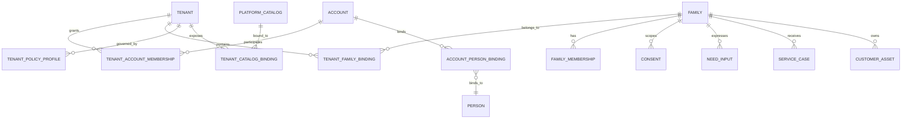

# Family / 伐木累多租户主数据审查 V1

## 1. 审查结论

当前工程已经具备 **Family-centric tenancy T1/T2** 的身份基础：`Account`、`AccountPersonBinding`、`FamilyMembership`、account-scoped session 和 trusted family scope。它解决了“一个账号可访问哪些家庭”和“家庭内角色是什么”，但它**还不是完整的多租户模型**，因为当前数据库没有 `Tenant`、没有 `tenant_id`，也没有 Tenant→Family、Tenant→Account、Tenant→Catalog 的显式关系。

因此，当前不能宣称已经支持多租户。正确结论是：

> **Family scope 已有，Tenant scope 尚缺。Family 是家庭私有数据所有权根；Tenant 是上层隔离、客户空间、策略和目录可见性边界。两者不能互相替代。**

## 2. 主数据数量修订

原 V1 的 22 个主数据对象没有覆盖多租户。审查后建议改为：

| 层级 | 原数量 | 修订后 | 变化 |
|---|---:|---:|---:|
| 业务主数据 | 18 | 18 | 保留；Family 仍是家庭私有数据根 |
| 多租户主数据 | 0 | **5** | 新增 Tenant、TenantAccountMembership、TenantFamilyBinding、TenantPolicyProfile、TenantCatalogBinding |
| AI 控制主数据 | 4 | 4 | 保留；模型控制不归家庭或租户自由修改 |
| **主数据合计** | **22** | **27** | 现阶段应按 27 个设计 |

`Account`、`IdentitySession`、`AuditLog`、`OutboxEvent` 仍属于平台基础设施/治理对象，不计入 27 个业务与控制主数据。Tenant 之所以计入主数据，是因为它代表商业化客户空间、数据隔离命名空间和策略继承边界，不只是一个技术列。

## 3. 新增的 5 个多租户主数据对象

| 编号 | 对象 | 作用 | 关键字段 | 关系 |
|---:|---|---|---|---|
| T-01 | `Tenant` | 商业客户空间/隔离命名空间 | `tenant_id`, `tenant_type`, `status`, `region`, `plan_ref`, `version` | 1:N Family、AccountMembership、Policy |
| T-02 | `TenantAccountMembership` | Account 在租户内的角色和生命周期 | `tenant_id`, `account_id`, `role`, `status`, `valid_from/to` | Account ↔ Tenant |
| T-03 | `TenantFamilyBinding` | Family 归属哪个租户、是否活动、数据迁移/解绑状态 | `tenant_id`, `family_id`, `status`, `effective_from/to` | Tenant ↔ Family |
| T-04 | `TenantPolicyProfile` | 租户级功能、数据保留、模型/工具、目录和外部适配器策略 | `tenant_id`, `policy_version`, `allowed_capabilities`, `llm_policy_ref`, `retention_policy_ref` | Tenant → Policy |
| T-05 | `TenantCatalogBinding` | 平台目录候选在租户内的准入/版本/可见性绑定 | `tenant_id`, `catalog_object_ref`, `version`, `visibility`, `status` | Tenant ↔ Platform Catalog |

`TenantRole`、`TenantStatus`、`TenantType`、`BindingStatus` 是枚举/值对象，不单独计为主数据对象。`TenantPolicyProfile` 可以在后续拆成多个策略对象，但在 V1 先作为稳定聚合根，避免策略表碎片化。

## 4. 正确的对象层级

### 4.1 所有权规则

`Tenant` 拥有租户空间、策略、目录可见性和审计分区；`Family` 拥有家庭私有事实、家庭成员关系、Consent、Need、Intent、Decision、Plan、Case、Task、Report 和 ServiceRecord；`Account` 只是登录与访问主体，不拥有 Family 数据；平台目录可以是全局对象，也可以通过 `TenantCatalogBinding` 被租户限定展示。

### 4.2 多租户上下文解析顺序

服务端必须按以下顺序生成可信上下文：

`Bearer Account → ACTIVE TenantAccountMembership → ACTIVE TenantFamilyBinding → ACTIVE Family → ACTIVE FamilyMembership → role → Consent → page/action scope`。

客户端不得提交或覆盖 `tenant_id`、`family_id`、`account_id`、`actor_id` 或 `subject_person_id`。若请求只带 Tenant 而未选择 Family，只能执行租户级目录/配置读取，不能读取家庭私有数据。

## 5. 哪些对象需要 `tenant_id`

### 5.1 必须同时带 `tenant_id + family_id`

所有家庭私有事实和投影必须同时保存两个范围：`families`、`persons`、`family_memberships`、`family_relationships`、`consents`、`growth_*`、`orchestration_*`、`service_*`、`family_page_*`、`test_experience_operations`、`family_llm_gateway_audits`、`customer_asset_projection`。

其中 `family_id` 是数据所有权根，`tenant_id` 是隔离和策略边界。数据库外键和服务端查询必须同时校验二者，防止同一 Family 被错误绑定到另一个 Tenant 后发生越界读取。

### 5.2 只带 `tenant_id`

租户级配置、租户策略、租户自定义目录绑定、租户级审计索引和租户级 feature flags 只需 `tenant_id`；它们不能包含家庭事实或跨家庭统计结果。

### 5.3 平台级不带 `tenant_id`

平台全局的模型能力目录、通用 Prompt Policy、全局 Tool Definition、通用 EvidenceSource 和平台公共候选可以不带 `tenant_id`，但实际展示前必须经过租户绑定和准入检查。全局对象不能反向读取任何家庭数据。

## 6. 当前数据库的缺口

| 缺口 | 当前事实 | 风险 | 修复方向 |
|---|---|---|---|
| Tenant 根表 | 不存在 | 无法证明商业客户空间 | 新增 `tenants` |
| Account→Tenant | 不存在 | Account 只有家庭绑定，不能限制租户角色 | 新增 `tenant_account_memberships` |
| Tenant→Family | 不存在 | 家庭可被错误跨租户读取 | 新增 `tenant_family_bindings`，并加唯一活动绑定 |
| 租户策略 | 不存在 | 不能按租户继承 LLM/目录/保留策略 | 新增 `tenant_policy_profiles` |
| 租户目录绑定 | 不存在 | 全局候选无法按租户准入 | 新增 `tenant_catalog_bindings` |
| 家庭表 tenant scope | `families` 无 `tenant_id` | 查询只能依赖 family_id，无法做数据库级租户保护 | 增加 tenant FK 或通过 binding 约束；生产前必须完成 |
| 审计租户 scope | 多数审计只有 family_id | 租户审计和事件分区不完整 | `audit_logs`、LLM audit、outbox 增加 tenant_id |
| LLM Context | 当前主要 family scope | 模型无法继承租户策略，或可能越过策略 | Context 必须包含服务端派生 tenant policy snapshot |
| 目录层级 | 当前候选表主要是全局测试目录 | 无租户自定义目录边界 | Global Catalog + TenantCatalogBinding |

## 7. 34 页 UI 的多租户影响

34 页 UI 不增加租户选择器，也不让用户手输租户 ID。租户上下文由登录会话和可信账户成员关系解析；家庭切换是租户内受控上下文切换，跨租户切换必须重新解析 Account 的 TenantMembership，不能由前端改参数完成。

| 页面组 | 租户级影响 | 家庭级影响 |
|---|---|---|
| UI-01–UI-12 成长/家庭 | 租户策略决定功能和 LLM 是否可用 | Family/Person/Consent/Need/Plan/Task/Report 私有 |
| UI-13–UI-18 商城/资产 | TenantCatalogBinding 决定目录可见性、版本和价格引用 | 操作、资产和回执归属 Family |
| UI-19–UI-24 名师/沙龙 | Provider/Activity 可为平台级或租户绑定 | Booking/Registration/ServiceRecord 归属 Family |
| UI-25–UI-28 社区 | 租户策略决定是否可用、内容模板边界 | 发布回执默认家庭私有；不得跨租户 feed |
| UI-29–UI-34 后台 | 租户策略决定模块开关和保留策略 | 报告、服务、资产和档案严格 Family 私有 |

## 8. 真实 LLM 的多租户边界

LLM Gateway 的 Context Assembler 必须服务端生成：`tenant_id`、`tenant_policy_version`、`allowed_pages`、`allowed_tools`、`family_id`、`family_visibility`、`consent_summary` 和最小业务快照。模型不可接收 Account token、真实 key、完整租户成员表、跨家庭聚合数据、未准入目录或其他家庭上下文。

模型策略继承顺序为：平台全局安全策略 → 租户 Policy Profile → 页面策略 → 家庭 Consent/状态 → 当前请求。下层只能收紧，不能放宽上层安全边界。审计必须记录 `tenant_id`、`family_id`、`policy_version`、`decision` 和 `allowed_state_upper_bound`，但不能记录真实 key、原始 prompt 或 provider 原文。

## 9. 多租户验收负例

| 编号 | 负例 | 必须结果 |
|---|---|---|
| TENANT-NEG-01 | Account 没有 ACTIVE TenantMembership | `403`，不解析 Family，不调用 LLM |
| TENANT-NEG-02 | TenantMembership 已撤销/过期 | `403`，零业务写入 |
| TENANT-NEG-03 | Family 不属于当前 Tenant | `403`，不能用客户端 tenant/family 参数绕过 |
| TENANT-NEG-04 | Family 同时存在两个 ACTIVE TenantBinding | `409` 或 fail-closed，禁止任意选择 |
| TENANT-NEG-05 | Tenant 禁止某页面/工具，但平台全局允许 | 页面和工具不可用，租户策略只能收紧 |
| TENANT-NEG-06 | TenantCatalogBinding 版本过期或未准入 | 候选不可见，不使用缓存候选 |
| TENANT-NEG-07 | LLM Context 请求其他 Tenant 的 family_id | 组装器拒绝，零 provider 调用 |
| TENANT-NEG-08 | 审计、资产或 outbox 缺 tenant_id | 不能进入生产迁移；DEV 测试必须标记结构缺口 |
| TENANT-NEG-09 | 只带 Tenant context 请求家庭私有对象 | `403`，要求明确唯一 Family context |
| TENANT-NEG-10 | 租户删除/停用时仍有 ACTIVE FamilyBinding | 停止新写入并转人工治理，不级联删除家庭数据 |

## 10. 结论与实施优先级

第一优先级是建立 Tenant、TenantAccountMembership、TenantFamilyBinding，并把它们接入可信上下文；第二优先级是给家庭私有事实补齐 `tenant_id` 和复合外键/查询约束；第三优先级是建立 TenantPolicyProfile 和 TenantCatalogBinding；第四优先级是把 34 页 API、LLM Context、审计和对象投影统一纳入双范围校验。

在这四步完成前，Family 可以继续做 DEV/TEST 单租户家庭体验，但不能宣称“多租户商业化就绪”。组织级跨家庭协作、AccessGrant、跨家庭统计、租户级推荐和生产商业化仍需独立授权与 Gate；多租户基础结构本身不等于解除这些 HOLD。
