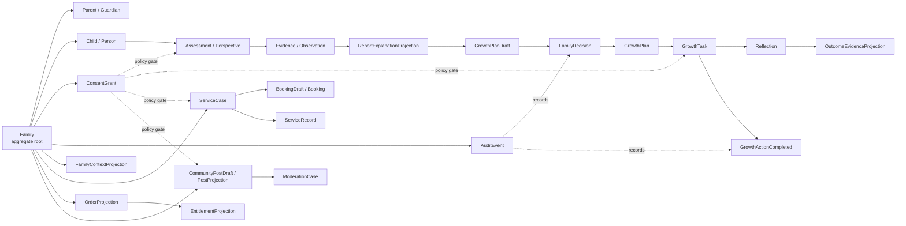

# consumer UI Wide Research to Development Slice 001

## 1. Research verdict

```text
PHASE=WIDE_RESEARCH_TO_DEV_SLICE
PATH=reports/m2/frontend/CONSUMER_UI_WIDE_RESEARCH_TO_DEVELOPMENT_SLICE_001.md
UI_SCOPE=UI-01..UI-34
WIDE_RESEARCH_DONE=YES
DEV_SLICE_CANDIDATES=4
RECOMMENDED_FIRST_SLICE=Family Today and Daily Task Check-in (UI-01 + UI-09)
BUSINESS_CODE_MODIFIED=NO
API_CONTRACT_FILES_CREATED=0
PHASE_D_IMPLEMENTATION_STARTED=NO
FILES_CREATED=1
FILES_UPDATED=0
```

本研究的结论不是“34 个页面已经可以开发”，而是明确了**可用既有工程能力、需要新建的受控投影、必须先关闭的最小决策**，并选择了首批可在无真实外部效果前提下打通数据关系的纵切。Phase C 已完整覆盖 34 个 UI，但 Phase D 仍为 `NO`；任何具体 API Contract 或业务代码仍需要逐 UI 的 Architect/Human admission。[1] [2]

最适合先行的真实运行纵切是 **Family Today and Daily Task Check-in（UI-01 + UI-09）**。它复用现有家庭鉴权、Consent 检查、`getTodayAction`、`CompleteGrowthAction`、idempotency、audit 和 outbox event 能力；不需要支付、预约、通知、分享、真人服务或模型调用。该纵切不会将“完成任务”解释为成长 Outcome，只把它记录为带边界的行动与 Reflection。[3]

## 2. Evidence boundary and research method

| Source class | Inputs used | Evidence status | Allowed use in development selection |
|---|---|---|---|
| E0 — Family SSOT | Phase A ledger、Phase B shared research、Phase C queue/gates/coverage、Phase D entry criteria、工程代码与迁移 | 现有工程与治理事实 | 识别既有对象、接口、鉴权、Consent、审计、测试能力及阻塞项。 |
| E1 — internal design material | `$REPO/30_素材_materials/_extracted/逐页文本_含页码/` 内三份逐页文本 | 设计输入，不自证 | 用于提出 90 天、打卡、会员、社群、Agent 等产品假设；不可证明教育效果、资质、诊断或因果。 |
| E2 — external domain research | FTC、Head Start、NIST、OWASP、儿童中心化设计研究 | 可引用的通用实践 | 约束 Consent、最小化数据、对象级授权、敏感评估和 AI/社区风险的系统设计。 |
| Hypothesis | “低风险、小行动、受控草稿可提高早期流程可运行性” | 未验证 | 仅作为首批纵切排序依据，需在 DEV/TEST 以用户理解、错误率和撤回率验证。 |
| Recommendation | 本文选择 UI-01 + UI-09 为 first slice | 非 Decision | 仍需 Architect/Human Decision record；不自动授予实施授权。 |

内部素材明确提出以成熟底座适配、真实交互数据迭代、知识库/Agent 和打卡入口作为业务方向，但这类表达属于 E1 战略/设计材料，不是教育或服务效果证据。[5] 因此，首批纵切不实现 Agent、积分、自动化触达或裂变，而是先建立可审计的家庭范围动作记录。

外部研究用于**收紧系统边界**而非替代本地业务决定。FTC 指出，当服务收集儿童信息或支持公开发布时，需重视家长同意、持续撤回/删除权和数据保留/删除安排；这支持 Family 的 Consent scope、fail-closed 和社区/媒体 HOLD 原则。[6] Head Start 的资料指出敏感风险/逆境数据只有在具备相应支持体系时才应收集，支持 Assessment 与 Outcome 页面先使用非诊断、最小化、可追溯的数据模型。[7] OWASP 把对象级和属性级授权列为 API 风险，支持每个 Family/Person/Action 都在服务端复验 scope。[8] NIST 的 Privacy Framework 与 AI RMF 分别强调隐私风险管理和可信 AI 风险管理，支持 Model Gateway、Adapter、Human Gate、Audit 的分层。[9] [10]

## 3. consumer UI product-system layers

| Product layer | UI IDs | Primary user outcome | System boundary |
|---|---|---|---|
| Core Growth | UI-01、UI-06、UI-07、UI-09、UI-10、UI-11、UI-12 | 看见家庭上下文、今日行动、个人历史与受控入口 | 家庭范围投影、任务/反思动作；禁止总分/排名/儿童诊断。 |
| 90-day Plan | UI-04、UI-05、UI-09 | 将需求转为可讨论计划和单次行动 | `PlanDraft → FamilyDecision → Named Action`，不允许自动创建正式 Plan。 |
| Assessment / Outcome | UI-02、UI-03、UI-07、UI-08、UI-29 | 结构化采集、解释、反思和证据链接 | Assessment/Report 仅解释或草稿；Outcome 不能被写成因果效果。 |
| Service / Booking | UI-19~UI-24、UI-31、UI-34 | 浏览供给、预约意向、查看服务过程记录 | Provider/Offering read model；Booking/Registration 先是 draft；真人服务与通知 HOLD。 |
| Commerce / Entitlement | UI-13~UI-18、UI-30、UI-32 | 查看商品、会员、权益、订单/资产 | 只读投影或 intent draft；支付、退款、库存、发票、下载/分享均经 Adapter。 |
| Community / Content | UI-25~UI-28 | 阅读社区、个人内容、受控互动 | Content projection、draft、moderation；发布/评论/外发均为 Named Action + Human Gate。 |
| Profile / Records | UI-33、UI-34 | 家庭资料、Consent、服务记录与纠错 | 细粒度 family/person scope；身份、导出、删除和跨系统同步 HOLD。 |

## 4. Cross-UI core object graph



| Object | Aggregate/master | Key relationships | Permitted source of truth | Prohibited shortcut |
|---|---|---|---|---|
| `Family` / `Person` / `Relationship` | Family aggregate | One Family has many Persons/Roles/Consents | family/person tables + authorized projection | Client-supplied person/family relation is not trusted. |
| `ConsentGrant` | Family privacy aggregate | Binds actor, subject, purpose, scope, version, revocation | consent record + policy evaluation | UI checkbox or stale cache cannot authorize write. |
| `Observation` / `Perspective` / `Evidence` | Evidence aggregate | May link to Assessment, Task, Reflection, ServiceRecord | source/version/time-aware evidence projection | Perspective is not Fact; free text is not Outcome. |
| `Assessment` / `ReportExplanationProjection` | Assessment aggregate | Assessment produces responses/evidence; report explains them | versioned instrument/response/evidence read model | No diagnostic or total score by default. |
| `GrowthPlanDraft` / `FamilyDecision` / `GrowthPlan` | Growth aggregate | Draft becomes Plan only after approved decision/action | controlled draft + decision/event | Recommendation cannot become Plan directly. |
| `GrowthTask` / `Reflection` | Journey aggregate | Plan has tasks; task may have reflection | task state + bounded perspective | Task completion is not outcome improvement. |
| `ServiceCase` / `BookingDraft` / `ServiceRecord` | Service aggregate | Provider/Offering → booking intent → case/record | service provider/schedule/read model | No real slot, contact, notification or payment before adapter approval. |
| `OrderProjection` / `EntitlementProjection` | Commerce aggregate | Order reference may grant entitlement | commerce adapter or DEV fixture receipt | UI state cannot grant entitlement/payment success. |
| `CommunityPostDraft` / `PostProjection` | Community aggregate | Draft → moderation → visible post; has comments/reactions | content store + visibility/moderation policy | AI or client cannot publish/alter visibility directly. |
| `AuditEvent` | Cross-cutting immutable ledger | Links Named Action, actor, correlation, idempotency, result | audit/outbox | No silent state mutation. |

## 5. End-to-end flows and data-operation classification

### 5.1 Whole-system flow

```text
UI-01 Family Home
→ family-scoped Today / Context projection
→ UI-02/UI-07 Assessment entry (when admitted)
→ Assessment draft / Evidence
→ UI-03/UI-08 explanation projection
→ UI-04 PlanDraft
→ FamilyDecision + Named Action
→ UI-09 task projection + check-in reflection
→ UI-29 evidence-linked outcome narrative
→ UI-19~UI-24 service read/draft path
→ UI-18/UI-30/UI-32 entitlement/order read path
→ UI-25~UI-28 community read/draft path
→ UI-33/UI-34 consent/profile/service-record read and correction path
```

### 5.2 Data-operation rules

| Data operation type | Examples | Storage/status rule | UI consequences |
|---|---|---|---|
| Read Projection | Family home, today task, provider list, membership summary, service records | Server projects authorized facts/versions into display DTO; includes provenance/scope/state. | Must support loading, empty, error, permission and stale/held states. |
| Controlled Draft | Assessment answer draft, PlanDraft, BookingDraft, Reflection draft, PostDraft, refund/correction draft | Versioned and scoped; may be abandoned/withdrawn; has no external side effect. | UI must label as draft/pending; must never render as confirmed booking/plan/outcome. |
| Named Action | `CompleteGrowthAction`, confirm growth intent, submit correction, confirmed publish | Registered command validates actor, object state, policy, consent, idempotency and audit. | Button maps to one action command, disabled/loading/error/replay state included. |
| External Effect Adapter | Payment, refund, booking slot, calendar/video, notification, share, download, customer contact | Production adapter not callable in first slices; DEV returns fixture receipt/no-op or fails closed. | UI shows `HOLD` / `REVIEW_REQUIRED`, never fake completion. |
| AI recommendation | Report explanation, task suggestion, content risk hint | Model Gateway → schema validation → policy/human gate → controlled draft only. | UI presents provenance and uncertainty; no direct core-state write. |

## 6. Existing engineering assets relevant to real slices

The repository already contains more than a static page shell, but its capabilities must be treated as **existing inputs**, not blanket authorization. `GrowthActionService` reads a pending daily action, validates family management permission and required `SERVICE`/`ASSESSMENT`/`GROWTH_TRACKING` consents, applies safety checks, performs idempotency locking, writes audit/outbox events, and returns a bounded reflection field.[3] `OrchestrationController` also exposes authenticated DEV/TEST fixture-only read projections and no-payment/no-calendar/no-notification receipts for service booking, commerce intent and membership entitlement flows.[4]

| Existing capability | Reusable for candidate | What remains to close |
|---|---|---|
| `getTodayAction` + `completeGrowthAction` | UI-01 + UI-09 | UI-specific read DTO, current visual baseline mapping, consent purpose matrix, task-state decision owner. |
| Orchestration authenticated `ReadFamily` routes | UI-01, UI-19, UI-18/30/32 | Stable projection contracts, policy scopes, fixture versions and UI error mapping. |
| Fixture-only service offering/slot/booking-request endpoints | UI-19 + UI-20 + UI-21 | Provider evidence/qualification wording, booking draft semantics and explicit no-op UX. |
| Fixture-only commerce/membership projections and intents | UI-18 + UI-30 + UI-32 | Order/entitlement source, payment/refund prohibition, UI visual replication. |
| Web `test-loop.js` route map | All 34 baseline routes | Replace static reference mounting only after per-slice contract admission; save runtime screenshots. |
| Unit/integration/e2e and page-object test entry points | First slice test loop | Align fixture → DTO → web state → screenshot path before implementation. |

## 7. First-batch development slice candidates

The candidates below are ordered by ability to form a real data relationship while suppressing external effects. Each candidate requires a narrow Architect/Human admission record before code begins; the selection is a Recommendation, not a Decision.

| Rank | Candidate | UI IDs | Why it can start early | External-effect posture | Admission status |
|---:|---|---|---|---|---|
| 1 | Family Today and Daily Task Check-in | UI-01 + UI-09 | Reuses real family/task/consent/audit/idempotency service path and ties home → action → reflection. | None; only internal task state after policy checks. | Recommended after 5 bounded decisions. |
| 2 | Service Supply Read + Booking Intent Receipt | UI-19 + UI-20 + UI-21 | Existing fixture-only offerings/slots/booking-request projection can validate Provider → Offering → BookingDraft relation. | Calendar, notification, payment, contact are no-op/HOLD. | Candidate after provider-provenance decision. |
| 3 | Membership and Entitlement Read Projection | UI-18 + UI-30 + UI-32 | Existing DEV/TEST membership/commerce projection can prove OrderRef → Entitlement view without payment. | Payment, refund, invoice, download/share are no-op/HOLD. | Candidate after entitlement-source decision. |
| 4 | Assessment Entry and Controlled Draft | UI-02 + UI-07 | Establishes Family/Child → consented AssessmentDraft → Evidence/Perspective relation without report diagnosis. | No real model, diagnosis, score or automated intervention. | Candidate after instrument/child-consent decision. |

### Candidate 1 — Family Today and Daily Task Check-in

| Dimension | Implementation-ready design draft |
|---|---|
| UI IDs / business goal | UI-01 Family Home exposes family-scoped Today projection; UI-09 displays one pending `GrowthTask` and lets a permitted guardian record a bounded check-in/reflection. |
| Object model | `Family` → `Person`/`ConsentGrant`; active `InterventionEpisode` → `GrowthTask`; `GrowthTask` → `Reflection` (Perspective) → `GrowthActionCompleted` audit/outbox event. No `Outcome` write. |
| API/read projection draft | `GET /families/:familyId/today` returns `FamilyTodayProjection { family, consent_state, today_action | null, projection_version, provenance }`. Existing `GET` task capability may be adapted only after contract admission; this is not a created OpenAPI file. |
| Named Action draft | `CompleteGrowthAction { family_id, action_id, completion_status, reflection?, occurred_at, idempotency_key, correlation_id }`; reuse existing internal semantics only if owner ratifies status/action mapping. |
| Frontend page/states | UI-01: loading/context/empty/permission/error/task-summary. UI-09: loading/pending/submitting/replayed/completed/conflict/consent-required/safety-review/empty. Baseline text/layout is reproduced only from assigned baseline. |
| Backend/modules | Existing `GrowthActionService`, family authorization, consent/safety policy, audit/outbox; add only an admitted home/today projection facade if needed. |
| Database/seed/mock | Existing `families`, persons/memberships, consents, intervention episode, `growth_actions`, idempotency, audit/outbox; seed one synthetic guardian, child, granted consent set, one pending action. No real child data. |
| Tests | Unit: policy/idempotency/reflection boundary. Integration: family scope, missing consent, duplicate key, completed conflict. Web: DTO-state mapping and page object. E2E: pending → submit → replay. |
| Playwright plan | Route UI-01 and UI-09 at baseline viewport; capture loading/pending/completed/empty/permission/HOLD; save outputs under a new runtime artifact directory only after implementation is authorized; compare with baseline. |
| Cannot do | Cannot infer outcome, change GrowthProfile, send notification, invoke model, create task from free text, write external data, or treat completion as effectiveness. |

### Candidate 2 — Service Supply Read + Booking Intent Receipt

| Dimension | Implementation-ready design draft |
|---|---|
| UI IDs / business goal | UI-19 provider/Offering list → UI-20 detail/availability summary → UI-21 BookingDraft receipt. Proves service supply relationship without real booking. |
| Object model | `ProviderProjection` → `OfferingProjection` → `AvailabilitySlotProjection`; guardian creates `BookingDraft`/no-op request receipt; each object has provenance/version. |
| API/read projection draft | Read offering list/detail/slot projections; controlled request command references fixture `service_offering_ref` and version only. No price/contact/free-text provider parameters. |
| Named Action draft | `SubmitServiceBookingIntent` / `CancelServiceBookingIntent`, idempotent, family scoped, emits audit receipt only. |
| Frontend page/states | list/detail/slot-selected/draft-submitted/cancelled/no-slots/permission/HOLD. Qualification and ranking claims are absent; provider labels carry source status. |
| Backend/modules | Existing `FamilyServiceBookingService` and fixture routes; admission must bind qualification/provenance policy and no-op Adapter receipt. |
| Database/seed/mock | Versioned fixture providers/offerings/slots plus synthetic `BookingDraft`; no calendar, video, contact, payment, or actual capacity. |
| Tests | Provider scope, version mismatch, absent SERVICE consent, duplicate draft, no slot, cancel replay, cross-family denial, no notification/calendar call. |
| Playwright plan | UI-19 list, UI-20 detail, UI-21 selected slot and `HOLD_EXTERNAL_EFFECT` receipt states at three baseline viewports. |
| Cannot do | No real slot reservation, provider contact, calendar/video creation, payment, notification, rating/ranking, or service result. |

### Candidate 3 — Membership and Entitlement Read Projection

| Dimension | Implementation-ready design draft |
|---|---|
| UI IDs / business goal | UI-18 / UI-30 membership center and UI-32 orders/assets show what an authorized family can read about fixture membership and entitlement state. |
| Object model | `MembershipProjection` → `EntitlementProjection`; optional synthetic `OrderIntentReceipt`; `AssetProjection` is read-only. |
| API/read projection draft | family-scoped membership/customer projection with plan/version/benefit status/source; no payment instrument or external order number exposed. |
| Named Action draft | Optional DEV-only `SubscribeMembershipIntent`/`ConsumeBenefitIntent` with fixture receipt; only if entitlement owner approves semantics. |
| Frontend page/states | active/inactive/benefit-unavailable/consumed/permission/error/HOLD; clear distinction between intent receipt and paid order. |
| Backend/modules | Existing `FamilyMembershipEntitlementService` and commerce intent service; first contract binds no-payment rules and entitlement source. |
| Database/seed/mock | versioned fixture plans, entitlement grants/consumption audit, synthetic family; no processor/customer payment data. |
| Tests | scope, source/version, duplicate intent, benefit limit, entitlement revoke, no payment/refund/invoice/download/share calls. |
| Playwright plan | UI-18, UI-30, UI-32 active/empty/HOLD states, preserving separate baseline pages. |
| Cannot do | No real purchase, renewal, refund, invoice, download, share, customer-service dispatch, price guarantee or benefit promise. |

### Candidate 4 — Assessment Entry and Controlled Draft

| Dimension | Implementation-ready design draft |
|---|---|
| UI IDs / business goal | UI-02/UI-07 provide a family/child-scoped entry and save/resume a fixture-backed AssessmentDraft; it validates consent and versioning without a diagnostic result. |
| Object model | `AssessmentInstrumentVersion` → `AssessmentDraft` → `AssessmentResponse` (controlled) → `Perspective/Evidence`; no `Diagnosis`, score, or automatic `GrowthPlan`. |
| API/read projection draft | instrument metadata and current draft projection; answers use allowlisted question/option IDs. No free-text model request or sensitive tool without approved instrument policy. |
| Named Action draft | `StartAssessmentDraft`, `SaveAssessmentDraft`, `AbandonAssessmentDraft`; `SubmitAssessment` remains HOLD until instrument/interpretation review closes. |
| Frontend page/states | not-started/consent-required/in-progress/saved/version-conflict/abandoned/permission/error/review-required. |
| Backend/modules | Existing consent and assessment intake stubs may inform fixture path; a real draft store requires separate contract admission. |
| Database/seed/mock | synthetic instrument version with non-sensitive items, draft/response rows, guardian consent fixture; no identifiable child answers in shared seed. |
| Tests | child/guardian scope, consent revocation, version conflict, idempotency, data minimization, no score/diagnosis, draft abandonment. |
| Playwright plan | UI-02/UI-07 entry, consent-blocked, saved draft, conflict and empty fixture states. |
| Cannot do | No clinical/education diagnosis, total score, autonomous plan creation, live model interpretation or real sensitive screening. |

## 8. First real running slice recommendation

**Recommendation: Candidate 1 — Family Today and Daily Task Check-in (UI-01 + UI-09).**

This is the best M2/M3 first slice because it runs through the smallest meaningful closed loop:

```text
Authorized FamilyContext
→ TodayProjection
→ one pending GrowthTask
→ guardian Named Action: CompleteGrowthAction
→ bounded Reflection as Perspective
→ audit + idempotency + outbox event
→ refreshed TodayProjection
```

It proves the most important relationships—family scope, consent, plan/task linkage, controlled state transition, reflection boundary, audit and UI state—without requiring an AI recommendation, product catalog, payment, community moderation, provider contact or external adapter. It is also directly aligned with the existing growth-action service rather than inventing a parallel backend.

The slice is **not yet auto-authorized**. Before implementation, the following five bounded decisions must be recorded by named owners: (1) UI-01/09 canonical baseline and route mapping; (2) `GrowthTask` status taxonomy and whether UI copy says “completed” versus “checked in”; (3) required consent purposes and guardian/child actor matrix; (4) reflection length/content handling and `REVIEW_REQUIRED` policy; and (5) the exact synthetic seed family/action used in DEV/TEST. Once these are recorded, the first contract can remain narrow and does not need to create a new external effect adapter.

## 9. Remaining Architect/Human decisions that block high-risk paths

| Risk category | Blocking UI clusters | Required decision before implementation |
|---|---|---|
| Child sensitive data and identity | UI-01~UI-11, UI-24~UI-25, UI-29, UI-31, UI-33~UI-34 | guardian authority, purpose, scope, revocation, retention/deletion, Human Gate escalation. |
| Family ranking / total score | UI-11, UI-17, UI-29 | approved replacement personal-history projection; prohibited aggregation and copy rules. |
| AI output | UI-03, UI-08, UI-10, UI-29 | structured Model Gateway schema, source/provenance display, rejection route, human oversight, no ontology write. |
| Payment / refund / entitlement | UI-13~UI-18, UI-30, UI-32 | authoritative commerce source, Adapter/no-op policy, order/refund state machine, audit/idempotency. |
| Community publication / interaction | UI-25~UI-28 | visibility, media, moderation, child safety, report/withdraw/delete, notification/share policy. |
| Human service / booking | UI-19~UI-24, UI-31, UI-34 | provider qualification provenance, BookingDraft vs Booking, contact/calendar/video/payment boundaries, record correction. |
| External notification / share / export | UI-12, UI-15~UI-16, UI-21~UI-23, UI-26~UI-34 | adapter ownership, no-op/fail-closed, delivery evidence, withdrawal/cancellation and audit. |

## 10. Exact next action

```text
NEXT_ACTION=Create and obtain Architect/Human approval for UI-01_UI-09_FIRST_REAL_SLICE_ADMISSION_AND_API_CONTRACT_001.md: record the five bounded decisions for the synthetic Family Today → GrowthTask check-in loop, bind the existing CompleteGrowthAction action/consent/audit contract to the canonical UI-01 and UI-09 baselines, then authorize one guarded implementation task.
```

This next task is intentionally narrow: it converts the selected recommendation into a decision record and an API admission package. Only after that explicit approval may the implementation task modify API/Web/DB code, create runtime screenshots and perform pixel diff.

## 11. References

[1] `reports/m2/frontend/PHASE_C_CONSUMER_UI_COVERAGE_SUMMARY_001.md` (Phase C coverage, commit `7c4489f1a5be779e4fc935328327a9ca5de5a530`).

[2] `reports/m2/frontend/PHASE_D_API_CONTRACT_ENTRY_CRITERIA_AND_BLOCKERS_001.md` (Phase D admission draft, commit `4ff407cdec1868c600fc7ef9ac2d6dced9652f0d`).

[3] `apps/api/src/modules/family/growth-action.service.ts` (existing permission, consent, idempotency, audit and outbox behavior; engineering fact, not an implementation authorization).

[4] `apps/api/src/modules/orchestration/orchestration.controller.ts` (existing authenticated DEV/TEST fixture-only routes and explicit no-external-effect comments; engineering fact, not production approval).

[5] `$REPO/30_素材_materials/_extracted/逐页文本_含页码/03_家庭教育大模型平台合作方案.txt`, pp. 2–6 (E1 strategy/design input only).

[6] [FTC, *Children’s Online Privacy Protection Rule: A Six-Step Compliance Plan*](https://www.ftc.gov/business-guidance/resources/childrens-online-privacy-protection-rule-six-step-compliance-plan-your-business).

[7] [U.S. Office of Head Start, *Tracking Progress Database: Standardized Measures to Assess Family Engagement Efforts and Effects*](https://headstart.gov/family-engagement/article/tracking-progress-database-standardized-measures-assess-family-engagement-efforts-effects).

[8] [OWASP, *API Security Project / API Security Top 10 2023*](https://owasp.org/www-project-api-security/).

[9] [NIST, *Privacy Framework*](https://www.nist.gov/privacy-framework).

[10] [NIST, *AI Risk Management Framework*](https://www.nist.gov/itl/ai-risk-management-framework).

[11] [Radesky & Hiniker, *Making Child-Centered Design the Default*](https://pmc.ncbi.nlm.nih.gov/articles/PMC8942378/).

[12] [Common Sense Education, *Family Engagement for Digital Literacy & Well-Being*](https://www.commonsense.org/education/family-engagement).
