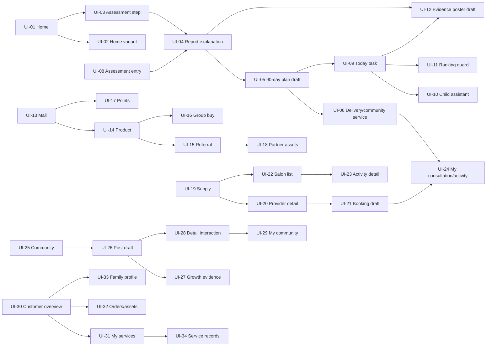

# Family 34 UI Function Lineage Audit

> **交付类型：** 文档级、证据约束的全量功能与血缘台账；不代表 34 页已经完成代码实现。
>
> **范围：** UI-01~UI-34。UI-01~UI-04 复用既有递归拆解成果并做来源复核；UI-05~UI-34 以 `FAMILY_34_UI_GLOBAL_BASELINE_CALIBRATION_001.md` 的 global baseline、PPT/截图 crosswalk 和各页单图可见线索为页面证据。UI-01 拆解报告只作为方法模板与 UI-01 已有血缘来源，不替代 UI-11~UI-34 的页面证据。
>
> **边界：** 视觉线索 ≠ 已实现能力；业务关联 ≠ 视觉复用；Recommendation ≠ Decision ≠ Action；DEV/TEST 可使用 synthetic/mock/stub，但不能把其写成真实 Fact，也不能触发真实预约、通知、支付、外发、直播或其他外部 effect。

## 1. 审计结论

本报告先完成 34 页全量覆盖层，再对 UI-05、UI-09、UI-10、UI-11、UI-12、UI-15、UI-16、UI-17、UI-18、UI-19、UI-20、UI-21、UI-25、UI-26、UI-27、UI-28 和 UI-30~UI-34 记录需要重点治理的边界。全量表中的每一行都包含页面证据、功能摘要、上下游、状态写入上限、Named Action 候选、对象/API/Agent/Adapter 候选以及 Gate/HOLD。证据不足的页面不以 UI-01 推断补齐，而是显式写为 `NEEDS_CONFIRMATION`、`MISSING_IMAGE` 或 `CONFLICT`。

| 统计项 | 数量 | 说明 |
|---|---:|---|
| 全量 global UI | 34 | UI-01~UI-34 一行不少 |
| `CONFIRMED` | 32 | baseline 与单图/PPT crosswalk 已提供充分页面锚点 |
| `NEEDS_CONFIRMATION` | 1 | UI-02 与 UI-01 首页版本/用户态关系 |
| `CONFLICT` | 1 | UI-03 global screen 与 PPT 测评内部 step 粒度冲突 |
| `MISSING_IMAGE` | 0 | UI-01 已由用户提供原图 overlay 补齐；后续仍需保留其版本裁定项 |
| 可启动 L1 只读方向 | 34 | 但不同页面的动态上限、权限和外部 effect 边界不同 |
| 允许自动写核心 ontology 的页面 | 0 | AI、页面点击和 mock 数据均不得直接写核心事实 |

## 2. Evidence Boundary and Source Registry

| Source ID | 证据文件/来源 | 允许证明的内容 | 不允许证明的内容 |
|---|---|---|---|
| E-BASELINE | `FAMILY_34_UI_GLOBAL_BASELINE_CALIBRATION_001.md` | global_ui_id、canonical title、单图文件名、PPT 场景/局部序号、visual signals、映射状态 | 未实现代码、生产数据、教育效果或真实外部能力 |
| E-UI01 | `UI01_FULL_EXPOSURE_SUBSYSTEM_DECOMPOSITION_001.md` | UI-01 暴露点方法、首页血缘和既有 UI-01~UI-04 拆解摘要 | UI-11~UI-34 的页面证据 |
| E-PPT68 | `UI04_UI10_PPT06_PPT08_VISUAL_GAP_ANALYSIS_001.md` | UI-04~UI-10 与 PPT 第6/8页的 exact/partial/semantic 关系及差距 | 商城商品转成长事实、报告分数转商业决策 |
| E-WAVE2 | `F06_F09_UI_NOTES.md` | F06~F09 已有 API/Named Action/状态边界与验证笔记 | 不能替代 UI-11~UI-34 单图视觉证据 |
| E-REF | `apps/web/public/bangyang-reference/` | 对应单页原图的可见文字和视觉结构 | 页面背后的生产能力或数据事实 |

## 3. A层：34 UI 全量覆盖表

字段说明：`state_write_upper_bound` 表示本页在当前阶段最多允许写入的状态；`named_action_candidate` 只表示未来需要受控定义的动作候选，不表示已实现或允许执行；`verification_status` 只表示当前证据完整度。

| global_ui_id | screen_name | source_ppt / ui_image_file | visible_text_and_visual_signals | feature_points_summary | upstream_ui | downstream_ui | state_write_upper_bound | named_action_candidate | domain_data_objects | api_service_candidate | agent_skill_adapter_candidate | gate_hold_boundary | verification_status |
|---|---|---|---|---|---|---|---|---|---|---|---|---|---|
| UI-01 | 家庭成长平台首页（首版参考） | 核心服务 L1；用户确认 UI-01 原图 | 家庭成长平台、免费家庭测评、AI诊断、21天挑战营、90天成长计划、成长案例、专家直播、家庭顾问、今日任务、推荐内容、底部导航 | 首页摘要；入口编排；今日任务；内容/服务目录；空/错/权限态 | — | UI-02/03/04/05/06/07/08/09/19/25/30 | L1 FamilyHomeProjection；不得自动建 Plan/Task/Booking | `NO_ACTION`；未来 `SelectHomeContext` | Tenant、Family、Person、Membership、Consent、ProjectionMetadata | `GET /families/:familyId/home` | Explanation Agent 仅解释；无外部 Adapter | tenant/family scope、consent、儿童数据、AI诊断、Ranking/Total Score、外部 effect 均 Gate/HOLD | CONFIRMED |
| UI-02 | 家庭成长平台首页（清晰母版） | 核心服务 L1；`home-screen-ui-crop.png` | 与首页同构：蓝色测评横幅、六入口、今日任务、推荐卡、底部导航 | 首页同构视图；可能是版本/用户态差异；需确认是否独立 global screen | UI-01（候选） | UI-03/04/05/06/07 | L1 只读首页投影；不因版本差异写事实 | `SelectHomeVariant`（候选，未确认） | Family、Person、Membership、Consent、HomeProjection | 同 UI-01 的 home projection，具体 route 待裁定 | 解释草稿可复用；不新增 Agent | UI-01/UI-02 版本关系、路由和用户态必须人工确认 | NEEDS_CONFIRMATION |
| UI-03 | 家庭测评第 2/5 步 | 核心服务 L2；`family-assessment-step2-reference-326x862.png` | 家庭测评、第2/5步、五个关注方向、补充信息、下一步 | 量表/题目展示；选项输入；步骤进度；补充信息 | UI-01/02、UI-08 | UI-04 | L1/L2 assessment draft/session answer；不写 Need/Diagnosis Fact | `StartAssessment`、`SaveAssessmentDraft`（须 consent/幂等） | Family、Person、AssessmentSession、QuestionSet、Answer、Consent、Evidence | `GET assessment definition`、`POST assessment draft` | Assessment Skill；Model Gateway 仅解释草稿 | 题目效度、儿童直接作答、敏感信息、诊断结论和跨家庭比较 HOLD | CONFLICT |
| UI-04 | AI 成长诊断报告 | 核心 L3、增长 L2；`ai-growth-diagnosis-reference-436x1118.png` | 成员卡、雷达、72、同龄平均、问题标签、建议、生成方案 CTA | 报告快照；证据/不确定性说明；建议；进入计划草稿 | UI-03、UI-08 | UI-05、UI-09、UI-12 | L1/L2 report explanation/recommendation；不写 Family/Need/Plan/Outcome Fact | `CreatePlanDraft`（只生成草稿）；`RequestHumanReview` | AssessmentSnapshot、Evidence、ExplanationDraft、ReportSnapshot、Consent | `GET report snapshot`、`POST explanation draft` | Model Gateway、Explanation Agent、Eval Skill | 总分、同龄平均、排名、敏感诊断、高风险建议必须 HOLD/Human Gate | CONFIRMED |
| UI-05 | 90 天成长方案 | 核心 L4；`growth-plan-90day-reference-434x1130.png` | 90天、3/12/36/90、周计划、任务三态、开始执行计划 | plan_draft/read projection；阶段与任务模板；家庭确认入口；暂停/返回 | UI-04 | UI-06、UI-09、UI-31 | L1/L2；只读 plan_draft，不能自动创建 Journey/Task/Intervention | `ProposeFamilyDecision`；后续 `ConfirmGrowthPlan`（须 actor/consent/version/audit） | PlanDraft、PlanVersion、JourneyTemplate、TaskTemplate、FamilyDecision、Evidence、Consent | `GET plan draft`；`POST decision candidate` | Plan Explanation Skill；Gateway 生成解释草稿；无外部 adapter | “开始执行”不是自动写真实 Journey/Task；敏感干预、真人服务、通知、日历、支付 L4 HOLD | CONFIRMED |
| UI-06 | 陪跑服务 / 社群服务 | 核心 L5；`delivery-community-reference-458x1128.png` | 家庭顾问、班主任、AI提醒、专家答疑、78%、成长打卡、家长交流、直播 | 服务交付摘要；陪跑进度；社群/直播入口；服务记录回流 | UI-05、UI-19/20 | UI-07、UI-24、UI-25/29、UI-31/34 | L1 服务/社群 read projection；L2 服务意向草稿；不创建真人服务记录 | `RequestServiceDraft`；`PauseServiceCase`（后续受权） | ServiceProvider、Offering、ServiceCase、ServiceRecord、Community、Activity、Consent | `GET service projection` | Service Supply；Community Skill；Video/Notification Adapter 仅边界 | 联系顾问、预约、直播、通知和公开社群均 Human Gate/Adapter HOLD | CONFIRMED |
| UI-07 | 我的 / 会员中心 | 核心 L6；`mine-member-reference-434x1124.png` | 年度会员、积分/等级/亲子币、报告/计划/订单/邀请、权益卡 | 会员权益投影；报告/计划/订单入口；家庭资产分域 | UI-01、UI-05/06 | UI-30、UI-31/32/33/34 | L1 Membership/Entitlement projection；不写真实购买或权益 | `ViewEntitlement`；未来 `RequestEntitlementAction` | Membership、Entitlement、Order、Report、Plan、InviteAsset | `GET membership/entitlements` | Catalog/Entitlement Skill；支付 Adapter HOLD | 真实订单、支付、积分资产、会员升级和外发奖励 HOLD | CONFIRMED |
| UI-08 | 家庭成长体检第 1/5 步 | 增长 L1；`family-assessment-entry-reference-428x952.png` | 家庭成长体检、第1/5步、五维评估、测评入口 | Assessment entry；适用范围；会话初始化；商业漏斗上游但不写商业事实 | UI-01、UI-13（业务关联） | UI-03、UI-04 | L1 entry/readiness；L2 synthetic draft；不写 referral/order/score | `StartAssessment` | Family、Person、AssessmentSession、QuestionSet、Consent | `GET assessment readiness`、`POST assessment draft` | Assessment Skill；无商业 Agent | 不因免费测评写订单、邀请、积分或营销标签；consent 缺失 fail-closed | CONFIRMED |
| UI-09 | 今日成长任务 | 增长 L3；`daily-growth-task-reference-448x916.png` | AI管家、三任务、78%、连续打卡、完成今日任务 | Task projection；任务状态；完成/部分完成/未完成；反思记录边界 | UI-04/05、UI-01 | UI-10、UI-31、UI-34 | L1 read；L3 仅受控 action 更新 Task status/Reflection，不改 Outcome/Profile | `CompleteTask`、`RecordReflection`、`PauseTask` | TaskInstance、TaskTemplate、Journey、ActionRecord、Reflection、Consent | `GET tasks`；`POST /growth/actions/:id/complete` | Task Skill；AI 解释可经 Gateway；不自动推荐或诊断 | 幂等、family scope、actor、pause/revoke；完成不等于成长效果，不触发通知 | CONFIRMED |
| UI-10 | 成长小助手 | 增长 L4；`growth-child-assistant-reference-448x920.png` | 儿童助手、成长能量、训练/阅读/情绪/目标、开始挑战 | 适龄助手投影；挑战入口；儿童输入/输出边界；家长可见性 | UI-09、UI-33 | UI-09、UI-27 | L1/L2 child-safe projection/draft；不写儿童能力、情绪或风险 Fact | `StartChildChallenge`（须 consent/Human Gate） | Person/ChildSubject、Task、Challenge、MediaAsset、Consent、Policy | `GET child assistant projection` | Child-safe Agent 经 Model Gateway；多模态 Adapter 受控 | 未成年人、情绪/风险、自由文本、图像/语音、训练使用和外发均 Gate/HOLD | CONFIRMED |
| UI-11 | 成长排行榜 | 增长 L5；`growth-ranking-reference-450x918.png` | 成长排行榜、周/月/同城/同班级、奖台、积分 | 视觉暴露/Benchmark guard；不作为真实排名系统 | UI-09、UI-12 | UI-12 | L0/L1 仅可显示禁用说明或非排名的自我历史投影；不得写排名 | `NoAction`；如研究需 `RequestBenchmarkReview` | Evidence、Task、ProgressSnapshot、PolicyDecision | `GET ranking exposure policy`（安全阻断优先） | Guard Skill；无 Ranking Agent | 禁止家庭 Total Score、跨家庭排名、同龄比较和儿童竞争激励；默认 HOLD | CONFIRMED |
| UI-12 | 成长成果海报 | 增长 L6；`growth-poster-reference-444x970.png` | 成长前后、勋章、二维码、分享 | Evidence story/export draft；可见成就素材；分享 adapter 边界 | UI-09、UI-27 | UI-25、UI-29、UI-07 | L1 evidence/story draft；不写永久 Outcome Fact；不自动分享 | `CreateEvidenceStoryDraft`；`RequestShareReview` | Evidence、ActionRecord、MediaAsset、OutcomeCandidate、Consent、ShareRequest | `GET story draft`；`POST export/share draft` | Story Generation Skill 经 Gateway；Share Adapter HOLD | 儿童图像、二维码、公开分享、效果前后对比和外发均 Human Gate/L4 HOLD | CONFIRMED |
| UI-13 | 家庭成长商城首页 | 商城 L1；`family-growth-mall-reference-424x978.png` | 邀请礼盒、拼团/好物/积分/会员/抢购/邀请、商品卡 | Catalog projection；入口分域；商品内容浏览 | UI-01、UI-07 | UI-14/15/16/17/18 | L1 商品目录与意向；不产生订单/支付 | `SelectProductIntent` | ProductOffering、SKU、Catalog、Entitlement、ReferralAsset | `GET catalog` | Catalog Skill；Payment/Referral Adapter HOLD | 商品目录不等于可售；不得由测评/报告驱动个性化营销或购买 | CONFIRMED |
| UI-14 | 商品详情 | 商城 L2；`product-detail-reference-418x970.png` | 21天亲子沟通挑战营、多价格、权益、购买/发起拼团 | SKU/权益详情；购买意向；拼团意向草稿 | UI-13 | UI-15/16、UI-07 | L1 product projection；L2 purchase/group draft；不支付不扣款 | `CreatePurchaseDraft`、`CreateGroupBuyDraft` | Product、SKU、Price、Entitlement、OrderDraft、Consent | `GET product detail`；`POST order draft` | Commerce Skill；Payment/GroupBuy Adapter HOLD | 真实支付、库存、优惠、成团、权益发放和自动 Journey 转换 HOLD | CONFIRMED |
| UI-15 | 邀请有礼 | 商城 L3；`invite-rewards-reference-432x992.png` | 3家庭、1/3、奖励、立即邀请、海报/微信 | Referral progress projection；邀请草稿；奖励账本候选 | UI-13/14 | UI-18、UI-12 | L1 referral projection；L2 invitation draft；不发送或发奖 | `CreateInvitationDraft`、`RequestRewardReview` | Referral、Invite、RewardLedger、PartnerAsset、Consent | `GET referral progress`；`POST invite draft` | Referral Skill；Share/Notification Adapter HOLD | 外发邀请、奖励发放、佣金/提现、儿童数据共享需 Gate/HOLD | CONFIRMED |
| UI-16 | 拼团专区 | 商城 L4；`group-buy-reference-440x960.png` | 拼团商品、团购价、人数、倒计时、去拼团 | Group-buy read model；商品/人数/时间显示；无真实成团 | UI-13/14 | UI-18、UI-32 | L1 mock/read projection；L2 group intent draft；不锁库存/支付 | `CreateGroupIntentDraft` | Group、Product、SKU、InventoryProjection、OrderDraft | `GET group offers`；`POST group draft` | GroupBuy Skill；Payment/Inventory Adapter HOLD | 倒计时、人数、价格不能宣称真实；支付、库存、成团和权益履约 HOLD | CONFIRMED |
| UI-17 | 积分商城 | 商城 L5；`points-mall-reference-472x982.png` | 成长积分、任务中心、积分兑换品 | Points ledger projection；兑换意向；任务来源说明 | UI-09、UI-13 | UI-18、UI-32 | L1 controlled ledger read；L2 redemption draft；不扣减真实积分 | `CreateRedemptionDraft` | PointsLedger、Task、Reward、Product、Entitlement | `GET points balance/catalog`；`POST redemption draft` | Ledger Skill；Fulfillment Adapter HOLD | mock 积分不是资产；不得用任务完成/儿童表现自动发放真实奖励 | CONFIRMED |
| UI-18 | 成长合伙人我的 | 商城 L6；`partner-mine-reference-440x994.png` | 合伙人、邀请/成交/积分/奖励、订单/权益 | Partner asset projection；邀请与奖励分域；收益仅候选 | UI-15/16/17 | UI-32、UI-07 | L1 partner asset read；不写佣金/提现/订单事实 | `ViewPartnerAsset`、`RequestRewardReview` | Partner、Referral、OrderProjection、RewardLedger、Entitlement | `GET partner assets` | Referral/Commerce Skill；Payout Adapter HOLD | 不把视觉指标写成成交/佣金事实；提现、结算、外发和税务动作 HOLD | CONFIRMED |
| UI-19 | 名师专区 | 名师 L1；`teacher-zone-reference-458x1008.png` | 名师专区、搜索、在线、热门领域、教师卡、立即咨询 | 服务供给列表；筛选；准入/可预约摘要；tenant/family scope | UI-01、UI-06、UI-13 | UI-20、UI-21、UI-22/23 | L1 read-only provider/offering/availability projection；不联系真人 | `QueryServiceSupply`（只读）；咨询为 draft/no-op | ServiceProvider、Offering、AvailabilitySlot、Qualification、Consent | `GET service supply projection` | Service Supply Skill；Calendar/Notification Adapter 不启用 | provider_kind=TEACHER；缺 scope/consent/准入 fail-closed；禁止排序、优劣判断、预约、通知 | CONFIRMED |
| UI-20 | 名师详情 | 名师 L2；`teacher-detail-reference-426x1002.png` | 名师详情、资质、评分、标签、可预约时间、咨询/预约 | provider profile projection；资质证据；时段摘要；服务意向 | UI-19 | UI-21、UI-24 | L1 provider/offering read；L2 booking draft；不锁时段 | `CreateConsultationDraft`、`CreateBookingDraft` | Provider、Qualification、Offering、Slot、Evidence、Consent | `GET provider detail`；`POST booking draft` | Provider Profile Skill；Calendar/Video Adapter HOLD | 评分、标签、资质必须有来源；不得做最佳/排名；真实预约/联系/通知 HOLD | CONFIRMED |
| UI-21 | 在线咨询 / 预约 | 名师 L3；`consultation-booking-reference-492x1008.png` | 咨询方式、时段、问题描述、隐私、确认预约 | Booking draft；用户意向；隐私/consent 检查；mock receipt | UI-20 | UI-24、UI-31/34 | L1 availability read；L2 booking draft；L3 仅受权 action，不触发外部 effect | `CreateBookingDraft`、`ConfirmBooking`（DEV stub/Human Gate） | Booking、ServiceRecord、Provider、Slot、Consent、AuditEvent | `POST booking draft/confirm stub` | Booking Skill；Calendar/Notification/Video Adapter | 真实占座、通知、视频、支付和真人联系 L4 HOLD；缺 consent fail-closed | CONFIRMED |
| UI-22 | 线下沙龙 | 名师 L4；`salon-list-reference-466x1008.png` | 城市、搜索、领域、活动卡、余量 | Activity catalog；地域/主题筛选；名额只读摘要 | UI-06、UI-19 | UI-23/24 | L1 activity read；L2 registration draft；不锁名额 | `CreateActivityRegistrationDraft` | Activity、Provider、Venue、CapacityProjection、Consent | `GET activities`；`POST registration draft` | Activity Discovery Skill；Calendar/Notification Adapter HOLD | 地点、余量、报名资格需来源；真实报名、通知、支付 HOLD | CONFIRMED |
| UI-23 | 活动详情 | 名师 L5；`activity-detail-reference-470x1016.png` | 活动亮点、流程、适合人群、报名 | Activity detail projection；适用范围说明；报名草稿 | UI-22 | UI-24 | L1 detail read；L2 registration draft；不产生实际报名 | `CreateActivityRegistrationDraft` | Activity、Agenda、Provider、Venue、Eligibility、Consent | `GET activity detail`；`POST registration draft` | Activity Explanation Skill；Registration Adapter HOLD | “适合人群”不得自动诊断；真实报名、名额、通知和支付 HOLD | CONFIRMED |
| UI-24 | 我的咨询与活动 | 名师 L6；`service-mine-reference-472x1018.png` | 我的咨询/活动、状态、进入咨询室、会员卡 | 服务/预约/活动回流 projection；状态和入口；不自动进入真人空间 | UI-21/23、UI-06 | UI-31/34、UI-07 | L1 service-case/booking projection；撤回/取消需受权，不自动通知 | `CancelBooking`、`WithdrawServiceIntent`（后续） | Booking、ActivityRegistration、ServiceCase、ServiceRecord、Membership、Consent | `GET my service activities` | Service Timeline Skill；Video/Notification Adapter HOLD | 状态必须来自受控过程事实；进入咨询室、客服、通知和真人互动 HOLD | CONFIRMED |
| UI-25 | 家长社区 | 社区 L1；`parent-community-reference-552x1034.png` | 分类、分享横幅、动态、赞评收藏、发帖/打卡入口 | 社区只读 feed；分类；安全入口；内容证据等级 | UI-06、UI-12 | UI-26/27/28/29 | L1 private/community read projection；不公开发布 | `NoAction`；未来 `CreatePostDraft` | Community、Post、Evidence、Consent、ModerationPolicy | `GET community feed` | Moderation Skill；Share/Notification Adapter HOLD | 跨家庭画像、公开儿童信息、自动推荐和互动外发 HOLD | CONFIRMED |
| UI-26 | 发布动态 | 社区 L2；`publish-dynamic-reference-548x1028.png` | 打卡/成果/求助/经验、图文、话题、同步社群、发布 | Post draft；媒体附件；可见范围；发布 no-op | UI-25、UI-27 | UI-28/29 | L2 draft only；不公开写入，不把内容转事实 | `CreatePostDraft`；`RequestPublishReview` | PostDraft、MediaAsset、Evidence、VisibilityPolicy、Consent | `POST post draft`；`POST publish request`（no-op） | Content Safety Skill；Media/Notification Adapter HOLD | 儿童材料、敏感内容、公开分享、社群同步须 Human Gate | CONFIRMED |
| UI-27 | 成长成果 | 社区 L3；`growth-outcomes-reference-522x1110.png` | 成长报告、勋章、成果对比、生成海报 | Evidence story projection；过程记录；勋章/对比仅解释素材 | UI-09、UI-12 | UI-26/28/29、UI-33 | L1/L2 evidence story draft；不写永久 Outcome/能力 Fact | `CreateEvidenceStoryDraft` | Evidence、ActionRecord、ReportSnapshot、BadgeProjection、OutcomeCandidate、Consent | `GET growth evidence`；`POST story draft` | Story Skill；Image/Share Adapter HOLD | 不把视觉成果、勋章、前后对比写成教育效果或能力；外发 HOLD | CONFIRMED |
| UI-28 | 动态详情 | 社区 L4；`dynamic-detail-reference-524x1022.png` | 图片、评论、私聊顾问、官方建议 | 内容详情；互动草稿；顾问沟通意向；官方内容引用 | UI-25/26/27 | UI-29、UI-06 | L1 detail read；L2 comment/message draft；不发送 | `CreateCommentDraft`、`CreateAdvisorContactDraft` | Post、CommentDraft、MessageDraft、Provider、Consent、ModerationEvent | `GET post detail`；`POST comment/message draft` | Moderation/Advisor Skill；Message/Notification Adapter HOLD | 私聊顾问、评论、敏感建议和外发消息均 Human Gate；官方建议不等于诊断 | CONFIRMED |
| UI-29 | 我的社区 | 社区 L5；`my-community-reference-560x1030.png` | 粉丝/关注/积分、发帖/打卡/挑战、等级权益 | 社区资产 projection；个人内容列表；积分/等级只读 | UI-25~28 | UI-30、UI-33 | L1 community asset read；L2 draft；不写真实社交等级/粉丝事实 | `ViewCommunityAsset`、`CreatePostDraft` | CommunityMembership、Post、FollowProjection、PointsProjection、Consent | `GET my community assets` | Community Skill；Notification/Share Adapter HOLD | 关注/粉丝/等级不可用于排名或画像；公开内容和通知 HOLD | CONFIRMED |
| UI-30 | 我的（年度会员服务） | 客户后台；`annual-member-mine-reference-532x994.png` | 年度会员、服务/积分/等级/邀请奖励、快捷入口、90天服务 | 客户总览；会员权益；服务进度；入口聚合 | UI-07、UI-31/32 | UI-31/32/33/34 | L1 customer/member projection；不购买/续费/发奖 | `ViewMembershipAsset`、`RequestEntitlementAction` | Membership、Entitlement、ServicePlan、PointsProjection、ReferralAsset | `GET customer overview` | Entitlement Skill；Payment/Notification Adapter HOLD | UI-07/18 同名资产必须分域；真实权益、支付、续费、奖励 HOLD | CONFIRMED |
| UI-31 | 我的服务 | 客户后台；`my-services-reference-532x1000.png` | 90天进度、陪跑角色、周任务、查看方案、继续打卡 | Service plan projection；Journey/Task 摘要；回到 UI-05/06/09 | UI-05/06、UI-24 | UI-09、UI-34 | L1 plan/service/task read；后续动作须 FamilyDecision/Named Action | `ResumeServicePlan`、`PauseServicePlan`（受权候选） | ServicePlan、Journey、Task、ServiceCase、FamilyDecision、Consent | `GET my services` | Plan/Task Skill；Notification/Calendar Adapter HOLD | 不因“继续打卡”自动创建或推进真实任务；暂停/撤回需审计 | CONFIRMED |
| UI-32 | 订单与资产 | 客户后台；`orders-assets-reference-552x1010.png` | 订单/券/积分/奖励、权益中心 | 订单与 entitlement projection；资产来源与状态 | UI-07、UI-13~18/30 | UI-30、UI-34 | L1 read projection；L2 dispute/intent draft；不支付/退款 | `RequestOrderReview`、`RequestEntitlementReview` | Order、Entitlement、Coupon、PointsLedger、RewardLedger、Consent | `GET orders/assets` | Commerce Skill；Payment/Refund Adapter HOLD | 订单/权益只读；真实支付、退款、提现、续费、外发奖励 HOLD | CONFIRMED |
| UI-33 | 家庭档案 | 客户后台；`family-profile-reference-542x1002.png` | 孩子信息、关注问题、报告/方案/记录/历史、时间线 | Family/Person private projection；档案入口；报告/方案/服务回流 | UI-01/02、UI-30/31 | UI-04/05/06/09/24/34 | L1 read；L2 correction draft；不得由 AI 自动更新档案 | `RequestProfileCorrection`、`SelectPersonContext` | Family、Person、Relationship、Need（confirmed only）、Report、Plan、ServiceRecord、Consent | `GET family profile`；`POST correction draft` | Profile Explanation Skill；Media Intake Adapter HOLD | 儿童信息、Need/画像、敏感资料和跨家庭访问必须 scope/consent/Human Gate | CONFIRMED |
| UI-34 | 服务记录 | 客户后台；`service-records-reference-566x1008.png` | 咨询、活动、状态、客服支持 | ServiceRecord read projection；过程时间线；客服意向 | UI-06、UI-24、UI-31/32 | UI-30/33、后续真人服务 | L1 process read；L2 support draft；不写 Outcome/效果 | `RequestServiceSupport`、`WithdrawServiceIntent`（候选） | ServiceRecord、Booking、ActivityRegistration、ServiceCase、Consent、AuditEvent | `GET service records`；`POST support draft` | Service Summary Skill；Support/Notification Adapter HOLD | 客服、通知、进入真人服务和效果判断均需独立 Gate；过程记录不等于 Outcome | CONFIRMED |

## 4. B层：重点深挖页面与受控边界

### 4.1 UI-05 状态机与动作边界

UI-05 是本轮从 `plan_draft` 到 Family Decision 的模板页，但其深挖不改变全量交付优先级。页面显示的 3/12/36/90、周计划和任务三态只能作为计划草稿或只读投影；“开始执行计划”只能生成 Family Decision 候选，不能自动创建真实 Journey、Task 或 Intervention。

| ui_exposure | visible_state | projection_source | allowed_dynamic_level | forbidden_upgrade | evidence_or_file_reference |
|---|---|---|---|---|---|
| 90天计划标题/周期 | 90天、阶段线、3/12/36/90 | PlanDraft/PlanVersion | L1 | 不将周期显示写成效果承诺 | E-BASE UI-05 单图；PPT 第5页核心 L4 |
| 周计划/任务三态 | 未开始/进行中/已完成 | plan_draft/read_projection 或 synthetic test projection | L1/L2 | 不自动创建或推进 TaskInstance | baseline UI-05 边界；E-PPT68 G-05-01 |
| 开始执行计划 | 橙色 CTA | FamilyDecision candidate | L2；后续经 Named Action 才可 L3 | 不直接创建 Journey/Task/Intervention、通知、预约 | UI-05 global baseline |
| 返回/调整计划 | 页面返回或候选修改 | versioned draft | L1/L2 | 不覆盖原报告/原计划事实 | UI-04→UI-05 lineage |
| 暂停/撤回 | 受控安全退出 | FamilyDecision/Consent state | L2/L3 候选 | 不自动提醒、不联系真人、不删除审计 | Consent/Policy gate |

| user_intent | is_decision | decision_record_required | candidate_named_action | human_gate_required_when | no_action_or_hold_reason |
|---|---|---|---|---|---|
| 查看 90 天方案 | 否 | 否 | `ReadPlanDraft` | 不需要，但需 scope | 只读；不得把推荐写成事实 |
| 接受某个计划建议 | 是 | 是；actor、family_id、consent、source_report_id、plan_version、reversible/pause policy | `ConfirmGrowthPlan` | 缺 evidence、consent、家庭主体或涉及敏感干预时 | 先停在 Decision candidate |
| “开始执行计划” | 否；只是意图入口 | 是；先记录 Family Decision | `ProposeGrowthPlanAction` | 创建真实 Journey/Task/Intervention 前必须 Human/Family Gate | 不自动写运行态 |
| 调整/拒绝计划 | 是 | 是；版本与拒绝原因可选 | `AmendOrRejectPlanDraft` | 涉及高风险建议时 | 保留原版本，NO_ACTION 可回流 |
| 联系真人/预约服务 | 否或待确认 | 是 | `CreateBookingDraft` | 始终需要 adapter + Human Gate | UI-05 不实现外部 effect |

### 4.2 UI-09、UI-10、UI-11、UI-12 的高风险深挖边界

UI-09 的任务完成必须是 action status，不是 outcome；UI-10 的儿童助手只能提供适龄、受 consent 约束的投影或草稿；UI-11 的视觉排行榜必须默认进入 Policy Guard/HOLD，禁止 Family Total Score、同龄排名和跨家庭竞争；UI-12 的成长海报只能是 evidence story/export draft，不能把“前后”视觉编排升级为教育效果事实或自动外发。

### 4.3 UI-19~UI-24 服务供给与预约链

UI-19 是已经形成独立 staged candidate 的 Service Supply L1 样板，但本报告不修改或提交其代码。UI-19→UI-20→UI-21→UI-24 的链路应保持：Provider/Offering/Slot 只读投影 → Provider detail projection → Booking draft → Service/booking record projection。缺 tenant/family scope、SERVICE consent、准入状态或 availability 证据时必须 fail-closed。UI-20 的评分、标签、资质不能被当成排序或优劣事实；UI-21 的确认预约只能是 DEV/TEST stub 或受控 Named Action 合同，不能触发真实占座、通知、视频、支付。

## 5. Page Lineage Graph：全局最小闭环

| lineage class | Pages | Data handoff | State handoff |
|---|---|---|---|
| Assessment → Explanation → Plan | UI-03/UI-08 → UI-04 → UI-05 | assessment snapshot、evidence refs、report_id、plan_version | session → explanation projection → plan_draft → FamilyDecision candidate |
| Plan → Delivery → Task | UI-05 → UI-06/UI-09/UI-31 | plan_id、journey template、task template、service plan | draft/read → controlled decision → authorized runtime only |
| Supply → Booking → Record | UI-19 → UI-20 → UI-21 → UI-24/UI-34 | provider/offering/slot、booking draft、service record | read → draft → stub/authorized action → process projection |
| Commerce → Asset | UI-13~18 → UI-30/UI-32 | product/SKU、order draft、entitlement/referral/points projection | catalog → intent draft → no real payment/fulfillment |
| Community → Evidence | UI-25~29 → UI-12/UI-33 | post/media/evidence/story draft | private read → draft → Human-reviewed publish/export only |

## 6. Complete Feature Inventory（全量归并规则）

本轮不按视觉控件膨胀功能数量，而按共享子系统和跨页血缘归并。以下 feature 是 34 页全量页面暴露点推导出的首批平台功能族；同一能力跨页出现只列一次。

| feature_id | feature_name | related_ui_pages | subsystem | capability_type | implementation_mode | first_vertical_slice | runtime_objects | required_api/db | policy_gate / human_gate | dynamic_level_target | status |
|---|---|---|---|---|---|---|---|---|---|---|---|
| FAM-HOME-001 | Family Home Projection | UI-01/UI-02/UI-30/UI-33 | Family/Home Projection | Projection | IT Subsystem | 家庭摘要+权限/空态只读 | Family、Person、Membership、Consent | family home DTO + projection tables | tenant/family scope | L1 | READY_FOR_L1 |
| ASSESS-001 | Assessment Intake & Session | UI-03/UI-08 | Assessment | Workflow/Domain | IT Subsystem + Skill | 适用范围+固定选项 draft | AssessmentSession、QuestionSet、Answer | assessment read/draft API | consent、量表证据 | L1/L2 | READY_FOR_L1 |
| EXPLAIN-001 | Report Explanation | UI-04/UI-12/UI-27 | Explanation/Evidence | AI Capability/Report | Model Gateway + Agent | facts/uncertainty/questions read projection | ReportSnapshot、Evidence、ExplanationDraft | report projection + Gateway contract | no diagnosis/ranking；Human Gate | L1/L2 | READY_FOR_L1 |
| PLAN-001 | Growth Plan Draft | UI-05/UI-31 | Plan/Journey | Workflow/Projection | IT Subsystem | plan_draft read + decision candidate | PlanDraft、PlanVersion、FamilyDecision | plan projection + decision contract | Decision boundary | L1/L2 | READY_FOR_L1 |
| TASK-001 | Task Runtime | UI-09/UI-10/UI-31 | Journey/Task | State Machine | IT Subsystem | task projection + idempotent completion | TaskInstance、ActionRecord、Reflection | task projection + Named Action | actor/scope/audit；no outcome | L1/L3 | READY_FOR_L1 |
| SERVICE-001 | Service Supply | UI-06/UI-19/UI-20 | Provider/Offering | Projection | IT Subsystem | UI-19 provider/offering/slot read | Provider、Offering、Qualification、Slot | supply projection API/DB | admission/consent；no ranking | L1 | READY_FOR_L1 |
| BOOK-001 | Booking Boundary | UI-21/UI-24/UI-34 | Booking/Service Record | Workflow/Adapter | IT Subsystem + Adapter | booking draft/no-op | Booking、ServiceRecord、AuditEvent | draft/confirm stub contract | Human Gate + external effect HOLD | L2/L3 ceiling | HOLD |
| COMMERCE-001 | Catalog/Product Projection | UI-13/UI-14/UI-16/UI-17 | Commerce Catalog | Projection | IT Subsystem | catalog/product read | Product、SKU、Price、Entitlement | catalog API/DB | no payment | L1 | READY_FOR_L1 |
| REFERRAL-001 | Referral/Partner Asset | UI-15/UI-18/UI-30 | Referral | Projection/Ledger | IT Subsystem | referral progress read | Referral、RewardLedger、PartnerAsset | read/draft API | no external invite/payout | L1/L2 | HOLD |
| COMMUNITY-001 | Private Community & Post Draft | UI-25~UI-29 | Community | Workflow/Content | IT Subsystem + Skill | private feed + post draft | Community、PostDraft、MediaAsset | feed/draft API | visibility/child safety/Human Gate | L1/L2 | READY_FOR_L1 |
| PROFILE-001 | Family/Profile Context | UI-01/UI-02/UI-30/UI-33 | Family/Person | Domain Projection | IT Subsystem | private family/person read | Family、Person、Relationship、Consent | profile DTO | tenant/family/consent | L1 | READY_FOR_L1 |
| AI-GATE-001 | Model Gateway & Human Gate | UI-04/UI-05/UI-10/UI-11/UI-12/UI-26/UI-28 | Governance | Policy/AI | IT Subsystem | blocked/allowed explanation contract | ModelProfile、PromptPolicy、HumanReview、Audit | Gateway + policy/eval tables | AI no ontology write | L1/L2 | READY_FOR_L1 |
| ADAPTER-001 | External Effect Adapter Boundary | UI-06/UI-12/UI-15/UI-18/UI-21/UI-22/UI-23/UI-26/UI-28/UI-32/UI-34 | Integration | Adapter | Adapter | no-op adapter contract | AdapterState、Consent、AuditEvent | adapter interfaces | Human Gate; all real effects HOLD | L4 HOLD | HOLD |

## 7. 验收证据与当前状态

本报告的页面层验证证据是 baseline 中的单图/PPT crosswalk，而不是代码实现证据。UI-19 的实现验证、PostgreSQL 集成测试和 Web route 验证属于其独立 staged slice 的证据，不在本报告中重复声称为 34 页已实现。F06~F09 的既有记录提供了 API/Named Action 和状态边界参考：优先级草稿确认、intervention start、action complete 与 reflection 记录均明确不写 Total Score、Ranking、Diagnosis 或 Outcome。[4]

后续每个页面在进入实现前，应补充至少四类证据：页面图像/浏览器复刻证据、API contract 与反向权限测试、真实 PostgreSQL projection/状态机测试、AI/多模态安全和外部 adapter no-op 测试。任何只有静态路由、fixture 或视觉截图的页面，应保持为 L0/L1 研究状态，不能称为生产能力。

## 8. 当前工作区与隔离声明

本轮只创建/更新本报告；没有修改业务代码、数据库、运行时能力，也没有对 UI-19 staged candidate 执行 add、commit 或 push。UI-19 仍作为独立 11 文件候选，不与本报告混合。最终核验应限定在 `reports/m2/frontend`，并检查 `FAMILY_34_UI_FUNCTION_LINEAGE_AUDIT_READY`、UI-01/UI-34 行存在、global UI 行数为 34，以及 reports 文档是否进入 staged。

## References

[1]: `FAMILY_34_UI_GLOBAL_BASELINE_CALIBRATION_001.md` — 34 global UI canonical baseline、PPT/单图 crosswalk 与视觉信号。
[2]: `UI01_FULL_EXPOSURE_SUBSYSTEM_DECOMPOSITION_001.md` — UI-01 暴露点、方法模板与既有首页血缘。
[3]: `UI04_UI10_PPT06_PPT08_VISUAL_GAP_ANALYSIS_001.md` — UI-04~UI-10 与 PPT 第6/8页的视觉复用与差距。
[4]: `F06_F09_UI_NOTES.md` — F06~F09 API、Named Action、状态与验证笔记。

**FAMILY_34_UI_FUNCTION_LINEAGE_AUDIT_READY** `50_开发_dev/reports/m2/frontend/FAMILY_34_UI_FUNCTION_LINEAGE_AUDIT_001.md`
