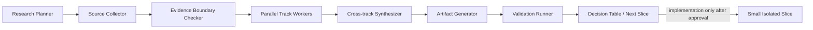

# Family Wide Research 内部 Skill 框架候选

> **文档性质：** 方法与接口框架候选，不是已注册/已启用的 Skill，不执行业务动作，不改变 Family 的代码、数据或治理状态。
>
> **目标：** 将 34 页 UI 的递归拆解、跨页血缘、子系统归并、证据边界与实施前研究变为可重复、可验证、可审阅的内部工作流。

## 1. Trigger：何时调用

当任务涉及下列任一情形时，应在编码前调用该框架。它不代替领域专家，也不把研究直接转换为生产功能；它的职责是先辨识能力边界、缺口与最小安全纵切。

| 触发情形 | 调用目的 | 预期结果 |
|---|---|---|
| 34 页 UI 首次拆解或新增清晰页面原图 | 将视觉暴露点登记为可追溯需求候选。 | Exposure Inventory。 |
| 一个 UI 入口指向其他页面 | 找到上游、下游、回流、对象和状态交接。 | Page Lineage Graph。 |
| 多个页面重复出现测评、计划、任务、服务、AI、报告或资产 | 判断是否应归并为共享子系统。 | Subsystem Coverage Map。 |
| 视觉稿、规格、代码、测试、外部研究之间不一致 | 明确冲突来源，不允许用任何单一材料覆盖全部事实。 | Conflicts / Gaps Register。 |
| 实现一个 L1/L2/L3 纵切之前 | 将功能候选转为对象、API、DB、Gate、测试和暂缓范围。 | Complete Feature Inventory + Implementation Roadmap。 |
| 发现儿童数据、AI/多模态、真人服务、支付、通知、日历、视频或公开传播 | 优先生成 Policy/HOLD 审查，不直接开发。 | HOLD / Human Gate Decision。 |
| 提交或推送前需要确认研究文档没有污染业务候选 | 核验 staged candidate 与报告文档的范围隔离。 | Git Isolation Evidence。 |

## 2. Inputs：标准输入契约

```yaml
research_scope:
  source_ui: UI-XX
  page_name: <页面名称>
  objective: <递归拆解/冲突裁决/实现前研究>
  recursion_depth: <本页、已确认上下游页、或完整闭环>
  execution_mode: research_only | design_only | implementation_precheck

source_files:
  visual_sources: [clear_ui_image, original_asset, ppt_page]
  flow_sources: [scenario_flow, page_matrix, route_manifest]
  governance_sources: [policy, consent, data_object_matrix, named_action]
  code_sources: [migration, contract, service, controller, test]
  external_sources: [authoritative_guidance_or_research]

ui_pages:
  current: [UI-XX]
  known_upstream: [UI-YY]
  known_downstream: [UI-ZZ]
  candidate_related: []

known_constraints:
  - tenant_family_scope_server_derived
  - real_family_child_data_hold
  - master_hold
  - no_real_payment_notification_booking_publish
  - model_gateway_required

evidence_rules:
  statuses: [VISIBLE, SPECIFIED, CODE_VERIFIED, EXTERNAL_EVIDENCE, HYPOTHESIS, IMPLICIT_PENDING_CONFIRMATION]
  self_material_ceiling: E1
  no_claim_promotion_without_evidence: true

isolation_rules:
  protected_staged_candidates: [UI-19 or current candidate]
  no_unrelated_git_add: true
  no_commit_or_push_without_validation: true
```

每个输入都必须有来源和用途。缺失的清晰原图、量表证据、模型策略、目标页或对象契约不能用经验补足；应进入 `NEEDS_CONFIRMATION` 或 `HOLD`。

## 3. Workflow：角色化工作流



| 节点 | 必做动作 | 禁止行为 | 产物 |
|---|---|---|---|
| **Research Planner** | 定义页面、递归深度、问题、约束、执行模式。 | 以“要写 API”为唯一目标；跳过 Policy/HOLD。 | Research Scope。 |
| **Source Collector** | 分别收集清晰视觉、规格、代码、数据、测试、外部证据。 | 从低清图补写小字；把 search snippet 当完整证据。 | Source Register。 |
| **Evidence Boundary Checker** | 给每个结论标记 `VISIBLE/SPECIFIED/CODE_VERIFIED/EXTERNAL_EVIDENCE/HYPOTHESIS`。 | 让视觉文案、模型输出、自家案例自证成功。 | Evidence / Uncertainty Log。 |
| **Parallel Track Workers** | 按页面区域、UI 页组、子系统、数据/API、Policy/HOLD 分轨研究。 | 将一个轨道的推测直接写成全局结论。 | Findings by Track。 |
| **Cross-track Synthesizer** | 去重、找冲突、生成上下游边与共享子系统。 | 按页面复制已有 Assessment/Journey/Task/Gateway。 | Lineage + Subsystem decisions。 |
| **Artifact Generator** | 生成标准表格、Capability Card、HOLD Register 和路线。 | 只生成散文或关系图而不落功能 inventory。 | 标准工程文档。 |
| **Validation Runner** | 核验 marker、统计、来源覆盖、Git 状态、staged 隔离；代码阶段再跑 DB/API/Web。 | 用混杂工作区证明候选提交通过。 | Validation Evidence Pack。 |

## 4. Parallel Tracks：推荐并行轨道

| 轨道 | 输入焦点 | 输出 | 关键反幻觉规则 |
|---|---|---|---|
| 页面区域 | Header、Hero、CTA、卡片、列表、状态、Footer。 | Exposure Inventory。 | 看不清的字标 `IMPLICIT_PENDING_CONFIRMATION`。 |
| 页面血缘 | source/target/return、闭环路径。 | Page Linkage edges。 | 没有页面或流程证据的 target_ui 不得编造。 |
| 子系统 | 对象、状态机、API、DB、权限、事件、测试。 | Subsystem Coverage Map。 | 重复出现的能力必须归并，不能按页复制。 |
| 数据 / API | migrations、DTO、service、controller、projection、Named Action。 | Coverage / Gap Map。 | 训练字段、mock 字段不是生产主数据。 |
| AI / 多模态 | ModelProfile、PromptPolicy、Input/Output Schema、Eval、Human Gate。 | Gateway / safety boundary。 | AI 只能解释/草稿/辅助判断，不直写 core ontology。 |
| Policy / HOLD | tenant/family、Consent、儿童、外部 effect、支付、真人。 | Gate / HOLD Register。 | 缺 consent/版本/资格即 fail-closed。 |
| 实施 / 验收 | L0–L4、最小纵切、测试命令、Git isolation。 | Roadmap / Evidence Pack。 | L1 不暗含 L4；未验证不提交。 |

## 5. Outputs：标准产物集合

| 产物 | 必含字段 | 用途 |
|---|---|---|
| **Exposure Inventory** | exposure_id、visible label、area、intent、evidence、subsystem、L0–L4、objects、Gate、HOLD。 | 把页面视觉转为能力候选。 |
| **Page Lineage Graph** | source_ui、target_ui、return_ui、flow、data/state handoff、mapping status。 | 描述页面之间真正交接什么。 |
| **Subsystem Coverage Map** | subsystem、覆盖 UI、对象/状态、API/DB、Agent/Skill、Adapter、Gate。 | 防止按页重复建设。 |
| **Complete Feature Inventory** | feature_id、来源/关联页、功能、L1 slice、对象、API/DB、Agent/Skill/Adapter、Gate、状态、验证。 | 形成可开发的平台功能 Backlog。 |
| **Implementation Roadmap** | L0–L4、优先级、依赖、范围、验证、HOLD。 | 组织可提交的最小纵切。 |
| **HOLD / NEEDS_CONFIRMATION Register** | 触发原因、证据缺口、解除条件、负责人/后续页。 | 使暂缓项不消失也不被偷渡实现。 |
| **Capability Card / Dynamic System Notes** | 需求来源、对象、流程、多模态、IT、验收。 | 形成页面完成后的长期工程记忆。 |

## 6. Validation：研究与实现后的核验

| 检查 | 命令或证据 | 通过标准 |
|---|---|---|
| Marker grep | `rg -n 'EXPOSURE|LINEAGE|COVERAGE|FEATURE|NEXT_TARGET|READY' reports/m2/frontend` | 页面、血缘、功能清单、下一目标和完成标记均存在。 |
| Git 研究文档状态 | `git status --short -- reports/m2/frontend` | 文档状态符合计划；未误加入业务候选。 |
| staged isolation | `git diff --cached --name-only`；`wc -l` | 受保护 staged candidate 文件数与范围未变化。 |
| m2 泄漏检查 | `git diff --cached --name-only | grep 'reports/m2/frontend'` | 未经独立文档切片审查时不得出现。 |
| HOLD / NEEDS 统计 | `READY + NEEDS_CONFIRMATION + HOLD = total` | 功能计数闭合；暂缓项不遗漏。 |
| source coverage | Source Register 对照 Exposure / Lineage | 每个关键结论有源或标为 Hypothesis。 |
| 实现阶段检查 | typecheck、focused PostgreSQL integration、Web test/build、cached patch clean apply | 验证的是 staged candidate，不是混杂工作区。 |

## 7. Safety Invariants：不可突破的语义规则

> **Perspective ≠ Fact。** 家庭、家长、孩子或服务者的观点、描述和选择不是客观事实。
>
> **Hypothesis ≠ Fact。** 研究假设、案例材料、模型候选和页面文案在被确认/验证前不是家庭事实。
>
> **Recommendation ≠ Decision ≠ Action。** 建议只能是候选；家庭明确选择后才是 Decision；合规 Named Action 成功且有审计后才是状态变更。

| 不变量 | 框架要求 |
|---|---|
| 不做 total score | 原图总分可作为静态视觉；不得动态产出或写入综合评分事实。 |
| 不做 ranking / benchmark | 不做同龄、同城、同班级、跨家庭比较、排行或画像。 |
| AI 不直接写核心 Ontology | 不得直写 Need、Intent、Plan、Case、Task、Outcome、标签或风险。 |
| Model Gateway 必经 | 模型、prompt、工具、schema、eval、审计、kill switch 必须可追溯。 |
| Human Gate 必经 | 儿童高风险、敏感内容、真人服务、外部 effect、支付、分享、视频/语音材料需明确人工门。 |
| Tenant → Family 双范围 | 所有私有读写由可信上下文派生 tenant/family，客户端不得覆盖。 |
| Consent fail-closed | 缺失、撤回、过期、用途不符或版本不明，必须停止。 |
| 外部 effect 明确隔离 | L4 Adapter 与 Human Gate 前不允许真实通知、预约占座、支付、发布、联系或分享。 |

## 8. 未来 Skill 化路线

该框架未来可演化为 `wide-ui-decomposition` 内部 Skill，但当前只固化为标准报告。正式 Skill 化前必须完成：

1. 使用 Skill Creator 工作流定义 `SKILL.md`、输入 schema、模板和版本号；
2. 由架构、隐私/安全、产品和质量角色审查上述不变量；
3. 用 UI-01 至 UI-05 至少五页递归样本验证模板完整性；
4. 验证其不会自动执行 Git add/commit/push、外部模型调用或业务写动作；
5. 定义变更控制、回滚、报告版本和实例化记录。

**完成标记：** `FAMILY_WIDE_RESEARCH_SKILL_FRAMEWORK_READY 50_开发_dev/reports/m2/frontend/FAMILY_WIDE_RESEARCH_INTERNAL_SKILL_FRAMEWORK_001.md`
