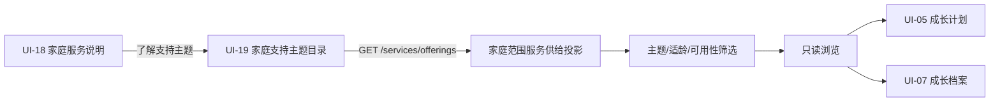

# UI-19 家庭支持主题目录 PDCA 001

## 本轮目标

本轮将 UI-18 的家庭服务说明连接至 UI-19 的**支持主题目录**。家长可以按服务主题、适龄范围和当前可用性了解家庭可探索的支持方向；浏览不等于预约、联系、报名、支付、通知或真人服务履约。孩子及家庭不会因为浏览目录被比较、排序、贴标签或自动匹配。

```text
ROUND=UI-19_FAMILY_SUPPORT_TOPIC_DIRECTORY
UPSTREAM=UI-18_FAMILY_SERVICE_SCOPE
UI_SCOPE=UI-18,UI-19
READ_MODEL=Family-scoped teacher/service supply projection
WRITE_SCOPE=NONE
EXTERNAL_EFFECT=NONE
```

## 用户需求与研究输入

家长在考虑家庭支持时，需要的是清晰、中性的主题说明和能够自己决定的浏览空间，而不是“系统最推荐什么”或“谁更好”的排序。Family Voices 将家庭中心服务描述为尊重家庭与专业人员伙伴关系、开放客观的信息分享，以及支持家庭作出选择和决定的做法。[1] CPIR 的资源中心也将信息、服务、最佳实践和系统导航作为面向家庭的资源类型，而非替家庭作决定。[2]

因此，UI-19 的用户界面应使用“家庭支持主题”“可以慢慢了解”“按家庭节奏查看”等表达。服务类型、适龄范围和当前可用性只是**浏览筛选条件**，不是服务质量、儿童需要程度或家庭优先级判断。服务提供者卡不显示“推荐名师”“已准入”“资格状态”“来源版本”等内部术语；仅呈现家庭可理解的主题、说明和可了解方式。

| 视角 | 本轮需要 | 本轮不做 |
|---|---|---|
| 家长 | 了解可探索的支持主题；按自己的情境筛选；知道浏览不产生安排 | 自动推荐、比较、外发联系、预约承诺 |
| 孩子 | 不被画像、比较或因家长浏览行为产生评价 | 适龄诊断、儿童数据展示、评分 |
| 家庭 | 保持共同决定节奏；可返回成长计划与家庭档案 | 自动匹配服务者、通知或外部履约 |
| 服务提供者 | 不因本轮浏览产生被联系、排期或收入承诺 | 联系方式公开、预约、视频、支付 |

## 现状复用与边界

现有 `teacher-supply-view.js` 已实现 UI-19 的家庭范围只读投影读取、服务类型/适龄范围/可用性筛选和空态。它向 `/families/{familyId}/orchestration/test-loop/services/offerings` 发起 GET 请求；客户端校验返回属于该家庭、属于教师类别，并保持 `external_effect=false`。本轮复用该读模型，不新增供给、排班、联系人、预约、通知、视频或支付写入。

原始 UI-19 名师专区视觉基线保持不变。动态目录位于原图之后，并将用户可见标题从“推荐名师”改为“家庭支持主题”；内部准入和资格校验仅保留在 API/客户端校验、审计和测试中。

## 数据关系与交互血缘



UI-19 的目录项目只产生阅读状态。筛选不创建核心对象；页面不含“预约”“联系”“报名”“支付”“发送”或“分享”动作。后续 UI-20 如需服务详情或预约，必须在独立轮次中审查具体 Named Action、同意、人工确认、审计和外部适配边界。

## 实现与验收

| 层级 | 本轮实现 | 验收重点 |
|---|---|---|
| 前端入口 | UI-18 服务说明增加“了解支持主题”入口 | 仅导航到 UI-19；不发起外部操作 |
| UI-19 呈现 | 产品化标题、自然说明、主题/适龄/可用性筛选、家庭空态 | 无推荐、排名、准入、资格、版本或工程术语 |
| 读取层 | 复用既有家庭范围只读服务供给投影 | family/tenant 范围、`external_effect=false`、不可跨家庭 |
| 回流 | 返回 UI-05 成长计划或 UI-07 成长档案 | 不触发预约或联系 |
| 测试 | 客户端、页面对象、接口读取与全量回归 | 筛选、空态、失败态、无写入、用户文案 |
| 视觉 | 原图保留，动态目录在原图之后 | 移动端层级、留白、前台无开发过程文案 |

## 参考资料

[1] [Family Voices: Family-Centered Care](https://familyvoices.org/familycenteredcare/)

[2] [Center for Parent Information and Resources](https://www.parentcenterhub.org/)

> 本轮仅将上述资料作为家庭中心信息架构与用户语言的设计输入，不将其外推为本产品的效果证明。

## 本轮完成条件

1. UI-18 至 UI-19 的入口仅导航，不提交预约、联系人、通知、支付或服务履约请求。
2. UI-19 的动态区域显示家庭支持主题，而不显示“推荐”“排名”“已准入”“资格”“版本”或开发过程词汇。
3. 主题、适龄范围和可用性筛选继续属于只读浏览。
4. UI-19 定向测试、Web/API 全量回归和移动端视觉复核通过。
5. 本轮文档与程序限定提交并推送后，才开始下一轮。

## 视觉复核准备与挂载结果

在 `teacher-zone` 路由以同一家庭测试投影挂载目录后，页面状态为 `READ_ONLY_READY`，并返回 `external_effect=false`。动态目录文本仅显示“亲子沟通支持”“支持主题：亲子沟通”“适龄参考：6-12岁”与“可以了解的方式：线上交流”；测试提供者名称及内部资格、准入状态均未进入用户卡片。

移动端复核显示：原始名师专区基线图完整保留，家庭支持主题目录紧随其后；主题/适龄/可用性筛选具有清晰的可点击区域。动态卡以主题、适龄参考和可了解方式呈现，未显示测试提供者姓名、推荐排序、准入状态、资格状态、预约、联系、支付或工程过程词汇。视觉与用户文案结论为：**通过。**

## 自动化与视觉验收

| 验证层级 | 命令 | 结果 |
|---|---|---|
| UI-19 前端定向 | `pnpm --filter @family/web exec vitest run src/test-loop.commerce-service.spec.ts src/test-loop.page-objects.spec.ts` | 2 个文件、28 个测试通过。 |
| UI-19 供给集成 | `pnpm --filter @family/api exec vitest run src/modules/orchestration/family-service-supply.integration.spec.ts` | 2/2 通过。 |
| Web 全量 | `pnpm --filter @family/web exec vitest run` | 14 个测试文件、98 个测试通过。 |
| API 全量 PostgreSQL | `pnpm --filter @family/api exec vitest run` | 52 个测试文件、273 个测试通过。 |

Web 全量测试仍出现 jsdom 对浏览器导航尚未实现的既有 stderr 提示；相关 `waf.spec.ts` 通过，未构成本轮行为回归。

## PDCA 本轮结论

**Plan**：将 UI-19 从供给者/推荐视觉转为家庭支持主题目录。**Do**：复用家庭范围只读供给投影、筛选和空态，新增 UI-18 入口，并将用户界面改为主题、适龄参考与可了解方式。**Check**：完成 API 供给集成、前端定向、Web/API 全量及移动端视觉复核。**Act**：保留提供者身份、准入/资格检查、家庭范围、服务同意和无外部效果校验于服务端、客户端校验和测试；UI-19 前台只承担家庭自主浏览。
