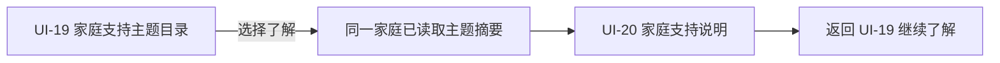

# UI-20 家庭支持说明 PDCA 001

## 本轮目标

本轮把 UI-19 的家庭支持主题浏览延伸至 UI-20 的**家庭支持说明页**。家长在 UI-19 选择一个已浏览主题后，可以阅读该主题的适龄参考、可了解方式与安排信息，并返回主题目录继续比较。页面不是专家评价、资质证明、服务者联系页，也不是预约、视频、支付或真人服务入口。

```text
ROUND=UI-20_FAMILY_SUPPORT_EXPLANATION
UPSTREAM=UI-19_FAMILY_SUPPORT_TOPIC_DIRECTORY
UI_SCOPE=UI-19,UI-20
READ_MODEL=Selected offering summary from family-scoped UI-19 projection
WRITE_SCOPE=NONE
EXTERNAL_EFFECT=NONE
```

## 用户需求与表达原则

家长在浏览支持主题后，需要的是对“这项支持大致是什么、适合怎样的家庭阶段、可以怎样进一步了解”的朴素说明，而不是把陌生服务者的评分、头衔或可约时间理解为对孩子的判断。Family Voices 强调开放、客观的信息分享和家庭参与决策；家庭中心服务应尊重家庭自身的优势、价值与节奏。[1] 因此，本页只说明已在 UI-19 可见的主题摘要；不呈现提供者身份、资质、评价、排序、收费或效果承诺。

| 用户 | 本轮获得 | 本轮不发生 |
|---|---|---|
| 家长 | 从主题卡进入一页可读说明；知道可以返回继续了解 | 自动匹配、自动安排、联系或预约 |
| 孩子 | 不因家长浏览被贴标签或被展示 | 儿童画像、诊断、评价或数据外发 |
| 家庭 | 可共同决定是否继续浏览其它主题 | 服务承诺、支付、通知或日历占位 |
| 服务提供者 | 不会因主题被浏览而收到任何请求 | 公开身份、被联系、排期或履约 |

## 数据血缘与动作边界



本轮只在前端会话中保存 UI-19 的已读取条目摘要。可展示字段限于 `title`、`service_type`、`age_band`、`next_available_channel`、`next_available_at`、`availability_status`。`provider_display_name`、`qualification_status`、`admission_status`、版本、来源、评分、评价以及一切内部元数据都不进入用户说明卡。

所有预约、联系、通知、视频、支付、评价发布和真人服务履约仍属于后续独立的 Named Action；本轮无写入和无外部效果。

## 实现与验收

| 层级 | 本轮实现 | 验收 |
|---|---|---|
| UI-19 | 每个支持主题增加“了解这个主题”导航 | 只在已读条目间传递摘要；不再请求或写入 |
| UI-20 | 原始详情基线后增加家庭支持说明卡和返回目录入口 | 无提供者、资质、评分、预约、联系、支付或工程术语 |
| 状态 | 无已选主题时仅保留原图；有主题时渲染说明 | 不伪造服务详情或真人承诺 |
| 测试 | UI-19→UI-20→UI-19 会话路径、字段白名单、无写入 | 请求总数不因导航增加 |
| 视觉 | 原图保留，说明卡置后 | 移动端层级和返回入口清晰 |

## 参考资料

[1] [Family Voices: Family-Centered Care](https://familyvoices.org/familycenteredcare/)

> 参考资料仅用于信息表达和家庭自主决策的设计输入，不构成任何主题、服务者或服务效果的评价。

## 本轮完成条件

1. UI-19 的主题卡仅能打开 UI-20 说明页，不创建预约、联系、通知或支付请求。
2. UI-20 动态卡仅使用 UI-19 已读取的白名单摘要字段。
3. 用户界面不展示提供者身份、资质、评价、排名、价格、效果或开发过程文案。
4. 定向测试、Web/API 全量回归和移动端视觉复核通过。
5. 本轮限定提交并推送后，才启动下一轮。

## 浏览器挂载验证

在 UI-19 页面挂载同一家庭主题投影并触发“了解这个主题”后，UI-20 说明卡状态为 `READY`。浏览器记录仅有一次 UI-19 目录 GET；进入 UI-20 未发起第二个请求，也没有任何写入请求。说明卡仅显示“亲子沟通支持”“支持主题：亲子沟通”“适龄参考：6-12岁”“可以了解的方式：线上交流”和返回目录入口；测试提供者身份、资格、准入、评价、预约、联系、支付与内部字段均未进入用户界面。
移动端复核显示：教师详情原始基线完整保留，家庭支持说明卡位于其后并有清晰留白。用户动态区域仅展示支持主题、适龄参考、可了解方式和返回目录入口；原图中的姓名、评分、服务量、好评率、评论、时间选择和预约按钮没有被动态解释或赋予事实含义。视觉与用户文案结论为：**通过。**

## 自动化与视觉验收

| 验证层级 | 命令 | 结果 |
|---|---|---|
| UI-19→UI-20 定向 | `pnpm --filter @family/web exec vitest run src/test-loop.teacher-supply.spec.ts src/test-loop.commerce-service.spec.ts` | 2 个文件、8 个测试通过。 |
| Web 全量 | `pnpm --filter @family/web exec vitest run` | 14 个测试文件、98 个测试通过。 |
| API 全量 PostgreSQL | `pnpm --filter @family/api exec vitest run` | 52 个测试文件、273 个测试通过。 |
| 浏览器复核 | UI-19 选择主题 → UI-20 说明 → 返回目录 | 仅发生一次目录 GET；无写入；动态卡和原图层级通过。 |

Web 全量测试仍出现 jsdom 对浏览器导航尚未实现的既有 stderr 提示；相关 `waf.spec.ts` 通过，未构成本轮行为回归。

## PDCA 本轮结论

**Plan**：让家庭在阅读主题后获得可理解的说明，而非进入专家比较或预约流程。**Do**：以会话摘要传递 UI-19 已读主题，UI-20 只呈现白名单字段并提供返回目录。**Check**：定向测试证实进入说明页不新增读取或写入；全量测试和移动端复核通过。**Act**：保留供给准入、范围和同意验证在 UI-19 读取层，UI-20 前台不显示提供者、资质、评价或任何工程治理词汇。
