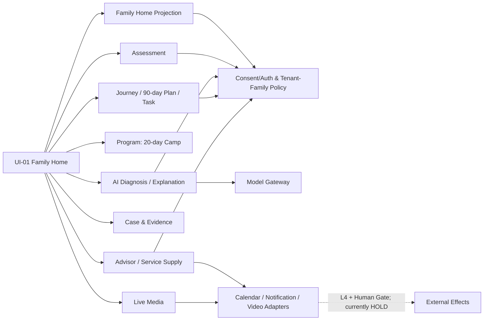
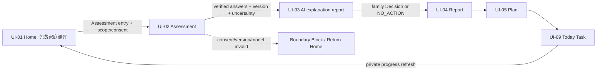
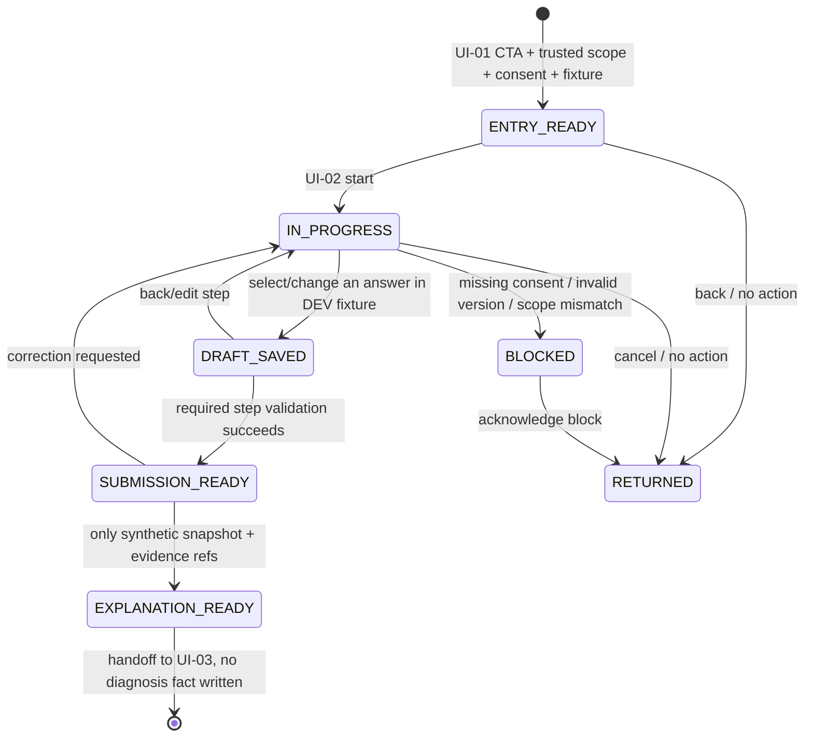
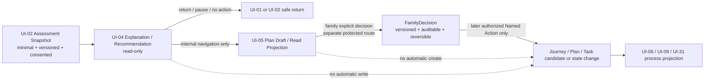
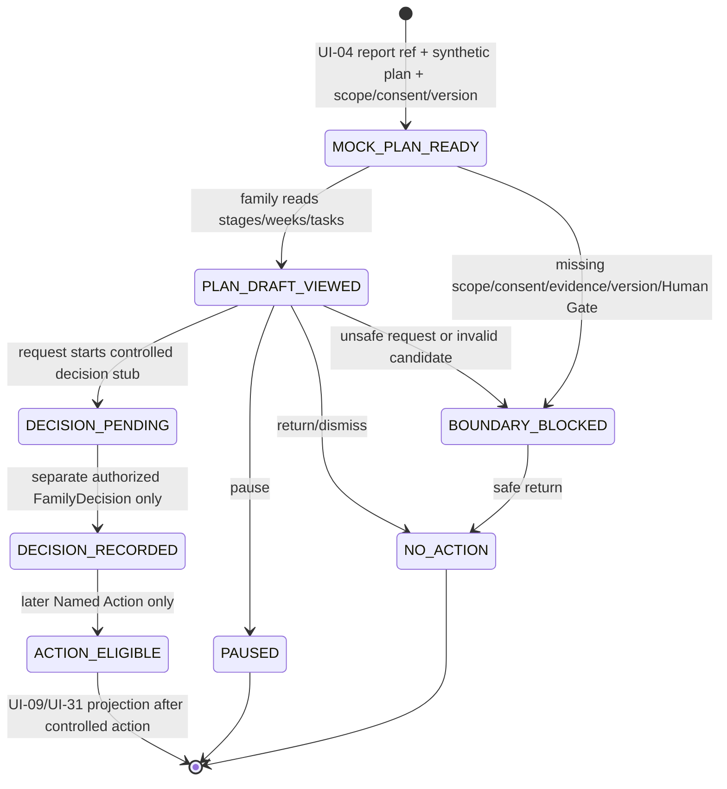

# UI-01 / F01 Family Home 全量 Exposure Point 与子系统拆解

> **状态：** 架构研究与需求拆解，不代表代码已实现。
>
> **范围：** UI-01 / F01 Family Home；以用户提供的首页截图、34 页 UI / PPT / 闭环规格和 Family V3 治理材料为证据。静态 UI 是**需求暴露入口**，不是需求、教育效果或生产能力本身。[1] [2]
>
> **UI-19 隔离声明：** 本报告不修改 UI-19 代码，也不进入当前 UI-19 的 staged candidate。UI-19 是下文 **Advisor / Service Supply** 子系统的一个已验证但仍待提交的 L1 页面切片。

## 1. 结论摘要

UI-01 不是“首页 + 七个快捷按钮”，而是 **Family Home Projection** 对至少 13 个平台子系统的编排入口。此次共登记 **46 个 Exposure Point**：其中 18 个来自用户清晰截图或清晰首页结构，17 个来自已存在的闭环/治理规格，11 个因首页下半屏小字、人物素材或具体控件尚未逐字确认而标为 `IMPLICIT_PENDING_CONFIRMATION`。后者是待验证的能力候选，不是实施承诺。

“免费家庭测评、AI诊断、20天挑战营、90天成长计划、成长案例、专家直播、家庭顾问”应分别落在 **Assessment、AI Diagnosis、Program Runtime、Journey/Task、Case/Evidence、Live Media、Service Supply** 系统中；它们共用 Family、Person、Consent、Evidence、Model Gateway 与 Home Projection，但不能互相越权。

| 动态等级 | 含义 | UI-01 的允许上限 |
|---|---|---|
| **L0** | 静态原图、文案、路由和视觉状态 | 复刻页面，不把文案当事实。 |
| **L1** | 家庭范围只读 projection / 解释 | 服务端派生 tenant/family；可显示空态、阻断态、版本和来源。 |
| **L2** | 草稿、候选、家庭确认 | AI 仅可生成解释草稿或候选；家庭确认前不创建核心事实。 |
| **L3** | Named Action 的受控私有状态变更 | 具备授权、consent、幂等、状态机、审计、撤回/暂停。 |
| **L4** | 受 Adapter + Human Gate 约束的外部 effect | 预约占座、通知、支付、日历、直播、视频、外发分享等；当前全部 HOLD。 |

## 2. Static UI Exposure → Capability / Subsystem Decomposition Method

每个静态页面先做“暴露点登记”，再做“需求解释”和“系统归属”，而不是直接把按钮接到 API。一个暴露点至少要回答以下问题：页面到底让谁在什么家庭成长场景下做什么；背后是 Feature、Workflow、Domain Object、AI Capability、Integration、Policy、Evaluation、Report 还是完整 Subsystem；其对象、状态机、权限、数据、审计和测试是否独立；以及它应该先停在 L1、L2、L3 还是 L4。

| 步骤 | 固定问题 | 判定产物 |
|---|---|---|
| 1. 暴露点识别 | 入口、按钮、卡片、标签、筛选、状态文案、报告、AI 提示、服务动作、空/错/权限态分别是什么？ | `Exposure Point`，并标记 `VISIBLE`、`SPECIFIED` 或 `IMPLICIT_PENDING_CONFIRMATION`。 |
| 2. 需求解释 | 它对应什么家庭教育实践、家庭成长需要、角色/场景/痛点？证据是 E1 实践素材、可追溯研究，还是待验证假设？ | `Demand Source Chain`；Hypothesis 与 Fact 分离。 |
| 3. 功能归类 | 这是单一功能、跨页流程、领域对象、AI 能力、外部集成、政策门、评估或报告吗？ | `Capability Type`。 |
| 4. 子系统判定 | 是否有独立对象、生命周期/状态机、API、存储、权限、审计、测试和运营边界？ | 满足则升格为 `Subsystem Candidate`。 |
| 5. 实现方式选择 | 可复用方法用 **Skill**；持续受控工作者用 **Agent**；有数据/API/状态/审计的业务能力用 **IT Subsystem**；有外部 effect 的边界用 **Adapter**。 | 主实现方式 + 辅助方式；任何 Agent 必经 Gateway/Policy。 |
| 6. 纵切分级 | 是否可先只读/解释，再草稿、Named Action、外部 effect？ | `L0 → L1 → L2 → L3 → L4` 路线。 |
| 7. 系统联动 | 与 Family、Person、GrowthProfile、Journey、Task、Evidence、Outcome、Consent、Model Gateway、Service Supply 的连接是什么？ | 对象关系与事件/投影边界。 |
| 8. 验收证据 | 哪些 API、DB、Web、浏览器、AI 安全、负向权限和 adapter 测试证明不是静态 mock？ | `Evidence Pack`；缺失即不得标记为动态化完成。 |

> **子系统判定规则。** 只要能力同时拥有独立领域对象、状态生命周期、读/写契约、权限/consent、持久化或事件、以及独立测试证据，就不能再被视为“首页小功能”，应作为平台子系统建设。

## 3. UI-01 全页面 Exposure Point Inventory

### 3.1 Header

| ID | 标签 / 可见文本 | 证据状态 | 用户意图 / 家庭成长需求 | 能力类型与候选子系统 | 主实现 | L0 → L4 | 最小 L1 | 连接对象 | Policy / HOLD |
|---|---|---|---|---|---|---|---|---|---|
| UI01-01 | 首页 / Family Home | VISIBLE | 回到家庭私有总览和今日行动 | Feature；**Family Home Projection** | IT Subsystem | 原图→家庭投影→解释草稿→私有动作→无外部 effect | `GET /families/:familyId/home` 的私有 DTO | Family, Person, Membership, Consent | `ReadFamily`；禁止跨家庭。 |
| UI01-02 | 当前家长 / principal 身份 | SPECIFIED | 知道当前谁在操作 | Policy；**Identity & Principal Runtime** | IT Subsystem | 视觉→可信 actor 投影→确认→受控角色动作→无 | 只读 actor/role | Principal, Person, Membership | 客户端不得提交 actor/role。 |
| UI01-03 | 家庭 / 孩子上下文或切换器 | IMPLICIT_PENDING_CONFIRMATION | 了解当前页面服务哪个家庭/成员 | Domain Context；**Family/Person Context** | IT Subsystem | 占位→私有成员投影→家庭确认→受控选择→无 | Family 内只读 Person/LifeStage | Family, Person, Relationship, Consent | 儿童直接输入、真实画像 HOLD。 |
| UI01-04 | tenant / family 范围状态 | SPECIFIED | 防止错误家庭或租户数据出现 | Policy；**Tenant–Family Scope Gate** | IT Subsystem | 不可见内核→可信 scope→确认→动作守卫→无 | 服务端派生 scope 的 projection | TenantPolicy, Family, Membership | 未绑定、过期、错租户 fail-closed。 |
| UI01-05 | consent / 服务授权状态 | SPECIFIED | 了解为什么有些入口不可用 | Policy；**Consent & Purpose Gate** | IT Subsystem | 文案→只读 consent→确认/撤回→动作门控→外部必过 Gate | `purpose / expires_at / visibility` 只读状态 | Consent, PolicyVersion | 撤回即停止下游；不得静默降级。 |
| UI01-06 | 顶部导航与返回 / NO_ACTION | SPECIFIED | 在核心闭环间安全移动或退出 | Workflow；**Navigation & Safe Exit** | IT Subsystem | 路由→投影→确认→受控回流→无 | 显式 route + `RETURN_HOME/NO_ACTION` | Journey, Task, EventEnvelope | NO_ACTION 不创建 Plan/Task/Booking/Reminder。 |

### 3.2 Hero 与 Primary CTA

| ID | 标签 / 可见文本 | 证据状态 | 用户意图 / 家庭成长需求 | 能力类型与候选子系统 | 主实现 | L0 → L4 | 最小 L1 | 连接对象 | Policy / HOLD |
|---|---|---|---|---|---|---|---|---|---|
| UI01-07 | 免费家庭测评 Hero | VISIBLE | 低门槛地理解家庭当前需要 | Workflow；**Family Assessment System** | IT Subsystem | Hero→测评说明/适用范围→草稿→受控会话→无外部 | 测评说明 + 入口资格/consent 检查 | Family, Person, Consent, AssessmentSession | 不等于诊断；真实家庭数据/量表结论 HOLD。 |
| UI01-08 | Hero 主文案的能力承诺 | VISIBLE | 理解该入口可解决什么问题 | Report / Policy；**Claim & Evidence Registry** | Skill + IT Subsystem | 文案→证据标签→解释→人工批准→外发 HOLD | 文案附 Evidence Grade/适用范围 | EvidenceSource, ContentVersion | 禁止“保证改善”“精准诊断”等无证据承诺。 |
| UI01-09 | 立即测评 CTA | VISIBLE | 开始测评流程 | Named Entry；**Assessment Orchestrator** | IT Subsystem | 路由→测试会话→家庭确认→Named Action→无 | DEV/TEST `start_assessment` 的受控入口 | AssessmentSession, Journey, AuditEvent | 可信 scope、fixture、consent 缺失即 block。 |
| UI01-10 | AI 诊断 / 报告预期 | VISIBLE | 寻求解释和下一步问题 | AI Capability；**AI Diagnosis Subsystem** | IT Subsystem + Agent | 占位→解释 projection→草稿→Human-confirmed action→外部 HOLD | 合成快照的“事实/缺口/解释”只读卡 | Evidence, ExplanationDraft, ModelGateway | 不做医学/心理/教育诊断；不评分、不风险标签。 |
| UI01-11 | Hero 阻断 / 退出文案 | SPECIFIED | 在不可用时理解边界并安全退出 | Policy；**Boundary & Block State** | IT Subsystem | 文案→block projection→确认退出→审计→无 | `CONSENT_REQUIRED / CONTEXT_BLOCKED` 文本等价 | Consent, TenantPolicy, FixtureVersion | 不回退匿名或真实数据。 |

### 3.3 Feature Cards：七个明确入口

| ID | 标签 / 可见文本 | 证据状态 | 用户意图 / 家庭成长需求 | 能力类型与候选子系统 | 主实现 | L0 → L4 | 最小 L1 | 连接对象 | Policy / HOLD |
|---|---|---|---|---|---|---|---|---|---|
| UI01-12 | 家庭测评 | VISIBLE | 主动理解家庭需要 | Subsystem；**Family Assessment System** | IT Subsystem | 卡片→说明→结果草稿→会话动作→无 | 只读测评目录/入口状态 | Family, Person, Consent, Assessment | 未验证量表/自由文本/真实事实写入 HOLD。 |
| UI01-13 | AI诊断 | VISIBLE | 获得可追溯解释，而非被机器判定 | Subsystem；**AI Diagnosis & Explanation** | IT Subsystem + Agent | 卡片→已验证解释→草稿→Human Gate 后动作→外部 HOLD | Gateway 输出的 facts/uncertainty/questions | Evidence, PromptPolicy, ModelGateway | 模型不得写 Need/Plan/Outcome。 |
| UI01-14 | 20天挑战营 | VISIBLE | 以短周期家庭实践开始行动 | Workflow；**Challenge/Camp Program Runtime** | IT Subsystem + Skill | 卡片→日程/内容只读→加入草稿→Enrollment action→通知/交付 HOLD | Day 1 内容、时长、检查点和“日程非完成度” | Program, ProgramDay, ContentAsset, Consent | 20 天不等于成长改善；真实 enrollment/支付/提醒 HOLD。 |
| UI01-15 | 90天成长计划 | VISIBLE | 了解较长期阶段路径 | Subsystem；**Growth Plan / Journey** | IT Subsystem | 卡片→计划只读→候选计划→`DecideGrowthService`→外部服务 HOLD | 已确认家庭的 Journey/Plan 只读 projection | JourneyTemplate, Plan, TaskTemplate, FamilyDecision | 不能自动创 Plan/Case/Task；须家庭明确 Decision。 |
| UI01-16 | 成长案例 | VISIBLE | 浏览可参考的过程材料 | Content / Evidence；**Case Library** | IT Subsystem | 卡片→案例目录→解释/收藏草稿→私有动作→外发 HOLD | Evidence Source / case 摘要只读 | CaseAsset, EvidenceSource, OutcomeProcess | 自家案例至多 E1；不可自证有效/可复制。 |
| UI01-17 | 专家直播 | VISIBLE | 发现经准入的专家内容或活动 | Content / Integration；**Live Session & Media** | IT Subsystem + Adapter | 卡片→活动目录→报名草稿→受控 registration→视频/通知 HOLD | 准入 Activity/Provider 只读卡 | Provider, Qualification, Activity, ResourceAsset | 不开真人直播、实时互动、外部报名或支付。 |
| UI01-18 | 家庭顾问 | VISIBLE | 理解可用的顾问/服务支持 | Subsystem；**Advisor / Service Supply** | IT Subsystem | 卡片→供给 projection→咨询草稿→Booking action→日历/通知/真人 HOLD | TEACHER/顾问已准入供给只读 | Provider, Offering, Slot, Consent | UI-19 L1 是此系统的第一个页面样板；不得联系真人。 |

### 3.4 Growth Journey

| ID | 标签 / 可见文本 | 证据状态 | 用户意图 / 家庭成长需求 | 能力类型与候选子系统 | 主实现 | L0 → L4 | 最小 L1 | 连接对象 | Policy / HOLD |
|---|---|---|---|---|---|---|---|---|---|
| UI01-19 | 当前成长旅程 | SPECIFIED | 知道家庭位于何处、可回到哪里 | Projection；**Growth Journey System** | IT Subsystem | 标签→私有旅程→解释→Decision→外部服务 HOLD | 当前 Journey 状态/版本/来源 | Journey, Plan, Consent | `as_of/source_refs/visibility` 必备。 |
| UI01-20 | 阶段 / 90 天进度 / 周计划 | SPECIFIED | 了解阶段结构和后续安排 | Projection；**Plan & Stage Runtime** | IT Subsystem | 视觉→只读阶段→草稿调整→Named Action→提醒 HOLD | 阶段、周计划和进度只读 | JourneyTemplate, Plan, TaskTemplate | 数字不等于效果或能力评分。 |
| UI01-21 | 今日行动 | VISIBLE | 找到当日最小可执行行动 | Workflow；**Today Action / Task System** | IT Subsystem | 卡片→任务 projection→动作候选→`COMPLETE/PAUSE`→通知 HOLD | 家庭私有 OPEN task 列表 | TaskInstance, Journey, Consent | 任务变更须幂等、可暂停/取消。 |
| UI01-22 | 任务状态 / 完成度 | SPECIFIED | 看见 OPEN、COMPLETED、PAUSED、CANCELLED | Domain State；**Task State Machine** | IT Subsystem | 文案→只读状态→确认→Named Action→无 | projection + row version | TaskInstance, AuditEvent | 未完成不可成为惩罚、排名或推荐依据。 |
| UI01-23 | 暂停 / 恢复 / 安全退出 | SPECIFIED | 保持家庭自主决定与可退出 | Policy / Workflow；**Journey Control** | IT Subsystem | 文案→状态→确认→Named Action→外部 HOLD | PAUSED/NO_ACTION 读回 | Journey, Task, Consent, Event | 暂停后不得自动提醒、自动推进或联系真人。 |

### 3.5 Insight：家庭摘要、档案与洞察

| ID | 标签 / 可见文本 | 证据状态 | 用户意图 / 家庭成长需求 | 能力类型与候选子系统 | 主实现 | L0 → L4 | 最小 L1 | 连接对象 | Policy / HOLD |
|---|---|---|---|---|---|---|---|---|---|
| UI01-24 | 家庭摘要 | SPECIFIED | 看见本家庭当前私有概览 | Projection；**Family Home Projection** | IT Subsystem | 壳→私有 DTO→解释→受控家庭动作→无 | FamilyHomeProjection | Family, Membership, Consent | 不显示真实数据给未授权主体。 |
| UI01-25 | 孩子年龄 / LifeStage | IMPLICIT_PENDING_CONFIRMATION | 理解家庭成员阶段背景 | Domain Projection；**Person & LifeStage** | IT Subsystem | 占位→只读 stage→说明草稿→家庭确认→无 | Person/LifeStage 私有投影 | Person, Relationship, Consent | 不推断能力、风险或儿童画像。 |
| UI01-26 | 当前关注 / 家庭需要 | SPECIFIED | 了解家庭已明确表达的问题 | Workflow；**Need / Intent Orchestration** | IT Subsystem | 文案→Need/Intent 只读→确认→Named Action→服务 HOLD | 已确认 Need/Intent 摘要 | NeedInput, NeedSignal, Intent | 模型和页面不得自动推断 Need。 |
| UI01-27 | 最近变化 / 时间线 | IMPLICIT_PENDING_CONFIRMATION | 回顾过程状态而非评判结果 | Report / Timeline；**Private Process Timeline** | IT Subsystem | 占位→私有事件→解释→撤回/修正→外发 HOLD | 任务、报告、服务记录时间线 | Task, Report, ServiceRecord, Event | 过程不等于 Outcome；无效果断言。 |
| UI01-28 | 家庭洞察 | IMPLICIT_PENDING_CONFIRMATION | 获得有出处的不确定性说明 | AI Capability；**Growth Insight** | Agent + IT Subsystem | 占位→Gateway 解释→草稿→Human/Family Gate→无 | 最小快照的解释卡 | HomeProjection, Evidence, ModelGateway | 禁止诊断、预测、标签和核心事实写入。 |

### 3.6 Services

| ID | 标签 / 可见文本 | 证据状态 | 用户意图 / 家庭成长需求 | 能力类型与候选子系统 | 主实现 | L0 → L4 | 最小 L1 | 连接对象 | Policy / HOLD |
|---|---|---|---|---|---|---|---|---|---|
| UI01-29 | 服务供给 / 推荐服务 | VISIBLE | 查看对本家庭可见的候选服务 | Subsystem；**Service Supply / Provider** | IT Subsystem | 卡片→供给投影→解释→Booking action→外部 HOLD | 已准入 Provider→Offering→Slot projection | Provider, Offering, Qualification, Slot | 强制 tenant/family/consent；不做“最佳”排序。 |
| UI01-30 | 服务者资格 / 可用时段 | SPECIFIED | 理解资格、状态和可用性 | Domain Projection；**Provider Eligibility** | IT Subsystem | 文案→资格/时段→说明→预约草稿→日历 HOLD | qualification/admission/next slot 摘要 | ProviderQualification, Slot, Consent | 未知资格或 consent 时 fail-closed。 |
| UI01-31 | 顾问 / 班主任 / 专家角色卡 | IMPLICIT_PENDING_CONFIRMATION | 理解服务角色而非自动接入真人 | Feature；**Role/Provider Presentation** | IT Subsystem | 静态→准入角色说明→草稿→服务动作→真人 HOLD | 合格服务者的只读介绍 | Provider, Qualification, Evidence | 不派单、不展示联系方式、不真人咨询。 |
| UI01-32 | 预约 / 咨询 / 联系 / 提醒 | IMPLICIT_PENDING_CONFIRMATION | 在未来表达服务意图 | Workflow / Integration；**Booking & Contact Boundary** | Adapter + IT Subsystem | 占位→可用性只读→booking draft→Named Action→日历/通知/视频 HOLD | 无写入的“当前不开放”或可用性说明 | Booking, ServiceRecord, Consent, Adapter | 真实占座、通知、电话、视频和客服 HOLD。 |
| UI01-33 | 我的服务 / 服务记录回流 | SPECIFIED | 回看家庭私有服务过程 | Projection；**Service Timeline** | IT Subsystem | 卡片→私有记录→解释→取消/撤回→外发 HOLD | ServiceRecord/Booking 只读 projection | ServiceRecord, Booking, Activity | 仅私有过程记录；不作服务效果结论。 |

### 3.7 Content

| ID | 标签 / 可见文本 | 证据状态 | 用户意图 / 家庭成长需求 | 能力类型与候选子系统 | 主实现 | L0 → L4 | 最小 L1 | 连接对象 | Policy / HOLD |
|---|---|---|---|---|---|---|---|---|---|
| UI01-34 | 推荐内容 / 内容卡 | VISIBLE | 发现可浏览的资源或服务说明 | Catalog；**Resource / Content Discovery** | IT Subsystem | 卡片→准入目录→解释→明确选择→购买/报名 HOLD | admitted catalog 只读 | ResourceAsset, EvidenceSource, Intent | 不以推荐暗示适配或教育效果。 |
| UI01-35 | 成长案例库 / 详情 / 证据等级 | VISIBLE + SPECIFIED | 了解案例背景、过程、来源与局限 | Subsystem；**Case Library & Evidence** | IT Subsystem | 卡片→案例投影→证据说明→私有收藏→外发 HOLD | case summary + evidence grade | CaseAsset, EvidenceSource, OutcomeProcess | E1 自有材料不得自证；不可公开儿童数据。 |
| UI01-36 | 专家直播 / 回放 | VISIBLE | 发现活动内容或回看资源 | Integration；**Live Session & Media** | Adapter + IT Subsystem | 卡片→活动/媒体目录→报名草稿→受控 registration→视频 HOLD | 活动/媒体 metadata 只读 | Activity, Provider, ResourceAsset | 无真实流、评论、互动、观看画像。 |
| UI01-37 | 内容详情 / 返回 / 内容事件 | SPECIFIED | 查看来源并安全回流 | Workflow；**Content Read & Event** | IT Subsystem | 路由→详情 projection→家庭选择→无写入→外发 HOLD | `content_viewed` 最小事件 | Content, Evidence, EventEnvelope | 浏览不得自动建 Task/Plan/Reminder。 |

### 3.8 AI 与多模态

| ID | 标签 / 可见文本 | 证据状态 | 用户意图 / 家庭成长需求 | 能力类型与候选子系统 | 主实现 | L0 → L4 | 最小 L1 | 连接对象 | Policy / HOLD |
|---|---|---|---|---|---|---|---|---|---|
| UI01-38 | AI 解释 / 助手入口 | VISIBLE + SPECIFIED | 请求对已验证家庭事实的说明 | Agent；**Explanation Agent** | Agent + Model Gateway | 图标→解释 projection→草稿→Human/Family confirmed action→外部 HOLD | 合成快照的解释草稿 | ModelProfile, PromptPolicy, EvalSuite, Evidence | Gateway allowlist、schema validation、audit、kill switch。 |
| UI01-39 | 文本问题输入 | IMPLICIT_PENDING_CONFIRMATION | 补充自身问题或表达意图 | Multimodal Intake；**Text Intake Adapter** | Adapter | 占位→枚举/最小输入→草稿→确认→无 | 受控 enum 或测试文本 | NeedInput, Consent, Context | 自由文本不得直接写本体，不进入训练。 |
| UI01-40 | 图片 / 语音 / 文件 / 视频输入 | IMPLICIT_PENDING_CONFIRMATION | 提交材料以获得解释辅助 | Multimodal Intake；**Media Intake Gateway** | Adapter + Model Gateway | 占位→文件校验→解释草稿→Human Gate→外部 HOLD | DEV fixture 文件的 metadata + block state | MediaAsset, Consent, Gateway | 真实儿童材料、证照、视频/语音进入 Human Gate；不训练、不自动落事实。 |
| UI01-41 | 模型阻断 / 人工交接 | SPECIFIED | 在高风险或证据不足时获得安全停止 | Policy；**Model Gateway & Human Gate** | IT Subsystem | 文案→block projection→人工队列草稿→授权动作→外部 HOLD | `BOUNDARY_BLOCKED` / `HUMAN_REVIEW_REQUIRED` | Consent, Policy, HumanHandoff, Audit | 诊断、儿童高风险、真人服务、外部发出必须显式 Gate。 |

### 3.9 Footer / Others：回流、全局状态、报告与记录

| ID | 标签 / 可见文本 | 证据状态 | 用户意图 / 家庭成长需求 | 能力类型与候选子系统 | 主实现 | L0 → L4 | 最小 L1 | 连接对象 | Policy / HOLD |
|---|---|---|---|---|---|---|---|---|---|
| UI01-42 | 首页 tab | VISIBLE | 重新加载家庭私有首页 | Feature；**Home Navigation** | IT Subsystem | 路由→投影→无→无→无 | Home route + projection | FamilyHomeProjection | 仅家庭私有读取。 |
| UI01-43 | 社群 tab | VISIBLE | 发现家庭互动/内容入口 | Subsystem；**Private Community** | IT Subsystem | 图标→私有合成 feed→草稿→受控 publication→外发 HOLD | private synthetic read-only feed | CommunityTemplate, Consent | 禁止公开社区、外发、跨家庭画像。 |
| UI01-44 | 商城 tab | VISIBLE | 浏览准入资源/产品目录 | Subsystem；**Admitted Catalog / Commerce Boundary** | IT Subsystem | 图标→目录→选择意图→测试操作→支付 HOLD | admitted catalog projection | ProductOffering, ResourceAsset, Entitlement | 不启用真实购买、积分、支付、履约。 |
| UI01-45 | 我的 tab | VISIBLE | 回看私有服务、计划、资产和档案 | Projection；**Customer / Family Private Space** | IT Subsystem | 图标→投影→解释→私有动作→外部 HOLD | CustomerAsset/Profile/Service 投影 | Membership, ServiceRecord, Profile | 真实权益、订单、商业化 HOLD。 |
| UI01-46 | 加载 / 空态 / 错误 / 权限 / consent 缺失 / 报告与记录入口 | SPECIFIED | 知道数据是否可用、为何不可用、可回看哪些私有过程 | Policy + Report；**Experience State & Evidence Pack** | IT Subsystem | 静态→状态 projection→解释→撤回/暂停→外部 HOLD | `EMPTY / FIXTURE_UNAVAILABLE / CONTEXT_BLOCKED / CONSENT_REQUIRED` | ProjectionMetadata, ReportSnapshot, Event, Consent | 缺少版本、来源、范围或同意时 fail-closed；报告/记录不等于 Outcome。 |

## 4. 子系统地图

| 子系统 | UI-01 暴露点 | 主要对象 / 状态 | 主实现方式 | 当前基座 / 后续边界 |
|---|---|---|---|---|
| Family Home Projection | 01, 19, 24, 42, 46 | Family, Person, Membership, Consent, projection metadata | **IT Subsystem** | UI-01 当前最适合的 L1 入口；只读。 |
| Assessment | 07, 09, 12 | AssessmentSession, QuestionSet, Answer, Consent | **IT Subsystem** | 先说明/会话；量表效度、真实作答和结论需要独立证据与 Gate。 |
| AI Diagnosis | 10, 13, 38, 41 | Evidence, ExplanationDraft, ModelPolicy, HumanReview | **IT Subsystem + Agent** | 用“解释/不确定性/下一步问题”替代自动诊断。 |
| Challenge/Camp | 14 | Program, ProgramDay, Enrollment, Checkpoint | **IT Subsystem + Skill** | 20 天只是 Program 配置；真实 enrollment/提醒/支付 HOLD。 |
| Growth Plan/Journey | 15, 19–23 | Journey, Plan, Decision, Task | **IT Subsystem** | 家庭 Decision 前只读；状态机与撤回不可省略。 |
| Today Action/Task | 21–23 | TaskTemplate, TaskInstance, AuditEvent | **IT Subsystem** | UI-09 是可复用的受控任务样板。 |
| Case Library & Evidence | 16, 35 | CaseAsset, EvidenceSource, ProcessRecord | **IT Subsystem** | E1 实践素材上限；不得成为效果自证。 |
| Live Session & Media | 17, 36 | Activity, MediaAsset, Provider, AdapterState | **Adapter + IT Subsystem** | 当前只读发现；视频、直播、互动、报名、通知 HOLD。 |
| Advisor / Service Supply | 18, 29–33 | Provider, Qualification, Offering, Slot, Booking, ServiceRecord | **IT Subsystem** | **UI-19 L1 已完成 staged candidate**；UI-20–24 后续独立。 |
| Growth Insight/Profile | 25–28 | LifeStage, Need, Intent, ReportSnapshot, Evidence | **IT Subsystem + Agent** | 只读家庭事实 + Gateway 解释；不做标签/评分。 |
| Consent/Auth & Policy | 02–06, 11, 41, 46 | Principal, Membership, Consent, TenantPolicy | **IT Subsystem** | 所有读写的共同门；服务端派生 scope。 |
| Model Gateway | 10, 13, 28, 38–41 | ModelProfile, PromptPolicy, ToolDefinition, EvalSuite | **IT Subsystem** | 草稿、schema、audit、kill switch；禁止直接业务写入。 |
| Notification / Calendar / Video Adapter | 17, 32, 36 | AdapterState, Booking, EventRegistration | **Adapter** | 生产同构边界存在，但真实 effect 一律 HOLD。 |



## 5. 需求来源与证据边界

> **Demand Source Chain：** `Family Education Practice → Family Growth Need → Role / Scenario / Pain Point → Evidence / Research / Example Practice → Requirement Understanding → Requirement Split → Implementation Slice → Validation Evidence`。

家庭中心实践提供的不是“系统可以替家庭作决定”的依据，而是应尊重家庭价值、支持知情选择、在证据有限时谨慎说明不确定性的设计方向。[3] [4] 因此 UI-01 的“AI诊断”“成长计划”“家庭顾问”等文案必须降解为：已验证事实的解释、证据缺口的明示、家庭可拒绝的候选与受控升级路径。任何有关改善、风险、适配、专家优劣或儿童结果的命题，在有适用人群、证据等级、局限和复核机制前，都只能是 Hypothesis。

| 证据等级 | 在本报告中的用途 | 禁止升级为 |
|---|---|---|
| **V：视觉证据** | 证明某个入口/卡片/导航在原图上可见。 | 真实对象、真实服务、教育效果。 |
| **S：规格证据** | 证明已有流程、对象或治理边界被定义。 | 生产开通、真实数据授权。 |
| **E1：自家实践素材** | 形成案例、内容或需求假设。 | 成效自证、推荐排序或因果结论。 |
| **E2+：可追溯外部研究/标准** | 约束设计原则、适用范围和风险。 | 对单个家庭的自动结论。 |

## 6. 第一批纵切优先级

| 优先级 | 纵切 | 原因 | 交付上限 | 明确不做 |
|---|---|---|---|---|
| **P0-1** | **UI-01 Family Home Projection：家庭摘要 + 当前 Need/Intent + 今日任务 + 空/权限/consent 状态** | 它为 UI-01 其余入口提供统一 tenant/family scope、Consent、版本、来源与安全停止；能把首页从原图变成真实私有读模型，但不涉及高风险 AI 或外部动作。 | L1 只读 projection + Web route smoke + API/DB/负向授权证据。 | 不创建 Plan/Task/Booking，不做真人服务、不做外部通知。 |
| **P0-2** | **Assessment Explanation Entry：测评适用范围 + 固定选项会话 + Gateway 解释草稿 + NO_ACTION** | 它连接 UI-01 → UI-02/UI-03 的核心需求理解路径，同时可验证 Model Gateway、consent、证据缺口、Human Gate 和禁止诊断边界。 | L1 只读/说明，L2 合成草稿；可复用现有 DEV fixture/Gateway。 | 真实量表结论、儿童直接作答、心理/教育诊断、自动生成 Need/Plan。 |
| P1 | UI-01 Today Action 汇总 | 复用已存在 Task/Page Objects，形成首页回流。 | L1 任务投影；后续 L3 仅复用现有受控动作。 | 新任务引擎、提醒/奖惩/排名。 |
| P1 | UI-01 Case/Evidence Library | 将案例从营销叙述变成来源可追溯的内容。 | L1 准入案例与证据等级。 | 效果承诺、公开案例、儿童隐私。 |
| P2 | UI-01 Advisor/Service Supply 入口 | 直接连接 UI-19 已完成的供给投影。 | L1 只读入口及跨页导航。 | UI-20–24、真人咨询、预约、联系、提醒。 |
| HOLD | Live、支付、外发、日历、通知、视频、专家实时互动 | 都涉及真实外部 effect 与高风险数据/真人边界。 | 无。 | 任何 L4 启动。 |

## 7. 验收与交付规则

一个 UI-01 暴露点只有同时通过以下检查才能称为“动态能力”，而不是静态 mock：

1. **契约证据：** DTO 明确，不允许客户端提交 tenant、family、actor、资格、模型或外部地址。
2. **数据证据：** 真实 PostgreSQL 的受控表/投影、版本、来源、可见性、`as_of` 与有效期可追溯。
3. **安全证据：** wrong tenant/family、缺权限、Consent 缺失/撤回、过期投影、未验证模型输出均 fail-closed。
4. **状态机证据：** 每个写动作有 Named Action、幂等、审计、暂停/取消/撤回；没有写动作时明确只读。
5. **AI 证据：** Gateway、schema validation、prompt/tool allowlist、eval、审计和 kill switch；AI 输出不写核心 ontology。
6. **前端证据：** 原图入口/文案等价、加载/空/错/权限态、真实 API contract、无未授权 POST 或 external effect。
7. **外部集成证据：** Adapter 可替换，DEV/TEST `external_effect=false`；生产外呼仅在人审和独立 Gate 后讨论。

## 8. 当前隔离状态

- UI-19 Service Supply 仍是独立的 11 文件 staged candidate，已完成 API、PostgreSQL、Web、build 与干净 worktree patch 验证，**等待用户确认后才提交/推送**。
- 本报告是新的、未暂存的 UI-01 架构文档；它不改变 UI-19 的 staged 内容，也不代表 UI-01 代码已经开始。
- 对 UI-01 首页下半屏小字、人物/海报素材和未确认控件，应继续遵守 `IMPLICIT_PENDING_CONFIRMATION`：先取得清晰单页或原始设计资产，再把候选升级为可编码需求。[1]

## References

[1]: `../../../governance/BANGYANG_18_UI_TRANSCRIPTION_REVIEW_AND_UNCERTAINTY_001.md` — 首页清晰图确认范围、低清小字与素材待确认项、语义冲突处理。

[2]: `../../../governance/FAMILY_34_UI_MASTER_DATA_API_NAMED_ACTION_MAPPING_V1.md` — UI-01 以及关联页面的对象、API、Named Action、投影与禁止边界。

[3]: `../../../governance/BANGYANG_34_UI_SCENARIO_FLOWS_AND_RULES_001.md` — DEV/TEST 受控闭环、Consent、Gateway、NO_ACTION 与外部副作用限制。

[4]: https://www.aap.org/en/practice-management/providing-patient--and-family-centered-care/shared-decision-making/ — American Academy of Pediatrics, *Shared Decision Making*；家庭价值、偏好与证据有限时的谨慎原则。

[5]: https://www.unesco.org/en/articles/guidance-generative-ai-education-and-research — UNESCO, *Guidance for Generative AI in Education and Research*；教育场景中以人为中心、隐私和治理的设计要求。

[6]: https://www.nist.gov/publications/artificial-intelligence-risk-management-framework-generative-artificial-intelligence — NIST, *Generative AI Profile*；生成式 AI 风险识别、治理和人类监督参考。


---

## 9. 34 UI Linkage Map

### 9.1 Iterative Page Lineage Analysis

UI 不是孤立页面；一个入口指向下一页，只证明它存在一次**页面级承接**，并不说明目标页的全部功能、对象、状态机、AI 边界或外部 effect 已被拆清。故本项目采用递归血缘工作法：

```text
UI-01 Exposure Inventory
  → 识别 target_ui / return_ui
  → 拆 target_ui 的全页面 Exposure Inventory
  → 为 target_ui 每个暴露点标记 lineage_type
  → 继续发现 downstream_ui
  → 更新 Page Lineage Graph + Subsystem Coverage Map + Implementation Roadmap
```

| lineage_type | 含义 | 实施含义 |
|---|---|---|
| `STANDALONE` | 功能只在本页完成或无页面跳转。 | 仍可能依赖共享子系统，例如 Auth/Consent。 |
| `UPSTREAM_ENTRY` | 本页承接上一页入口。 | 必须校验进入时交接的 scope、consent、对象 ID、版本和状态。 |
| `DOWNSTREAM_TARGET` | 暴露点会导向下一页。 | 目标页需继续全量拆解，不能用 route 代替系统设计。 |
| `BIDIRECTIONAL_FLOW` | 存在返回、暂停、回流、撤回或状态刷新。 | 需定义 return_ui、状态回写和读取一致性。 |
| `SHARED_SUBSYSTEM` | 多页复用同一对象、状态机或能力。 | 建设一个共享子系统，禁止按页面复制实现。 |
| `HOLD` | 证据不足、风险过高或涉及外部 effect。 | 明确安全停止，不以占位假装完成。 |

每个 UI-02 及后续页面的暴露点必须追加以下字段：`upstream_ui`、`downstream_ui`、`same_subsystem_pages`、`lineage_evidence`、`lineage_status`。其中 `lineage_status` 只能是 `CONFIRMED`、`PROPOSED_ALIGNMENT`、`NEEDS_CONFIRMATION` 或 `HOLD`。

> **复用规则。** Assessment、Growth Plan、Journey、Task、Advisor/Service Supply、Consent/Auth、Model Gateway 等是共享子系统；任何 UI 仅能成为其一个视图/入口/动作面，不能为了接页而重复建表、状态机或 Agent。

### 9.2 Page Linkage Table：UI-01 → UI-02…UI-34

下表逐项为第 3 节的 46 个 UI-01 Exposure Point 增加跨页字段。`target_ui` 是已确认或候选承接页；没有目标页的项仍记录其作为全局共享能力或安全状态的血缘。`mapping_status` 以页面规格和已确认原图为准，不把推测写成事实。

| source_ui | source_area | exposure_label | target_ui | target_page_purpose | return_ui | cross_ui_flow | data_handoff | state_handoff | subsystem_link | implementation_slice | mapping_status |
|---|---|---|---|---|---|---|---|---|---|---|---|
| UI-01 | Header | 首页/Home tab | UI-01 | 家庭私有总览 | UI-01 | `STANDALONE` | trusted family scope | `HOME_READY` | Family Home Projection | L1 Home read projection | CONFIRMED |
| UI-01 | Header | principal 身份 | UI-02–UI-34 | 各页可信主体校验 | UI-01 | `SHARED_SUBSYSTEM` | actor/principal（服务端派生） | authorization result | Identity/Auth | L1 shared context | CONFIRMED |
| UI-01 | Header | 家庭/孩子上下文 | UI-33 | 家庭档案与成员阶段 | UI-01 | `BIDIRECTIONAL_FLOW` | person/ref + life-stage projection | selected context only | Family/Person Context | L1 private profile read | PROPOSED_ALIGNMENT |
| UI-01 | Header | tenant/family scope | UI-02–UI-34 | 所有家庭私有页 | UI-01 | `SHARED_SUBSYSTEM` | tenant/family binding | scope verified/blocked | Tenant–Family Gate | L1 shared guard | CONFIRMED |
| UI-01 | Header | consent 状态 | UI-02, UI-03, UI-19, UI-21, UI-23 | 测评、解释、供给、预约、活动边界 | UI-01 | `SHARED_SUBSYSTEM` | consent_ref/purpose/expires_at | active/revoked/blocked | Consent & Policy Gate | L1 consent status | CONFIRMED |
| UI-01 | Header | 顶部导航/安全退出 | UI-02, UI-05, UI-06, UI-25, UI-30 | 核心路径、社群、我的 | UI-01 | `BIDIRECTIONAL_FLOW` | page context/correlation | return/paused/no-action | Navigation & Safe Exit | L1 route + return | CONFIRMED |
| UI-01 | Hero | 免费家庭测评 | UI-02 | 家庭测评入口/作答流程 | UI-01 | `DOWNSTREAM_TARGET` | AssessmentSession seed + family scope | `HOME_READY→ASSESSMENT_ENTRY` | Assessment | L1 entry/readiness | CONFIRMED |
| UI-01 | Hero | 能力承诺文案 | — | 无独立页面；作用于全站说明 | UI-01 | `STANDALONE` | claim/evidence metadata | none | Claim & Evidence Registry | L1 evidence labels | CONFIRMED |
| UI-01 | Primary CTA | 立即测评 | UI-02 | 开始测评流程 | UI-01 | `DOWNSTREAM_TARGET` | fixture/version/consent | start/blocked/no-action | Assessment Orchestrator | L1 controlled entry | CONFIRMED |
| UI-01 | Hero | AI诊断预期 | UI-03 | 报告与解释路径 | UI-02 / UI-01 | `DOWNSTREAM_TARGET` | validated assessment snapshot | `ASSESSMENT→EXPLANATION_READY` | AI Diagnosis / Gateway | L1 explanation projection | CONFIRMED |
| UI-01 | Hero | 阻断/退出文案 | UI-01 | 安全停止 | UI-01 | `STANDALONE` | block reason/policy version | blocked/no-action | Policy Gate | L1 boundary state | CONFIRMED |
| UI-01 | Feature Card | 家庭测评 | UI-02 | 测评会话 | UI-01 | `DOWNSTREAM_TARGET` | assessment context | `HOME_READY→ASSESSMENT_ENTRY` | Assessment | L1 entry | CONFIRMED |
| UI-01 | Feature Card | AI诊断 | UI-03 | AI解释报告 | UI-02 / UI-01 | `UPSTREAM_ENTRY` + `DOWNSTREAM_TARGET` | answer summary/evidence refs | explanation draft ready | AI Diagnosis | L1 report read | CONFIRMED |
| UI-01 | Feature Card | 20天挑战营 | UI-05, UI-09, UI-31 | 计划、任务、我的服务 | UI-01 / UI-05 | `BIDIRECTIONAL_FLOW` | Program/Day/Task refs | not-joined/in-progress/paused | Challenge/Camp + Journey + Task | L1 program-day read | PROPOSED_ALIGNMENT |
| UI-01 | Feature Card | 90天成长计划 | UI-04, UI-05, UI-31 | 报告、计划、服务视图 | UI-01 / UI-04 | `BIDIRECTIONAL_FLOW` | report→decision→plan refs | report-ready/plan-only/paused | Growth Plan / Journey | L1 plan read | CONFIRMED |
| UI-01 | Feature Card | 成长案例 | UI-08, UI-29 | 报告反馈、成果过程 | UI-01 | `DOWNSTREAM_TARGET` | evidence/case/process refs | viewed only | Case Library & Evidence | L1 case/evidence read | PROPOSED_ALIGNMENT |
| UI-01 | Feature Card | 专家直播 | UI-22, UI-23 | 沙龙列表、活动详情/报名 | UI-01 / UI-22 | `DOWNSTREAM_TARGET` | activity/provider/media refs | discovered/eligibility-checked | Live Session & Media | L1 activity catalog | PROPOSED_ALIGNMENT |
| UI-01 | Feature Card | 家庭顾问 | UI-19, UI-20, UI-21, UI-24 | 供给、详情、预约、服务记录 | UI-01 / UI-19 | `BIDIRECTIONAL_FLOW` | provider/offering/slot/booking refs | catalog/booking-draft/recorded | Advisor / Service Supply | **L1 UI-19 supply read** | CONFIRMED |
| UI-01 | Growth Journey | 当前成长旅程 | UI-05, UI-06, UI-31 | 计划、服务旅程、我的服务 | UI-01 / UI-05 | `BIDIRECTIONAL_FLOW` | journey/plan/service case refs | current/paused/returned | Journey | L1 Journey projection | CONFIRMED |
| UI-01 | Growth Journey | 阶段/周计划 | UI-05, UI-31 | 计划与服务页面 | UI-01 / UI-05 | `BIDIRECTIONAL_FLOW` | plan stage/task summary | plan-only/paused | Plan Runtime | L1 plan summary | CONFIRMED |
| UI-01 | Growth Journey | 今日行动 | UI-09 | 今日任务 | UI-01 / UI-09 | `BIDIRECTIONAL_FLOW` | task object ID/source page/version | open/completed/paused/cancelled | Task System | L1 task projection; L3 reuse action later | CONFIRMED |
| UI-01 | Growth Journey | 任务状态/完成度 | UI-09, UI-31 | 今日任务、我的服务 | UI-01 | `SHARED_SUBSYSTEM` | task status/row version | task state transition | Task System | L1 read | CONFIRMED |
| UI-01 | Growth Journey | 暂停/恢复/安全退出 | UI-09, UI-31 | 任务/服务私有状态 | UI-01 | `BIDIRECTIONAL_FLOW` | action ID/audit receipt | paused/no-action/returned | Journey Control | L3 existing named action only | CONFIRMED |
| UI-01 | Insight | 家庭摘要 | UI-33 | 家庭档案 | UI-01 | `BIDIRECTIONAL_FLOW` | profile snapshot/version | read-only | Family Profile / Home Projection | L1 profile summary | CONFIRMED |
| UI-01 | Insight | 孩子年龄/LifeStage | UI-33, UI-10 | 家庭档案、孩子侧页面 | UI-01 | `BIDIRECTIONAL_FLOW` | person/life-stage refs | selected/read-only | Family/Person Context | L1 private context | PROPOSED_ALIGNMENT |
| UI-01 | Insight | 当前关注/Need | UI-03 | 当前需要确认 | UI-01 / UI-03 | `BIDIRECTIONAL_FLOW` | need signal/intent/capability refs | need/intent/no-action | Need/Intent Orchestration | L1 need summary | CONFIRMED |
| UI-01 | Insight | 最近变化/时间线 | UI-33, UI-34, UI-29 | 档案、服务记录、成长成果 | UI-01 | `BIDIRECTIONAL_FLOW` | event/report/service refs | viewed/withdrawn/recorded | Private Timeline | L1 process timeline | PROPOSED_ALIGNMENT |
| UI-01 | Insight | 家庭洞察 | UI-03, UI-04, UI-08 | Need、报告、反馈解释 | UI-01 / UI-03 | `SHARED_SUBSYSTEM` | evidence snapshot + uncertainty | explanation/blocked | Model Gateway / Insight | L1 explanation only | PROPOSED_ALIGNMENT |
| UI-01 | Services | 服务供给/推荐服务 | UI-19 | 名师专区供给列表 | UI-01 / UI-19 | `DOWNSTREAM_TARGET` | supply filters + scoped projection | admitted/available/unavailable | Service Supply | **L1 UI-19 staged slice** | CONFIRMED |
| UI-01 | Services | 服务者资格/可用时段 | UI-19, UI-20, UI-21 | 供给、详情、预约 | UI-01 / UI-19 | `BIDIRECTIONAL_FLOW` | qualification/admission/slot summary | eligible/available | Provider Eligibility | L1 supply summary | CONFIRMED |
| UI-01 | Services | 顾问/班主任/专家角色卡 | UI-19, UI-20 | 名师专区、详情 | UI-01 | `DOWNSTREAM_TARGET` | provider role/qualification refs | catalog/detail only | Provider Presentation | L1 provider read | NEEDS_CONFIRMATION |
| UI-01 | Services | 预约/咨询/联系/提醒 | UI-21, UI-24 | 在线咨询预约、我的服务 | UI-01 / UI-19 | `DOWNSTREAM_TARGET` | booking draft/consent/slot | draft/confirmed/cancelled | Booking + Adapters | L1 availability only; L3 test action; L4 HOLD | HOLD |
| UI-01 | Services | 我的服务/服务记录 | UI-24, UI-31, UI-34 | 服务活动、我的服务、服务记录 | UI-01 | `BIDIRECTIONAL_FLOW` | booking/service record/task refs | recorded/cancelled | Service Timeline | L1 records read | CONFIRMED |
| UI-01 | Content | 推荐内容/内容卡 | UI-13, UI-14 | 商城目录、详情 | UI-01 / UI-13 | `DOWNSTREAM_TARGET` | catalog/resource/evidence refs | discovered/viewed | Content Discovery / Catalog | L1 admitted catalog | PROPOSED_ALIGNMENT |
| UI-01 | Content | 成长案例库/证据等级 | UI-08, UI-29 | 报告反馈、成长成果 | UI-01 | `DOWNSTREAM_TARGET` | case/evidence/process refs | viewed/withdrawn | Case Library & Evidence | L1 evidence read | PROPOSED_ALIGNMENT |
| UI-01 | Content | 专家直播/回放 | UI-22, UI-23 | 沙龙、活动详情 | UI-01 / UI-22 | `DOWNSTREAM_TARGET` | activity/media/provider refs | discovered/hold | Live Session & Media | L1 media metadata only | PROPOSED_ALIGNMENT |
| UI-01 | Content | 内容详情/内容事件 | UI-14, UI-20, UI-23, UI-27 | 商品/名师/活动/动态详情 | UI-01 | `BIDIRECTIONAL_FLOW` | object ref/evidence/version | viewed/returned | Content Read/Event | L1 detail read | PROPOSED_ALIGNMENT |
| UI-01 | AI | AI解释/助手 | UI-03, UI-04, UI-08, UI-09 | 报告、方案、反馈、任务解释 | UI-01 / UI-03 | `SHARED_SUBSYSTEM` | minimal verified context snapshot | explanation/blocked | Model Gateway / Explanation Agent | L1 gateway explanation | CONFIRMED |
| UI-01 | AI | 文本问题输入 | UI-02, UI-03 | 测评与需要确认 | UI-01 | `UPSTREAM_ENTRY` | controlled answer/intent candidate | draft/confirmed/no-action | Intake / Need | L1 enumerated input only | NEEDS_CONFIRMATION |
| UI-01 | AI | 图片/语音/文件/视频输入 | — | 无明确目标页 | UI-01 | `HOLD` | media metadata only | blocked/human-review | Multimodal Intake Gateway | no implementation before Gate | HOLD |
| UI-01 | AI | 模型阻断/人工交接 | — | 共享安全能力，无独立 UI 确认 | UI-01 | `STANDALONE` + `SHARED_SUBSYSTEM` | block/handoff audit refs | blocked/human-review | Model Gateway / Human Gate | L1 block state | NEEDS_CONFIRMATION |
| UI-01 | Footer | 首页 tab | UI-01 | 返回首页 | UI-01 | `STANDALONE` | home route context | home-ready | Home Navigation | L1 route | CONFIRMED |
| UI-01 | Footer | 社群 tab | UI-25, UI-26, UI-27, UI-28 | 社区、发布、详情、我的社区 | UI-01 / UI-25 | `BIDIRECTIONAL_FLOW` | template/publication receipt refs | private read/recorded | Private Community | L1 private synthetic feed | CONFIRMED |
| UI-01 | Footer | 商城 tab | UI-13–UI-18 | 商城、商品、邀请、拼团、积分、资产 | UI-01 / UI-13 | `BIDIRECTIONAL_FLOW` | catalog/commerce operation refs | catalog/confirmed asset | Admitted Catalog / Commerce Boundary | L1 catalog read | CONFIRMED |
| UI-01 | Footer | 我的 tab | UI-30–UI-34 | 会员、服务、资产、档案、记录 | UI-01 / UI-30 | `BIDIRECTIONAL_FLOW` | member/asset/profile/record refs | private read | Private Customer Space | L1 private projection | CONFIRMED |
| UI-01 | Global | 加载/空/错/权限/consent/报告记录状态 | UI-02–UI-34 | 每页全局体验状态 | source page | `SHARED_SUBSYSTEM` | projection metadata/block reason | loading/empty/blocked/stale | Experience State & Evidence Pack | L1 states across pages | CONFIRMED |

### 9.3 Subsystem Coverage Map

| 子系统 | 覆盖 UI | 覆盖功能点 | API / DB / Agent / Adapter 能力 | 第一实现切片 | 状态 |
|---|---|---|---|---|---|
| Family Home Projection | UI-01, UI-33, UI-30–34 | 摘要、成员、时间线、私有空间、错误态 | `/home`、ProfileSnapshot、ServiceRecord、projection metadata | UI-01 家庭摘要+Need/Intent+Today Action L1 | P0-1 |
| Assessment | UI-01, UI-02 | Hero/卡片、入口、作答 | AssessmentSession、QuestionSet、Answer、Consent | 测评说明+受控入口 | P0-2 |
| AI Diagnosis / Explanation | UI-01, UI-03, UI-04, UI-08, UI-09 | AI诊断、洞察、报告/方案解释 | Model Gateway、PromptPolicy、Evidence、ExplanationDraft、Human Gate | 合成快照 explanation L1 | P0-2 |
| Challenge/Camp Program | UI-01, UI-05, UI-09, UI-31 | 20 天挑战营、日程、任务 | Program/Day/Enrollment/Checkpoint、Task | Day 1 只读计划 | P1; linkage proposed |
| Growth Plan / Journey | UI-01, UI-04, UI-05, UI-06, UI-31 | 90 天、阶段、旅程、暂停 | JourneyTemplate、Plan、Decision、ServiceCase | plan summary L1 | P1 |
| Today Action / Task | UI-01, UI-09, UI-31 | 今日行动、任务状态、暂停/完成 | TaskInstance、page objects、audit event | 首页任务汇总 L1 | P1；UI-09 已有后端样板 |
| Case Library / Evidence | UI-01, UI-08, UI-29 | 成长案例、报告、成果、来源 | EvidenceSource、ReportSnapshot、OutcomeProcess | case/evidence read | P1; linkage proposed |
| Content / Catalog | UI-01, UI-13, UI-14, UI-20, UI-22, UI-23, UI-27 | 推荐卡、详情、活动内容 | ResourceAsset、ProductOffering、Activity、Provider、Evidence | admitted catalog read | P1/P2 |
| Live Session / Media | UI-01, UI-22, UI-23 | 专家直播、回放、活动 | Activity、MediaAsset、Video Adapter | media metadata read | P2; L4 HOLD |
| Advisor / Service Supply | UI-01, UI-19–UI-24, UI-31, UI-34 | 顾问、供给、资格、预约、记录 | Provider、Qualification、Offering、Slot、Booking、ServiceRecord | **UI-19 supply list L1** | staged candidate; UI-20–24 later |
| Consent/Auth/Policy | UI-01–UI-34 | 身份、范围、consent、阻断 | Principal、Membership、Consent、TenantPolicy、PolicyVersion | shared guard/read status | foundational |
| Model Gateway / Human Gate | UI-01, UI-02–UI-09 | AI解释、多模态、阻断、交接 | ModelProfile、Tool allowlist、EvalSuite、Handoff、Audit | safe explanation/block state | foundational |
| Notification/Calendar/Video Adapters | UI-01, UI-21–UI-24 | 预约、提醒、直播、外部服务 | adapter state、booking/activity | no-op boundary only | L4 HOLD |
| Private Community | UI-01, UI-25–UI-28 | 社群入口、私有动态、发布回执 | CommunityTemplate、PublicationReceipt | synthetic private feed | P2; external publish HOLD |
| Commerce Boundary / Assets | UI-01, UI-13–UI-18, UI-30, UI-32 | 商城、资产、会员入口 | Catalog、Operation、CustomerAssetProjection | admitted catalog/assets read | P2; payment HOLD |

### 9.4 UI02_LINEAGE_NEXT_TARGET

**下一递归目标：UI-02（家庭测评 / 成长体检入口）。**

UI-02 是 `UI01-07 / UI01-09 / UI01-12 / UI01-39` 的直接承接页，但不是 Assessment 系统终点。下一份 UI-02 拆解必须逐项登记：

1. 测评标题、适用范围、证据等级、退出提示；
2. 第 `n/5` 步、题目、选项、进度、上一步/下一步、保存/退出；
3. 父母/家庭/孩子维度及是否允许儿童直接输入；
4. 答案对象、量表/题库版本、证据依据、反向题/缺失/重测；
5. `AssessmentSession` 的 `DRAFT → IN_PROGRESS → SUBMITTED → EXPLANATION_READY / BLOCKED / CANCELLED` 状态机；
6. UI-02 → UI-03 的 `AssessmentSnapshot / evidence refs / consent / version / uncertainty` 交接；
7. UI-03 → UI-04 / UI-05 的报告、家庭 Decision、计划候选与回流；
8. 每个点的 `lineage_type`、`upstream_ui=UI-01`、`downstream_ui`、`same_subsystem_pages`、`lineage_evidence`、`lineage_status`；
9. AI 只能处理已验证、最小化、有效期内的合成快照，不能把作答直接升级为诊断、儿童画像、成长结果或核心事实。



### 9.5 UI-01 Linkage 统计口径

| 分类 | 数量 | 说明 |
|---|---:|---|
| 已找到 target_ui（`CONFIRMED` 或 `PROPOSED_ALIGNMENT`） | **34** | 已有 UI-02–UI-34 中明确或合理承接页，并列出对象/状态交接。 |
| `HOLD` | **4** | 多模态真实材料、预约/联系/提醒外部 effect 等，必须经 Adapter + Human Gate，当前不实现。 |
| `NEEDS_CONFIRMATION` | **8** | Header 细节、顾问角色卡、受控文本输入、人工交接及相关小字/出口需要清晰原图或后续规格确认。 |
| UI-01 总 Exposure Point | **46** | 其余为本页独立安全状态或共享基础子系统，仍会在递归拆页时继续回填 lineage。 |


---

## 10. Complete Feature Inventory Output

> **定义。** 本清单不是视觉控件目录，而是从 UI-01 暴露点、已确认/候选跨页血缘、子系统归并和 L0–L4 实现路径推导出的**平台功能清单**。同一能力在多个页面出现时只登记一次 `feature_id`；`related_ui_pages` 记录覆盖范围。清单现阶段覆盖 UI-01 已暴露并可追溯到 UI-02–UI-34 的平台能力簇；UI-02 及后续页完成递归 Exposure Inventory 后，将对同一清单增补字段和证据，不新建重复功能。

### 10.1 功能归并和状态规则

| 规则 | 执行口径 |
|---|---|
| 一功能一 ID | 同一个 Assessment、Journey、Task、Service Supply、Gateway 等跨页出现时，保留一个 feature ID。 |
| 多入口不重复计数 | UI-01 卡片、Footer、报告页、我的服务页都只视为相同共享能力的入口/视图。 |
| `READY_FOR_L1` | 已有第一个只读/解释纵切、对象、API/DB 边界、Policy Gate 和可验证证据。它不代表生产上线。 |
| `NEEDS_CONFIRMATION` | 目标页/视觉文字、量表/内容/数据模型、跨页交接或证据等级仍缺失；进入 Backlog，不进入代码。 |
| `HOLD` | 外部 effect、高风险儿童数据、真人服务、诊断结论、支付或公开传播；保留为功能实体但不实施。 |
| 共享功能复用 | 任何页面只能调用共享子系统的 contract/projection/Named Action；禁止按页面复制表、Agent 或状态机。 |

### 10.2 平台功能 Inventory

| feature_id | feature_name | source_ui / source_exposure | related_ui_pages | lineage_type | subsystem / capability_type | implementation_mode | first_vertical_slice | runtime_objects | required_api / required_db | required_agent_or_skill | required_adapter | policy_gate / human_gate | dynamic_level_target | status | validation_evidence |
|---|---|---|---|---|---|---|---|---|---|---|---|---|---|---|---|
| F-001 | 家庭私有首页投影 | UI-01：Home、家庭摘要、全局状态 | UI-01, 30–34 | SHARED_SUBSYSTEM | Family Home Projection / Read Model | **IT Subsystem** | UI-01：家庭摘要+当前 Need/Intent+今日任务+状态 | Family, Person, Membership, Consent, HomeProjection | `GET /families/:familyId/home`; Family/Profile/Task/Report 投影表 | Projection mapping skill | 无 | ReadFamily、tenant/family scope；无 Human Gate | L1 | READY_FOR_L1 | API integration、cross-tenant 负测、Web route/empty/blocked smoke |
| F-002 | 身份、家庭范围与授权 | UI-01：Header principal/家庭上下文 | UI-01–34 | SHARED_SUBSYSTEM | Auth/Scope / Policy | **IT Subsystem** | 可信 principal→family scope→投影读取 | Principal, Membership, Family, TenantPolicy | 受保护 routes；身份/成员/绑定表 | Security review skill | 无 | Auth Guard、scope derived server-side；高风险操作再进 Human Gate | L1–L3 | READY_FOR_L1 | missing auth、wrong role、wrong family、wrong tenant fail-closed |
| F-003 | Consent 与用途门控 | UI-01：consent 状态、阻断文案 | UI-01–34，重点 02/03/19/21/23 | SHARED_SUBSYSTEM | Consent Gate / Policy | **IT Subsystem** | active/revoked/expired consent 只读状态 | Consent, Purpose, PolicyVersion, AuditEvent | consent projection；consent 表 | Privacy/security review skill | 无 | purpose、expiry、withdrawal；敏感/真人路径 Human Gate | L1–L4 | READY_FOR_L1 | consent missing/revoked/expired negative tests；no-side-effect assertion |
| F-004 | 安全导航、返回、暂停与 NO_ACTION | UI-01：Header/安全出口 | UI-01–34 | BIDIRECTIONAL_FLOW | Navigation & Safe Exit / Workflow | **IT Subsystem** | route+return+NO_ACTION 读回 | Journey, Task, ActionReceipt, Correlation | page routes；audit/event 表 | UX flow review skill | 无 | NO_ACTION 不创建 Plan/Task/Booking/Reminder；无 Human Gate | L1–L3 | READY_FOR_L1 | route smoke、return/pause/no-action integration、idempotency |
| F-005 | 家庭测评会话与题库 | UI-01：免费家庭测评/CTA | UI-01, 02, 03, 33 | BIDIRECTIONAL_FLOW | Assessment / Workflow + Evaluation | **IT Subsystem** | 测评说明+受控 session entry（合成 fixture） | AssessmentSession, QuestionSet, Answer, Consent, EvidenceRef | `/assessment` entry/answer contract；assessment tables（待建） | Assessment design/review skill | 无 | consent、age/role、version；真实儿童作答/量表结论 Human Gate | L1→L3 | READY_FOR_L1 | session state integration、question version checks、cancel/no-action、Web step smoke |
| F-006 | 测评量表效度、评分与重测规则 | UI-01/02：测评题目、结果预期 | UI-02, 03, 33 | SHARED_SUBSYSTEM | Evaluation / Evidence | **Skill + IT Subsystem** | 量表/题库证据登记与适用范围，不计算真实结论 | Instrument, Dimension, ScoringRule, EvidenceSource, RetestPolicy | evidence/instrument catalog（待确认）；不开放 scoring API | Psychometrics/education evidence skill | 无 | evidence grade、适用范围、人工复核；不可医学/心理诊断 | L1–L2 | NEEDS_CONFIRMATION | 专家评审、版本审计、benchmark/validity evidence；当前无可用题库证据 |
| F-007 | AI 诊断解释与报告草稿 | UI-01：AI诊断；UI-02→03 | UI-01–04, 08, 09 | BIDIRECTIONAL_FLOW | AI Diagnosis / Explanation | **IT Subsystem + Agent** | 合成最小快照→facts/gaps/explanation draft→block | EvidenceSnapshot, ExplanationDraft, PromptPolicy, EvalRun | Gateway draft/replay；model/eval/audit 表 | Explanation Agent；Model Gateway skill | Model adapter（仅受控） | Gateway allowlist/schema/audit/kill switch；高风险结论 Human Gate | L1→L2 | READY_FOR_L1 | schema/eval tests、hallucination/unsafe output block、no-core-write test、Web text-equivalent |
| F-008 | 20 天挑战营 Program Runtime | UI-01：20天挑战营 | UI-01, 05, 09, 31 | BIDIRECTIONAL_FLOW | Challenge/Camp / Program Workflow | **IT Subsystem + Skill** | Day 1 内容、时长、检查点、日程位置只读 | Program, ProgramDay, Enrollment, Checkpoint, TaskRef | program projection（待确认）；program/runtime tables | Content sequencing skill | Content adapter（read-only） | consent；20 天不等于效果；enrollment/notification/payment Human Gate/HOLD | L1→L3 | NEEDS_CONFIRMATION | program day read tests、version/evidence test；20 天专属内容与目标页需确认 |
| F-009 | 90 天成长计划与 Journey | UI-01：90天成长计划/阶段 | UI-01, 04–06, 31, 33 | BIDIRECTIONAL_FLOW | Growth Plan / Journey | **IT Subsystem** | 当前 Journey/Plan 阶段摘要只读 | JourneyTemplate, Plan, FamilyDecision, Stage, TaskTemplate | GrowthJourneyProjection；plan/journey tables | Journey design skill | 无 | Decision before Plan；暂停/撤回；无自动建 Case/Task | L1→L3 | READY_FOR_L1 | projection integration、Decision negative tests、plan version/state tests |
| F-010 | 今日行动与任务状态机 | UI-01：今日行动；UI-09 | UI-01, 09, 31 | SHARED_SUBSYSTEM | Today Action / Task | **IT Subsystem** | 首页 OPEN task 汇总并链接 UI-09 | TaskTemplate, TaskInstance, RowVersion, AuditEvent | page-objects projection/action；task tables | Task orchestration skill | Notification adapter HOLD | Execute action、idempotency、family scope；无惩罚/排名 | L1→L3 | READY_FOR_L1 | 已有 Page Objects API/DB integration；新增 Home read/route smoke |
| F-011 | 家庭档案与成员阶段 | UI-01：家庭/孩子摘要 | UI-01, 10, 33 | SHARED_SUBSYSTEM | Family/Person/LifeStage | **IT Subsystem** | 首页使用 FamilyProfileSnapshot 最小摘要 | Family, Person, Relationship, LifeStage, ProfileSnapshot | profile projection；identity/profile tables | Profile data quality skill | 无 | Family private、child consent；不自动画像 | L1 | READY_FOR_L1 | profile scope integration、child context blocked tests、Web display/empty state |
| F-012 | Need / Intent 家庭明确确认 | UI-01：当前关注；UI-03 | UI-01, 03–05 | BIDIRECTIONAL_FLOW | Growth Orchestration / Workflow | **IT Subsystem** | 只读当前 Need/Intent + Confirm/NO_ACTION 说明 | NeedInput, NeedSignal, Intent, Capability, Decision | need/intent/decision APIs；growth foundation tables | Need intake skill | 无 | 明确家庭 action；AI 不得自动创建 Need/Intent | L1→L3 | READY_FOR_L1 | L0/L1 integration、NO_ACTION、wrong scope、decision audit |
| F-013 | 家庭洞察 / 成长画像解释 | UI-01：家庭洞察/画像 | UI-01, 03, 04, 08, 29, 33 | SHARED_SUBSYSTEM | Growth Insight / Report | **IT Subsystem + Agent** | 已验证事实的解释卡，不输出评分/标签 | Evidence, ReportSnapshot, ExplanationDraft, Uncertainty | explanation projection/Gateway；report tables | Insight/summary skill | Model adapter（受控） | no diagnosis/no score/no permanent label；敏感解释 Human Gate | L1→L2 | NEEDS_CONFIRMATION | source/evidence freshness tests、output policy eval；UI 原图指标与适用证据待确认 |
| F-014 | 私有过程时间线与成长记录 | UI-01：最近变化；UI-29/33/34 | UI-01, 08, 29, 33, 34 | SHARED_SUBSYSTEM | Process Timeline / Report | **IT Subsystem** | Task/Report/ServiceRecord 的只读时间线 | EventEnvelope, Task, ReportSnapshot, ServiceRecord, Retention | timeline projection；event/report/service tables | Timeline projection skill | 无 | process ≠ outcome；withdraw/retention；无跨家庭可见 | L1→L3 | READY_FOR_L1 | event/source/as_of integration、withdrawal and privacy tests |
| F-015 | 服务供给与教师/顾问目录 | UI-01：家庭顾问/服务入口 | UI-01, 19–24, 31, 34 | SHARED_SUBSYSTEM | Advisor / Service Supply | **IT Subsystem** | UI-19：教师供给列表+筛选+availability 摘要 | Provider, Qualification, Offering, AvailabilitySlot, SupplyProjection | `GET .../services/offerings?page_id=UI-19`; 0032 service supply tables | Service catalog skill | 无（L1） | ReadFamily + SERVICE consent + tenant/family；不排序“最佳” | L1 | READY_FOR_L1 | **UI-19 staged candidate**：API/PG/Web tests、scope/consent/no effect validation |
| F-016 | Provider 资格、准入与可用性 | UI-01：服务者/可用时段 | UI-19–21 | SHARED_SUBSYSTEM | Provider Eligibility / Domain | **IT Subsystem** | qualification/admission/next-slot 摘要 | Provider, Qualification, Offering, Slot, Admission | provider detail/supply APIs；0032 tables | Credential/admission review skill | Calendar adapter HOLD | qualification unknown→block；非服务者不可见 | L1→L3 | READY_FOR_L1 | admitted-only query tests、wrong tenant/consent tests、availability read tests |
| F-017 | 预约、咨询、Case Management 与服务记录 | UI-01：预约/联系；UI-21/24 | UI-01, 21, 23, 24, 31, 34 | BIDIRECTIONAL_FLOW | Booking / Service Case | **IT Subsystem + Adapter** | availability read；后续 DEV no-op booking draft | Booking, ServiceCase, ServiceRecord, EventRegistration | booking/cancel/service APIs；0032 and Page Objects tables | Service operations skill | Calendar/notification/video adapters | SERVICE consent、Named Action、Human Gate；真人联系/占座/支付 HOLD | L1→L4 | HOLD | 仅现有 DEV no-op tests；生产 adapter and human review not authorized |
| F-018 | 成长案例库与证据叙事 | UI-01：成长案例 | UI-01, 08, 29 | SHARED_SUBSYSTEM | Case Library / Evidence Story | **IT Subsystem + Skill** | case/evidence summary + E1/E2 label | CaseAsset, EvidenceSource, ProcessRecord, OutcomeClaim | case catalog/read API（待建）；evidence tables | Evidence review/storytelling skill | Media adapter HOLD | E1 不能自证；儿童隐私；效果主张 Human Gate | L1→L2 | NEEDS_CONFIRMATION | evidence provenance/withdraw tests；案例素材、适用范围和目标页细节待确认 |
| F-019 | 内容/资源目录与详情 | UI-01：推荐内容；UI-13/14/20/22/23/27 | UI-01, 13, 14, 20, 22, 23, 27 | SHARED_SUBSYSTEM | Admitted Content/Catalog | **IT Subsystem** | admitted catalog card/detail read | ResourceAsset, ProductOffering, Activity, Provider, Evidence | `/catalog` + detail DTO；catalog tables | Catalog curation skill | External content adapter HOLD | ReadFamily; evidence/admission; no automatic best-match | L1→L2 | READY_FOR_L1 | catalog projection tests、admission/visibility tests、Web card/detail smoke |
| F-020 | 专家直播、回放与媒体播放 | UI-01：专家直播 | UI-01, 22, 23 | BIDIRECTIONAL_FLOW | Live Session / Media | **Adapter + IT Subsystem** | activity/media metadata only | Activity, MediaAsset, Provider, PlaybackState | activity/media read API（待确认）；asset/activity tables | Media catalog skill | Video/live/chat/CDN adapter | content suitability/consent; real live/chat/download/notification Human Gate | L1→L4 | HOLD | metadata read possible；真实 adapter、直播风险和视觉目标页待确认 |
| F-021 | 私有社区与内容发布回执 | UI-01：Footer 社群 | UI-01, 25–28 | BIDIRECTIONAL_FLOW | Private Community | **IT Subsystem** | private synthetic feed + template read | CommunityTemplate, PublicationReceipt, Consent | private community APIs；community tables | Community moderation/review skill | Publish/notification adapter HOLD | no public profile/no external publish; content risk Human Gate | L1→L3 | READY_FOR_L1 | existing private/mock flow evidence；external publish prohibited |
| F-022 | 商城目录、测试体验操作与客户资产 | UI-01：Footer 商城/我的 | UI-01, 13–18, 30, 32 | BIDIRECTIONAL_FLOW | Commerce Boundary / Customer Assets | **IT Subsystem** | admitted catalog + private asset projection | ProductOffering, CommerceOperation, CustomerAsset, Entitlement | catalog/customer projection/experience APIs；0031/0033 tables | Commerce boundary skill | Payment/fulfillment adapter HOLD | no real payment/entitlement/fulfillment; test action only | L1→L3 | READY_FOR_L1 | existing DEV/TEST commerce/asset integration; payment negative assertion |
| F-023 | 多模态材料采集 | UI-01：图片/语音/文件/视频隐含入口 | UI-01, 02, 03, 10 | SHARED_SUBSYSTEM | Multimodal Intake | **Adapter + Model Gateway** | 不开放；仅定义 block/fixture metadata | MediaAsset, Consent, IntakeRequest, Audit | intake contract/asset store（待建） | Multimodal safety/vision skill | file/voice/video/model adapters | 儿童材料、证照、隐私、高风险内容 Human Gate；真实输入 HOLD | L0–L1 | HOLD | 可验证 block state；真实采集、处理、留存未授权 |
| F-024 | Model Gateway、输出验证与人工交接 | UI-01：AI block/handoff | UI-01–12, 19–24 | SHARED_SUBSYSTEM | AI Governance / Policy | **IT Subsystem + Agent** | explanation or blocked response | ModelProfile, PromptPolicy, ToolDefinition, EvalSuite, Handoff, Audit | `/llm/draft/replay`; model/eval/handoff tables | Gateway/evaluation/red-team skill | LLM provider adapter (controlled) | schema/allowlist/audit/kill switch; high-risk Human Gate | L1→L3 | READY_FOR_L1 | Gateway integration/eval/block tests; no direct ontology write |
| F-025 | 通知、日历、视频与外部提醒 | UI-01：提醒/直播/预约隐含动作 | UI-01, 21–24, 36 | SHARED_SUBSYSTEM | External Effects | **Adapter** | no-op boundary declaration only | AdapterState, NotificationIntent, CalendarHold, VideoSession | adapter interfaces only；no production tables/action | Integration/adapter skill | notification/calendar/video providers | external effect + Human Gate; production HOLD | L4 | HOLD | no-op adapter tests; no outbound network event |
| F-026 | 报告、反馈、成果与 outcome 解释 | UI-01：报告/记录入口；UI-04/08/29 | UI-01, 04, 08, 29, 33, 34 | SHARED_SUBSYSTEM | Report / Outcome Process | **IT Subsystem** | private report/process read + withdrawal | SupportReportSnapshot, ServiceRecord, Evidence, OutcomeProcess | report/page-objects APIs；0023 tables | Report evidence skill | External sharing adapter HOLD | no effect claim; withdrawal/retention; outcome ≠ delivery | L1→L3 | READY_FOR_L1 | report read/withdraw integration; privacy and no-effect tests |
| F-027 | 家庭成员和儿童直接参与边界 | UI-01：孩子上下文；UI-10 | UI-01, 10, 33 | HOLD | Child Participation / Safeguarding | **IT Subsystem + Policy** | child context read only | Person, Relationship, ChildConsent, SafeguardCase | private context only；no input API | Child safety review skill | voice/game/media adapters HOLD | no child direct answer/profile/diagnosis; Human Gate for exceptions | L1–L4 | HOLD | scope/consent blocks; no child-input integration allowed |

### 10.3 Inventory Metrics

| 指标 | 数量 | 口径 |
|---|---:|---|
| `total_feature_count` | **27** | 已按共享子系统归并后的平台功能项；不按 46 个 UI-01 控件重复计数。 |
| `ready_for_l1_count` | **18** | 已具备 L1 首个纵切、对象/接口或明确 DB 边界、Gate 与验证路线。 |
| `needs_confirmation_count` | **4** | F-006、F-008、F-013、F-018 及对应 UI 小字/证据/目标页交接尚需确认。 |
| `hold_count` | **5** | F-017、F-020、F-023、F-025、F-027；均涉及外部 effect、真人服务、儿童/多模态高风险或未授权生产能力。 |
| `shared_subsystem_feature_count` | **21** | 至少覆盖两个 UI 页的功能；必须集中建设，不得页面复制。 |

> **统计校验。** 18 + 4 + 5 = 27；每项均已登记，不因 `NEEDS_CONFIRMATION` 或 `HOLD` 而从平台 Backlog 中消失。

### 10.4 Top 5 First Vertical Slices

| 顺位 | 最小纵切 | 主要关联 UI | 为什么先做 | L1 交付物 / 验收 |
|---:|---|---|---|---|
| 1 | **Family Home Projection** | UI-01, 33, 31, 34 | 为首页所有后续动态入口提供 scope、consent、version、empty/blocked 状态，风险低、复用面最大。 | Home DTO + PG projection + wrong scope/consent tests + Web smoke。 |
| 2 | **Assessment Entry + Explanation Boundary** | UI-01→02→03 | 验证“家庭主动理解需要”而非自动诊断；同时落地 Gateway、uncertainty、NO_ACTION 和证据边界。 | 合成 fixture session、Evidence refs、explanation/blocked contract、AI safety eval。 |
| 3 | **UI-01 Today Action Summary** | UI-01→09→31 | 复用已经存在的 Page Objects 和 Task 状态机，把首页变为有真实私有读模型的行动回流点。 | OPEN task projection、UI-09 link、private status refresh、无外部 effect。 |
| 4 | **Case Library & Evidence Summary** | UI-01→08→29 | 把“成长案例”从营销表达收敛为来源、等级、局限明确的内容系统。 | evidence/case read DTO、E1 标签、privacy/withdraw tests。 |
| 5 | **UI-01 → UI-19 Service Supply Entry** | UI-01→19 | 直接复用已验证的 UI-19 Supply L1，形成家庭需要理解到受控资源发现的连接，但不碰预约。 | Home supply entry + UI-19 scoped list、SERVICE consent、no booking/no contact assertion。 |

### 10.5 递归更新约定

当 UI-02 递归拆解完成后，必须：

1. 以 `feature_id` 方式更新 F-005、F-006、F-007，而不是新建“UI-02 测评功能”；
2. 补全 UI-02 每个 Exposure Point 的 `upstream_ui`、`downstream_ui`、`same_subsystem_pages`、`lineage_evidence`、`lineage_status`；
3. 若发现新对象、状态机或外部边界，则提出新 feature，并先判断是否应并入既有共享子系统；
4. 重新计算 Inventory Metrics、Top 5 和 Page Lineage Graph；
5. 未有清晰原图、规格或证据的功能必须降为 `NEEDS_CONFIRMATION`，不能因为 UI 路由存在就标记 READY。

**完成标记：** `COMPLETE_FEATURE_INVENTORY_READY 50_开发_dev/reports/m2/frontend/UI01_FULL_EXPOSURE_SUBSYSTEM_DECOMPOSITION_001.md`


---

## 11. UI-02 / F02 家庭测评：递归 Exposure Inventory 与血缘更新

> **证据范围。** 本节读取两张清晰 UI-02 原图：家庭成长体检第 1/5 步与家庭测评第 2/5 步。可见事实包括标题、Hero、五大维度、示例题、单选题、选中态、可选补充信息及“下一步”；它们不自动证明题库有效、字段可收集、模型可诊断，或系统已经实现。[1] [2]

### 11.1 页面角色与 Demand Source Chain

UI-02 承接 UI-01 的“免费家庭测评”入口。它服务的不是“替家庭给孩子分类”，而是让家长在可退出、可理解、可审计的前提下表达自己认为最需要关注的方向。其需求链应为：**家庭教育实践中需要澄清关注点** → **家长希望以较低负担表达当前情境** → **固定选项与可选补充信息** → **可追溯的测评会话和不确定性说明** → **家庭决定是否进入解释页**。题目选项、年龄/阶段、家庭情况和性别均只能视为原图暴露的候选数据点；每一项的数据最小化、目的、适用性、保存期限及对儿童的影响都需在题库/consent 设计中独立确认。

### 11.2 UI-02 Exposure Point Inventory

| exposure_id | label / visible text | page area | evidence | user intent / family growth demand | capability / subsystem | lineage_type | upstream_ui | downstream_ui | same_subsystem_pages | runtime objects / state | minimal L1 | policy / human gate | status |
|---|---|---|---|---|---|---|---|---|---|---|---|---|---|
| UI02-01 | `家庭成长体检` / `家庭测评` 标题 | Header | VISIBLE | 确认进入的是家庭测评流程 | Assessment Session / UI shell | UPSTREAM_ENTRY | UI-01 | UI-01 return, UI-03 | UI-01, UI-03, UI-33 | AssessmentSession; `ENTRY_READY` | session/status read | trusted family scope；无独立 Human Gate | READY_FOR_L1 |
| UI02-02 | 返回箭头 | Header | VISIBLE | 安全回到首页或上一上下文 | Navigation & Safe Exit | BIDIRECTIONAL_FLOW | UI-01 | UI-01 | UI-01–UI-34 | correlation_id; `RETURNED/NO_ACTION` | route return + receipt | 不创建答案、Need、Plan 或报告 | READY_FOR_L1 |
| UI02-03 | `第 1/5 步`、`第 2/5 步`与进度条 | Header / Progress | VISIBLE | 理解流程位置和可退出性 | Assessment State Machine | SHARED_SUBSYSTEM | UI-01 | UI-02 next step / UI-03 | UI-01, UI-02, UI-03, UI-33 | AssessmentSession; `DRAFT→IN_PROGRESS` | step/progress projection | 进度不等于完成率、成长值或诊断；无 Human Gate | READY_FOR_L1 |
| UI02-04 | `3分钟了解孩子成长状态`及 Hero 说明 | Hero | VISIBLE | 理解评测承诺与边界 | Claim & Evidence Registry | STANDALONE | UI-01 | UI-02 | UI-01–UI-34 | Claim, EvidenceSource, ContentVersion | evidence/claim label read | 不得承诺诊断、改善或准确性；需内容审核 | NEEDS_CONFIRMATION |
| UI02-05 | `立即开始测评` | Hero CTA | VISIBLE | 从介绍态进入会话 | Assessment Orchestrator | UPSTREAM_ENTRY / DOWNSTREAM_TARGET | UI-01 | UI-02 question flow | UI-01, UI-02 | AssessmentSession; `ENTRY_READY→IN_PROGRESS` | controlled session start using DEV fixture | consent/fixture/scope missing → block；不自动写真实事实 | READY_FOR_L1 |
| UI02-06 | `5大维度快速评估` | Dimension section | VISIBLE | 了解评测会涉及哪些话题 | Assessment Instrument Catalog | SHARED_SUBSYSTEM | UI-01 | UI-02 question flow | UI-01, UI-02, UI-03 | InstrumentVersion, DimensionDefinition | dimension metadata read | 维度展示不是 validated construct 或儿童标签；专家/证据评审前不可评分 | NEEDS_CONFIRMATION |
| UI02-07 | `亲子沟通` | Dimension card | VISIBLE | 识别可能的关注主题 | Assessment Dimension | SHARED_SUBSYSTEM | UI-02 | UI-03/04 only after assessment | UI-02, UI-03, UI-04, UI-33 | DimensionDefinition, Answer | fixed dimension fixture read | 选项不得自动转 Need/Intent 或问题标签 | NEEDS_CONFIRMATION |
| UI02-08 | `学习习惯` | Dimension card | VISIBLE | 同上 | Assessment Dimension | SHARED_SUBSYSTEM | UI-02 | UI-03/04 only after assessment | UI-02, UI-03, UI-04, UI-33 | DimensionDefinition, Answer | fixed dimension fixture read | 同上；禁止由视觉词推断能力等级 | NEEDS_CONFIRMATION |
| UI02-09 | `情绪管理` | Dimension card | VISIBLE | 同上 | Assessment Dimension / sensitive topic | SHARED_SUBSYSTEM | UI-02 | UI-03 only through protected explanation | UI-02, UI-03, UI-33 | DimensionDefinition, Answer, SensitivityFlag | topic metadata only | 高敏主题需强化 consent 和 Human Gate；不作心理诊断 | HOLD |
| UI02-10 | `自律能力` | Dimension card | VISIBLE | 同上 | Assessment Dimension | SHARED_SUBSYSTEM | UI-02 | UI-03/04 only after confirmation | UI-02, UI-03, UI-04, UI-33 | DimensionDefinition, Answer | topic metadata only | 不以维度产生永久标签或预测 | NEEDS_CONFIRMATION |
| UI02-11 | `手机依赖` | Dimension card | VISIBLE | 同上 | Assessment Dimension / sensitive topic | SHARED_SUBSYSTEM | UI-02 | UI-03 only through protected explanation | UI-02, UI-03, UI-33 | DimensionDefinition, Answer, SensitivityFlag | topic metadata only | 原图可见名称，不代表医学/成瘾判断；须专家与 Human Gate | HOLD |
| UI02-12 | 示例题：`孩子最近愿意主动和你分享学校里的事情吗？` | Question template | VISIBLE | 理解回答形式和题目语义 | Question Presentation | SHARED_SUBSYSTEM | UI-02 | UI-02 answer event | UI-02, UI-03 | QuestionDefinition, EvidenceRef, DisplayOrder | question read from fixture/version | 题目文字≠证据充分；不得把单题视为结果 | NEEDS_CONFIRMATION |
| UI02-13 | `经常主动分享 / 偶尔分享 / 很少分享 / 几乎不分享` | Answer options | VISIBLE | 在不被系统替代的情况下选择答案 | Answer Capture | BIDIRECTIONAL_FLOW | UI-02 | UI-02 validation, UI-03 snapshot | UI-02, UI-03 | AnswerDraft; `UNANSWERED→SELECTED→SAVED` | local/session draft only | 数据最小化、可修改/删除、不可自动建 Need；不直接交给模型 | READY_FOR_L1 |
| UI02-14 | `您孩子目前最需要改善的问题是？（单选）` | Step 2 question | VISIBLE | 明确家长当前主观关注点 | Concern Selection / Need Intake | UPSTREAM_ENTRY / SHARED_SUBSYSTEM | UI-01 | UI-03 explanation candidate | UI-01, UI-02, UI-03, UI-04 | ConcernSelection, NeedCandidate; `UNSET→SELECTED` | enumerated concern draft | 不是客观问题、诊断或儿童标签；家庭确认前不创建 Need/Intent | READY_FOR_L1 |
| UI02-15 | 五个单选关注项及说明 | Step 2 options | VISIBLE | 在固定候选中选择关注点 | Concern Taxonomy | SHARED_SUBSYSTEM | UI-02 | UI-03 | UI-02, UI-03, UI-04, UI-33 | ConcernTaxonomy, SensitivityFlag | static taxonomy/version read | 候选说明的证据、适龄性和措辞需评审；敏感项 Human Gate | NEEDS_CONFIRMATION |
| UI02-16 | 选中态（原图为`亲子沟通`） | Step 2 state | VISIBLE | 看见当前选择，支持修改 | Assessment Draft State | BIDIRECTIONAL_FLOW | UI-02 | UI-02 next / back | UI-02 | AnswerDraft, RowVersion; `SELECTED↔CHANGED` | draft read/write in DEV fixture only | 幂等、可撤回；不得写真实家庭档案 | READY_FOR_L1 |
| UI02-17 | `补充信息（可选）` | Supplement boundary | VISIBLE | 判断是否补充背景信息 | Data Minimization / Optional Intake | STANDALONE | UI-02 | UI-03 only if purpose allowed | UI-02, UI-03, UI-33 | OptionalFieldPolicy, Consent | availability/purpose read | optional 必须真实可跳过；最小化、retention、withdrawal、Human Gate | NEEDS_CONFIRMATION |
| UI02-18 | `孩子年龄/阶段` | Supplement field | VISIBLE | 提供阶段背景 | Person/LifeStage Context | SHARED_SUBSYSTEM | UI-01 / UI-02 | UI-03 / UI-33 | UI-01, UI-02, UI-03, UI-10, UI-33 | Person, LifeStage, Consent | trusted existing profile projection only | 不新增儿童真实数据收集；精确年龄、年龄段规则需确认 | HOLD |
| UI02-19 | `家庭情况`（双亲/单亲/重组） | Supplement field | VISIBLE | 提供家庭结构背景 | Family Context / sensitive demographic | SHARED_SUBSYSTEM | UI-02 | UI-03 only if explicitly needed | UI-02, UI-03, UI-33 | FamilyStructure, Consent, SensitivityFlag | field policy only; no production capture | 敏感家庭结构字段需 necessity/purpose/retention/Human Gate；不可推断风险 | HOLD |
| UI02-20 | `孩子性别`（男孩/女孩） | Supplement field | VISIBLE | 提供自我呈现/背景字段 | Demographic Context | SHARED_SUBSYSTEM | UI-02 | no required downstream field | UI-02, UI-03, UI-33 | DemographicAttribute, Consent | field policy only; no production capture | 原图二元选项不定义平台数据模型；必须审查 inclusivity/necessity/Human Gate | HOLD |
| UI02-21 | `下一步` | Primary CTA | VISIBLE | 验证步骤、保存草稿并继续 | Assessment Flow Controller | DOWNSTREAM_TARGET | UI-02 | UI-02 next step; final handoff UI-03 | UI-01–UI-04 | AssessmentSession, AnswerDraft, ValidationReceipt | validate + persist DEV fixture step; no report creation | missing answer/consent/version → fail-closed；最后提交需 Human/Policy Gate | READY_FOR_L1 |
| UI02-22 | 无答案/无 consent/过期版本/上下文失配状态 | Global state | SPECIFIED | 理解为何不能继续 | Experience State & Policy | SHARED_SUBSYSTEM | UI-01 / UI-02 | UI-02 return/blocked | UI-01–UI-34 | BlockReason, ProjectionMetadata, PolicyVersion | blocked/empty/stale read | 不使用默认答案、匿名回退或真实数据补洞 | READY_FOR_L1 |
| UI02-23 | UI-02 → UI-03 报告交接 | Page handoff | CONFIRMED by specs | 在家庭完成受控会话后查看解释 | Assessment Snapshot / Diagnosis Gateway | DOWNSTREAM_TARGET | UI-02 | UI-03 | UI-01–UI-04, UI-08 | AssessmentSnapshot, EvidenceRefs, ConsentRef, InstrumentVersion, Uncertainty | synthetic snapshot read/replay only | 不交接 raw sensitive fields beyond purpose；AI 仅解释；真实诊断/评分/风险 HOLD | READY_FOR_L1 |

### 11.3 Assessment 状态机与跨页交接



| 交接 | source → target | data_handoff | state_handoff | 保留 / 禁止 |
|---|---|---|---|---|
| 首页进入 | UI-01 → UI-02 | trusted tenant/family/principal、ConsentRef、fixture/instrument version | `HOME_READY→ENTRY_READY` | 允许受控入口；禁止客户端赋值范围/身份。 |
| 测评步骤内 | UI-02 → UI-02 | Question/AnswerDraft、display order、row version、validation status | `IN_PROGRESS↔DRAFT_SAVED` | 允许 DEV fixture 草稿和修改；禁止真实家庭档案写入。 |
| 测评到解释 | UI-02 → UI-03 | 最小 AssessmentSnapshot、EvidenceRefs、ConsentRef、InstrumentVersion、Uncertainty | `SUBMISSION_READY→EXPLANATION_READY` | 只允许合成/受控快照；禁止 raw 高敏字段、真实诊断、评分和风险标签。 |
| 解释到计划 | UI-03 → UI-04 / UI-05 | explanation draft、候选 capability、家庭 Decision 或 NO_ACTION | `EXPLANATION_READY→DECISION_PENDING/NO_ACTION` | 必须家庭明确决定；禁止自动创建 Plan/Case/Task。 |
| 任务回流 | UI-09 / UI-31 → UI-01 | private task projection、audit receipt | task read/status refresh | 过程状态回流；不生成 Outcome 或比较。 |

### 11.4 UI-02 Page Lineage Graph 增量

| source_ui | source_area | exposure_label | target_ui | target_page_purpose | return_ui | cross_ui_flow | data_handoff | state_handoff | subsystem_link | implementation_slice | mapping_status |
|---|---|---|---|---|---|---|---|---|---|---|---|
| UI-02 | Header | 标题/返回 | UI-01 | 家庭首页安全回流 | UI-01 | BIDIRECTIONAL_FLOW | correlation/context only | `RETURNED/NO_ACTION` | Navigation & Safe Exit | L1 route + no-action | CONFIRMED |
| UI-02 | Progress | 第 n/5 步、进度 | UI-02 | 测评会话内分步 | UI-02 | SHARED_SUBSYSTEM | session/step/version | `ENTRY_READY→IN_PROGRESS→DRAFT_SAVED` | Assessment Session | L1 session projection | CONFIRMED |
| UI-02 | Hero | 立即开始测评 | UI-02 | 进入题目流程 | UI-01 | UPSTREAM_ENTRY | trusted scope/consent/fixture | `ENTRY_READY→IN_PROGRESS` | Assessment Orchestrator | L1 controlled entry | CONFIRMED |
| UI-02 | Dimensions | 五大维度 | UI-03 | 解释页面（仅最小快照） | UI-02 | DOWNSTREAM_TARGET | instrument/dimension version | no diagnostic state | Instrument Catalog | evidence catalog first | NEEDS_CONFIRMATION |
| UI-02 | Question | 示例题/答案选项 | UI-02 | 保存或修改草稿 | UI-02 | BIDIRECTIONAL_FLOW | question/answer draft/row version | `UNANSWERED↔SELECTED↔SAVED` | Answer Capture | L1 DEV fixture draft | CONFIRMED |
| UI-02 | Step 2 | 当前最需改善方向 | UI-03 | 解释与不确定性说明 | UI-02 | DOWNSTREAM_TARGET | selected concern as candidate, not Need | `SELECTED→SUBMISSION_READY` | Need Intake / Assessment | L1 enumerated candidate | PROPOSED_ALIGNMENT |
| UI-02 | Supplement | 年龄/家庭情况/性别 | UI-33 / UI-03 | 档案或解释背景 | UI-02 | SHARED_SUBSYSTEM | only policy-approved profile refs | no required state | Family/Person/Consent | field policy decision first | HOLD |
| UI-02 | CTA | 下一步/最终提交 | UI-03 | AI 报告解释 | UI-02 | DOWNSTREAM_TARGET | snapshot/evidence/uncertainty/consent/version | `SUBMISSION_READY→EXPLANATION_READY` | Assessment + Model Gateway | L1 synthetic replay | CONFIRMED |
| UI-02 | Global | blocked/empty/stale | UI-01 | 安全退出或重试说明 | UI-01 | BIDIRECTIONAL_FLOW | block reason/policy version | `BLOCKED→RETURNED` | Experience State & Policy | L1 block state | CONFIRMED |

### 11.5 Complete Feature Inventory 增量与状态修订

UI-02 没有产生独立于现有 Inventory 的新业务子系统；它为 F-005（Assessment）、F-006（Instrument Evidence）、F-007（AI Explanation）、F-011（Family/Person Context）、F-012（Need/Intent）和 F-024（Model Gateway）补充了明确定义的页面级能力和字段边界。因此总功能项维持 **27**，但证据和下列实现项被更新：

| feature_id | UI-02 补充内容 | 状态结论 | 追加验证证据 |
|---|---|---|---|
| F-005 Assessment Session | 明确 1/5、2/5、草稿、单选、下一步、返回和最终快照交接。 | READY_FOR_L1 | step/version/answer draft/return/blocked integration + Web step smoke。 |
| F-006 Instrument Evidence | 明确五大维度、示例题和选项需要 version、evidence、适龄性、评分/重测规则。 | NEEDS_CONFIRMATION | 专家评审、来源/效度证据、instrument version audit。 |
| F-007 AI Explanation | 明确 UI-02 仅交接最小 snapshot + uncertainty，不交接诊断结论。 | READY_FOR_L1 | gateway schema/eval/no-core-write + sensitive data minimization tests。 |
| F-011 Family/Person Context | 年龄/阶段仅可读取可信档案；家庭情况/性别不可默认收集。 | READY_FOR_L1 for read; field capture HOLD | profile scope/consent test；field-policy decision record。 |
| F-012 Need/Intent | Step 2 单选是 Concern candidate，不等于 Need/Intent。 | READY_FOR_L1 | candidate→explicit confirmation→NO_ACTION/Decision tests。 |
| F-027 Child Safeguarding | 年龄、家庭结构、性别和敏感主题均强调儿童/家庭数据最小化。 | HOLD | policy/Human Gate evidence before any capture action。 |

### 11.6 UI03_LINEAGE_NEXT_TARGET

下一递归目标为 **UI-03（AI诊断报告）**。它必须拆解：儿童/家庭信息卡、雷达/指标、核心问题、建议、报告来源、生成方案 CTA、返回/重看、证据与不确定性说明、Gateway block/Human Gate。UI-03 要验证 UI-02 交接的是“可解释的受控快照”而不是诊断结果，并继续追踪 UI-03 → UI-04 → UI-05 → UI-09/31 的 Decision、Plan、Task 和回流血缘。

**UI02_DECOMPOSITION_READY** `50_开发_dev/reports/m2/frontend/UI01_FULL_EXPOSURE_SUBSYSTEM_DECOMPOSITION_001.md`


---

## 12. UI-03 / F03 AI成长诊断报告：递归 Exposure Inventory、模型治理与血缘更新

> **证据范围。** 本节以 UI-03 清晰页面原图、核心闭环规格和现有 UI-03 模型页面策略为依据。原图可见“AI成长诊断”、孩子信息、测评时间、综合成长评估、雷达图、`72` 综合分、五个维度数值、`同龄平均`图例、核心问题、成长建议和“生成个性化方案”按钮。它们均为页面暴露或合成解释候选，不构成真实诊断、客观评分、跨家庭比较、儿童画像、风险判断、成长结果或自动创建计划的事实。[1] [2]

### 12.1 页面角色与 AI 边界

UI-03 承接 UI-02 的 `AssessmentSnapshot`，但只允许形成**对经过最小化、版本化、带证据引用和不确定性标记的快照的解释**。当前页面策略明确：`page_id=UI-03` 的 use case 为 `family.dev.explain_need`，可达状态上限为 `NEED`，支持动作仅为 `RETURN`、`PAUSE`、`NO_ACTION` 与 `SELECT_OPTION`。因此 UI-03 不拥有创建 Plan、Case、Task、Booking、服务记录、通知、支付或外部消息的权力。

“生成个性化方案”在视觉上是主 CTA；在动态系统中应解释为：家庭可在看见来源、局限和不确定性后，**选择**继续进入 UI-04/UI-05 的方案候选。该选择本身只能产生 Decision candidate 或 `NO_ACTION`，不能由模型或页面自动推进为计划事实。

### 12.2 UI-03 Exposure Point Inventory

| exposure_id | label / visible text | page area | evidence | user intent / family growth demand | capability / subsystem | lineage_type | upstream_ui | downstream_ui | same_subsystem_pages | runtime objects / state | minimal L1 | policy / human gate | status |
|---|---|---|---|---|---|---|---|---|---|---|---|---|---|
| UI03-01 | `AI成长诊断` 标题 | Header | VISIBLE | 知道当前页面在解释测评输出 | Explanation Report / UI shell | UPSTREAM_ENTRY | UI-02 | UI-02 return; UI-04/05 candidate | UI-02–UI-08 | ExplanationProjection; `EXPLANATION_READY` | report shell + policy metadata read | 标题不授权诊断；必须显示/可获得边界说明 | READY_FOR_L1 |
| UI03-02 | 返回箭头 | Header | VISIBLE | 回到测评修改或退出 | Navigation & Safe Exit | BIDIRECTIONAL_FLOW | UI-02 | UI-02 / UI-01 | UI-01–UI-34 | correlation/context; `RETURNED/NO_ACTION` | controlled return | 不保存新的 Need/Plan/Report fact；无 Human Gate | READY_FOR_L1 |
| UI03-03 | 家庭/孩子信息卡 | Summary card | VISIBLE | 确认报告作用的家庭与成员上下文 | Family/Person Context | SHARED_SUBSYSTEM | UI-02 | UI-33; return UI-02 | UI-01, UI-02, UI-03, UI-10, UI-33 | PersonRef, FamilyRef, LifeStage; trusted projection | minimal private identity context | 只读、最小化；不得以头像/姓名形成儿童画像 | READY_FOR_L1 |
| UI03-04 | 测评时间 | Summary card | VISIBLE | 识别解释所基于的会话时间/版本 | Assessment Provenance | SHARED_SUBSYSTEM | UI-02 | UI-03 refresh / UI-33 history | UI-02, UI-03, UI-33 | AssessmentSessionRef, completed_at, InstrumentVersion, as_of | provenance read | 不得伪装为实时结论；过期/版本缺失 fail-closed | READY_FOR_L1 |
| UI03-05 | `基于您的测评结果，AI已为您生成诊断报告…` | Summary claim | VISIBLE | 理解报告来源和目的 | Claim & Evidence / Model Disclosure | STANDALONE | UI-02 | UI-03 | UI-01–UI-34 | Claim, EvidenceRefs, ModelPolicyRef, Uncertainty | disclosure/evidence card | 文案不得宣称准确诊断；模型、来源、局限需可见/可取 | NEEDS_CONFIRMATION |
| UI03-06 | `综合成长评估` | Report section | VISIBLE | 看到结构化解释区域 | Report Projection | SHARED_SUBSYSTEM | UI-02 | UI-04/05 only after Decision | UI-03, UI-04, UI-08, UI-29 | ReportSnapshot, ExplanationDraft | synthetic report projection read | Projection 非基表；不得反写 Need/Outcome | READY_FOR_L1 |
| UI03-07 | 雷达图 | Visualization | VISIBLE | 浏览多维说明性可视化 | Visualization / Explanation | SHARED_SUBSYSTEM | UI-02 | UI-03 only | UI-03, UI-04, UI-08 | DimensionExplanation[], EvidenceRefs, DisplayPolicy | static/synthetic chart metadata | 图形不得暗示 validated score；维度定义/量表证据先确认 | NEEDS_CONFIRMATION |
| UI03-08 | `72 综合分` | Visualization center | VISIBLE | 获取汇总数值印象 | Composite Scoring / Evaluation | HOLD | UI-02 | none until validation | UI-03, UI-08, UI-11 | CompositeScore, ScoringRule, InstrumentVersion | no dynamic value; visually preserved only | 未验证评分、儿童/家庭风险和标签均需 Human Gate；不得进入 L1 | HOLD |
| UI03-09 | `沟通/自律/学习/情绪/关系`及数值 | Radar dimensions | VISIBLE | 浏览维度级解释 | Dimension Evaluation / Explanation | SHARED_SUBSYSTEM | UI-02 | UI-03 / UI-04 candidate | UI-02–UI-05, UI-33 | DimensionValueCandidate, EvidenceRefs, Uncertainty | qualitative/evidence-referenced explanation only | 不得将显示值写成核心事实、能力/风险标签或健康结论 | NEEDS_CONFIRMATION |
| UI03-10 | `孩子得分 / 同龄平均` | Comparison legend | VISIBLE | 理解图例对比含义 | Comparative Benchmark Guard | HOLD | UI-02 | none | UI-03, UI-11, UI-12 | BenchmarkDefinition, CohortPolicy, ComparisonDisclosure | no dynamic benchmark; preserve visual only | 禁止跨家庭比较、同城/同班级排名、未授权 cohort；Human Gate + evidence required | HOLD |
| UI03-11 | `核心问题`标题 | Insight section | VISIBLE | 了解当前报告在提示什么关注方向 | Need Explanation / Insight | SHARED_SUBSYSTEM | UI-02 | UI-04 Decision candidate | UI-01–UI-05, UI-08 | ExplanationCandidate, NeedCandidate, EvidenceRefs | evidence/uncertainty explanation read | `NEED` 上限；模型不可创建 Need/Intent | READY_FOR_L1 |
| UI03-12 | 核心问题标签：如`亲子沟通不足`、`情绪表达困惑`、`自律性较弱` | Insight tags | VISIBLE | 阅读候选关注主题 | Concern Explanation / Taxonomy | SHARED_SUBSYSTEM | UI-02 | UI-04 after explicit family selection | UI-02–UI-05, UI-33 | ConcernCandidate, TaxonomyVersion, SensitivityFlag | candidate labels with evidence/uncertainty | 不得作为儿童永久标签；敏感主题需 Human Gate；不自动创建 Need | NEEDS_CONFIRMATION |
| UI03-13 | `成长建议（优先级从高到低）` | Recommendation section | VISIBLE | 获得可选择的下一步建议 | Recommendation Explanation | SHARED_SUBSYSTEM | UI-02 | UI-04/05 only after Decision | UI-03–UI-06, UI-09 | RecommendationDraft, EvidenceRefs, Disclosure | static/synthetic recommendation read | AI 只能草稿/解释；建议不是处方、服务或任务事实 | READY_FOR_L1 |
| UI03-14 | 建议 1：高质量亲子沟通 | Recommendation row | VISIBLE | 阅读候选实践建议 | Content / Intervention Candidate | SHARED_SUBSYSTEM | UI-03 | UI-04/05 candidate | UI-03–UI-06, UI-19/22 | ResourceCandidate, EvidenceSource, Capability | admitted candidate explanation | 家庭选择前不得创建任务/服务；自家材料 E1 不自证 | NEEDS_CONFIRMATION |
| UI03-15 | 建议 2：建立情绪识别与表达能力 | Recommendation row | VISIBLE | 阅读候选实践建议 | Sensitive Intervention Candidate | HOLD | UI-03 | none without review | UI-03–UI-06 | ResourceCandidate, SensitivityFlag, HumanReview | no dynamic action | 心理/情绪高敏；无自动干预/诊断；Human Gate 必需 | HOLD |
| UI03-16 | 建议 3：制定可执行的习惯养成计划 | Recommendation row | VISIBLE | 了解可选计划方向 | Journey / Plan Candidate | DOWNSTREAM_TARGET | UI-03 | UI-04, UI-05, UI-09 | UI-03–UI-06, UI-09, UI-31 | CapabilityCandidate, FamilyDecision, JourneyTemplate | candidate summary only | 方案需家庭 `SELECT_OPTION`/Decision；不得自动建 Plan/Task | READY_FOR_L1 |
| UI03-17 | `生成个性化方案` | Primary CTA | VISIBLE | 主动选择继续查看方案候选 | Family Decision Boundary | DOWNSTREAM_TARGET | UI-03 | UI-04 / UI-05 | UI-03–UI-06, UI-31 | DecisionCandidate; `EXPLANATION_READY→DECISION_PENDING/NO_ACTION` | explicit select-option / decision draft | 当前 UI-03 policy无 CREATE_PLAN；必须保持 Gateway/Consent/Human Gate | READY_FOR_L1 |
| UI03-18 | 暂停 / 不继续 / 解释不可用 | Global state | SPECIFIED | 安全停止、返回或保留未来决定 | Model Gateway & Safe Exit | BIDIRECTIONAL_FLOW | UI-03 | UI-02/UI-01 | UI-01–UI-34 | BlockReason, Audit, PolicyVersion; `BLOCKED/PAUSED/NO_ACTION` | block/return/pause read | schema/eval/policy failure fail-closed；不得 fallback 到静态“诊断”事实 | READY_FOR_L1 |
| UI03-19 | 图片/语音/文件材料辅助（UI-03–UI-05 治理候选） | Multimodal boundary | SPECIFIED | 未来提供材料以获取辅助解释 | Multimodal Intake / Gateway | HOLD | UI-03 | none before gate | UI-03–UI-05, UI-29–UI-34 | MediaAsset, Consent, ProcessingPolicy, OutputSchema | explicit blocked/fixture-only state | 真实儿童材料、语音、图像、文件需独立 Consent、Gateway、Human Gate；不写 Need/Intent/Report | HOLD |

### 12.3 UI-03 模型治理状态机

```mermaid
stateDiagram-v2
  [*] --> REPORT_CONTEXT_READY: UI-02 synthetic snapshot + scope + consent + version
  REPORT_CONTEXT_READY --> EXPLANATION_READY: Gateway policy/UI-03 allowlist passes
  EXPLANATION_READY --> OPTION_SELECTED: family selects an admitted candidate
  EXPLANATION_READY --> PAUSED: family pauses
  EXPLANATION_READY --> NO_ACTION: family declines / returns
  OPTION_SELECTED --> DECISION_PENDING: explicit family decision only
  DECISION_PENDING --> [*]: handoff to UI-04/05 candidate view; no plan created
  REPORT_CONTEXT_READY --> BLOCKED: stale/missing evidence, consent, policy, schema or eval
  EXPLANATION_READY --> BLOCKED: unsafe/invalid model output
  BLOCKED --> NO_ACTION: safe return
  PAUSED --> [*]
  NO_ACTION --> [*]
```



| 模型 / 系统条件 | UI-03 允许 | UI-03 禁止 |
|---|---|---|
| 输入 | 最小化、family-scoped、合成或准入快照；带 `source_refs`、`as_of`、`projection_version`、`expires_at`、`consent_ref`。 | 原始高敏儿童材料、未授权 profile、跨家庭数据、无版本题库或未验证自由文本。 |
| 输出 | 有来源/不确定性/局限的解释草稿；可选候选；`RETURN/PAUSE/NO_ACTION/SELECT_OPTION`。 | 诊断、风险分级、综合分/维度分作为事实、永久标签、预测、治疗/处方、自动 Need/Intent/Plan/Task。 |
| 比较 | 视觉参考可保存为静态资产。 | 同龄平均、跨家庭、同城、同班级或排名的动态比较。 |
| 行动 | 显式家庭选择形成 `DecisionCandidate`，交由后续 UI-04/UI-05 阅读。 | `CREATE_PLAN`、`CREATE_CASE`、`CREATE_TASK`、预约、通知、支付、外发或模型直写业务对象。 |
| 失败 | 说明 block 原因，提供 return/pause/no-action。 | 使用默认静态诊断、隐性降级、切换真实数据或绕过 consent。 |

### 12.4 UI-03 Page Lineage Graph 增量

| source_ui | source_area | exposure_label | target_ui | target_page_purpose | return_ui | cross_ui_flow | data_handoff | state_handoff | subsystem_link | implementation_slice | mapping_status |
|---|---|---|---|---|---|---|---|---|---|---|---|
| UI-03 | Header | AI成长诊断/返回 | UI-02 | 修改/退出测评 | UI-02 | BIDIRECTIONAL_FLOW | correlation/context only | `RETURNED/NO_ACTION` | Navigation & Safe Exit | L1 return | CONFIRMED |
| UI-03 | Summary card | 家庭/孩子+测评时间 | UI-33 | 家庭档案与测评历史 | UI-03 | SHARED_SUBSYSTEM | trusted PersonRef/SessionRef/version | read only | Profile + Assessment Provenance | L1 private read | PROPOSED_ALIGNMENT |
| UI-03 | Report | 雷达/综合分/维度 | UI-04 | 方案解释前的受控上下文 | UI-03 | DOWNSTREAM_TARGET | explanation candidate + evidence + uncertainty; no scores as facts | `EXPLANATION_READY→DECISION_PENDING` | Explanation / Evaluation | L1 explanation only | NEEDS_CONFIRMATION |
| UI-03 | Comparison | 同龄平均 | — | 无动态目标；风险边界 | UI-03 | HOLD | none | visual only | Comparative Benchmark Guard | no implementation | HOLD |
| UI-03 | Core concerns | 问题标签 | UI-04 / UI-05 | 家庭选择关注方向和方案候选 | UI-03 | DOWNSTREAM_TARGET | concern candidate/evidence; no Need fact | `EXPLANATION_READY→OPTION_SELECTED` | Need Explanation | L1 select option | PROPOSED_ALIGNMENT |
| UI-03 | Recommendations | 建议列表 | UI-04 / UI-05 / UI-19 | 计划/资源/服务候选阅读 | UI-03 | BIDIRECTIONAL_FLOW | admitted candidate refs/evidence/disclosure | candidate viewed/selected/no-action | Journey + Catalog + Service Supply | L1 candidate read | PROPOSED_ALIGNMENT |
| UI-03 | CTA | 生成个性化方案 | UI-04 / UI-05 | 报告/成长计划候选 | UI-03 | DOWNSTREAM_TARGET | DecisionCandidate, consent, evidence refs | `EXPLANATION_READY→DECISION_PENDING` | Family Decision / Journey | L1 decision draft | CONFIRMED |
| UI-03 | Global state | block/pause/no-action | UI-01 / UI-02 | 安全返回 | UI-01/UI-02 | BIDIRECTIONAL_FLOW | block reason/policy/audit | `BLOCKED/PAUSED/NO_ACTION` | Model Gateway + Safe Exit | L1 block state | CONFIRMED |

### 12.5 Complete Feature Inventory 增量与指标修订

UI-03 继续细化 F-007（AI Explanation）、F-013（Growth Insight）、F-024（Model Gateway）和 F-026（Report/Outcome Process），并新增一个必须独立保留的风险功能：**F-028 Comparative Benchmark Guard**。这个新增项不代表实现比较功能；相反，它记录并阻断原图“同龄平均”类比较向动态行为升级。

| feature_id | feature_name | UI-03 补充内容 | 状态结论 | 验证证据 |
|---|---|---|---|---|
| F-007 | AI 诊断解释与报告草稿 | 定义最小快照、证据/不确定性、Explanation Ready 和 block。 | READY_FOR_L1 | schema/eval/no-core-write/source freshness/return tests。 |
| F-013 | 家庭洞察/成长画像解释 | 核心问题、建议、雷达维度均为候选解释，而非事实。 | NEEDS_CONFIRMATION | instrument/evidence review、sensitivity classification、output policy eval。 |
| F-024 | Model Gateway、输出验证与人工交接 | UI-03 policy 固定为 `explain_need` / NEED / 四个动作。 | READY_FOR_L1 | page-policy, allowlist, output-schema, kill-switch, audit tests。 |
| F-026 | 报告、反馈、成果与 outcome 解释 | 报告是 projection/草稿；不可写 outcome。 | READY_FOR_L1 | report provenance, withdraw, privacy/no-effect tests。 |
| F-028 | Comparative Benchmark Guard | 原图“同龄平均”是需显式阻断的比较暴露点。 | HOLD | no-comparison query/UI test；跨家庭/排名/benchmark endpoint negative test。 |

| 指标 | UI-02 后 | UI-03 更新后 | 变化说明 |
|---|---:|---:|---|
| total_feature_count | 27 | **28** | 新增 F-028 比较安全门。 |
| ready_for_l1_count | 18 | **18** | UI-03 细化既有 L1，不扩大行动上限。 |
| needs_confirmation_count | 4 | **4** | 仍包含 Instrument、Program、Insight、Case/Evidence。 |
| hold_count | 5 | **6** | 增加动态比较/同龄平均阻断能力。 |
| shared_subsystem_feature_count | 21 | **22** | F-028 覆盖 UI-03、UI-11、UI-12 等比较/排名页面。 |

### 12.6 UI04_LINEAGE_NEXT_TARGET

下一递归目标为 **UI-04（个性化成长方案 / 报告承接页）**。它必须验证 UI-03 后的家庭 Decision 如何进入只读方案候选，拆解阶段/周期（3/12/36/90 或视觉等价）、目标、建议、开始执行 CTA、返回/暂停/NO_ACTION，以及 UI-04→UI-05→UI-09/31 的 Journey、Plan、Task 血缘。其首要审查点是：UI-04 不得把“生成个性化方案”误实现为模型自动创建 Plan/Case/Task；须继续维持 Decision、Consent、Policy 和 Human Gate。

**UI03_DECOMPOSITION_READY** `50_开发_dev/reports/m2/frontend/UI01_FULL_EXPOSURE_SUBSYSTEM_DECOMPOSITION_001.md`


**UI03_LINEAGE_READY** `50_开发_dev/reports/m2/frontend/UI01_FULL_EXPOSURE_SUBSYSTEM_DECOMPOSITION_001.md`

> 下一血缘目标保持为 `UI04_OR_UI05_LINEAGE_NEXT_TARGET`：先拆 UI-04 的报告/方案承接与家庭 Decision，再拆 UI-05 的阶段计划、Journey 和 Task 回流；二者均复用 Assessment、Explanation、Consent、Journey 与 Task 共享子系统，禁止自动创建 Plan、Case、Task 或外部 effect。


---

## 13. Human Architect + Manus Observation Loop：UI-04 编号与页面语义纠偏

| 字段 | 记录 |
|---|---|
| `observed_behavior` | 在 UI-03 血缘说明及后续请求中，出现“UI-04 个性化成长方案”的口径；但权威交付计划的 canonical screen map 明确为 `UI-04 = AI 成长诊断报告`，其 source file 为 `ai-growth-diagnosis-reference-436x1118.png`，而 `UI-05 = 90 天成长方案`，其 source file 为 `growth-plan-90day-reference-434x1130.png`。已有 UI-03 `UI04_LINEAGE_NEXT_TARGET` 也将报告承接与方案候选概念混称。 |
| `learned_pattern` | 遇到 UI 编号、页面语义、视觉资源或下游目标冲突时，先核验 canonical screen map / 34 页总交付计划 / source file / 已有 lineage marker / 原图证据，再执行拆解或编码；不得仅依自然语言简称、历史 alias 或上一次报告文字直接推进。 |
| `architect_instruction` | 本轮以权威编号继续：`UI-04 = AI 成长诊断报告`，承接测评并解释受控报告；`UI-05 = 90 天成长方案`，作为 UI-04 中“生成个性化方案”的下游入口追踪。UI-04 不得创建 Plan/Case/Task；Recommendation 不等于 Decision，不等于 Action。 |
| `artifact_created_or_updated` | 更新 `reports/m2/frontend/UI01_FULL_EXPOSURE_SUBSYSTEM_DECOMPOSITION_001.md`；后续 UI-04 递归拆解、血缘、功能清单与标记均写入该文件。 |
| `validation_result` | 在本条记录写入前：UI-03 lineage marker 与 Complete Feature Inventory marker 已存在；`reports/m2/frontend` 文档未暂存；UI-19 staged count 为 11；m2 研究文档未进入 staged。最终状态在 UI-04 完成自检中复核。 |
| `next_interaction` | 当前：以 UI-04 报告页完成 Exposure / Lineage / Feature 更新；下一页：`UI-05` 90 天成长方案，继而追踪 UI-05 → UI-06 / UI-09 / UI-31 的 Journey、Task 与服务回流。 |

> **控制规则：** 若权威页面基线与既有报告冲突，以清晰原图与总交付计划为准；既有报告保留为冲突审计记录，随后显式更新，而不是悄然改写历史结论。


---

## 14. UI-04 / F04 AI 成长诊断报告：权威编号 Exposure Inventory

> **编号校正。** 本节以 canonical screen map 为准：`UI-04 = AI 成长诊断报告`，来源为 `ai-growth-diagnosis-reference-436x1118.png`；`UI-05 = 90 天成长方案`，来源为 `growth-plan-90day-reference-434x1130.png`。此前报告中以 UI-03 承载同一报告视觉的记录保留为历史研究痕迹，但不得再作为编号或实现依据。详细纠偏过程见第 13 节。
>
> **页面政策。** 当前代码页策略对 UI-04 仅允许 `family.dev.explain_report`、状态上限 `READ_ONLY_ADMITTED_CANDIDATES` 和 `RETURN/PAUSE/NO_ACTION`。故本页只是报告/候选解释与内部导航的受控读取面，不是创建计划、任务或服务的动作面。

### 14.1 Evidence Register

| 证据来源 | 可确认内容 | 不可确认 / 不可推导 |
|---|---|---|
| **视觉：UI-04 清晰原图** | 报告页标题、成员摘要、测评时间、报告说明、雷达图、五个维度、`72`总评、`孩子得分/同龄平均`图例、问题标签、三条建议、生成方案按钮。 | 数值的真实计算、题库效度、同龄样本、诊断准确性、建议有效性、真实服务可用。 |
| **规格：34 页总交付计划与闭环映射** | UI-04 入口为家庭测评，出口为 UI-05 90 天成长方案；DEV 仅允许固定 mock 报告。 | 任何生产诊断、自动 Plan/Case、真实家庭事实写入。 |
| **代码：UI-04 page policy** | `explain_report`、只读候选上限、`RETURN/PAUSE/NO_ACTION`。 | `SELECT_OPTION`、`CREATE_PLAN`、`CREATE_TASK` 等 UI-04 动作授权。 |
| **报告 / 假设** | 模型可将最小化快照解释为带来源/不确定性的候选文本。 | 模型输出为真实成长结论，或可取代家庭 Decision/Human Gate。 |

### 14.2 UI-04 Full Exposure Point Inventory

| exposure_id | label / visible text | page area | evidence | user intent | capability / subsystem | lineage_type | upstream_ui | downstream_ui | objects / state | minimal L1 | policy / human gate | status |
|---|---|---|---|---|---|---|---|---|---|---|---|---|
| UI04-01 | `AI成长诊告`标题 | Header | VISIBLE | 识别当前为报告解释页 | Report Projection / Navigation | UPSTREAM_ENTRY | UI-03/测评闭环 | UI-02 return, UI-05 navigation | ReportSnapshot; `MOCK_REPORT_READY` | report shell + page policy read | 标题不构成诊断授权 | READY_FOR_L1 |
| UI04-02 | 返回箭头 | Header | VISIBLE | 回到测评或退出 | Navigation & Safe Exit | BIDIRECTIONAL_FLOW | UI-02 / UI-03 alias | UI-02 / UI-01 | correlation/context; `RETURNED/NO_ACTION` | internal return | 不创建 Need/Plan/Task | READY_FOR_L1 |
| UI04-03 | 更多与圆形图标 | Header | VISIBLE | 发现辅助操作候选 | UI Control / Unknown intent | IMPLICIT_PENDING_CONFIRMATION | UI-04 | none | unknown control ref | no dynamic operation | 图标语义未确认；不得推断分享、设置或联系能力 | NEEDS_CONFIRMATION |
| UI04-04 | 乐乐、10岁/小学四年级、男孩、双亲家庭 | Summary card | VISIBLE | 核对报告对象和背景 | Family/Person Context | SHARED_SUBSYSTEM | UI-02 trusted context | UI-33 private archive | PersonRef, FamilyRef, LifeStage, Consent | minimal private context projection | 只读最小化；不得由显示资料生成儿童画像；任何新增采集 HOLD | READY_FOR_L1 |
| UI04-05 | `测评时间` | Summary card | VISIBLE | 判断报告来源会话、时间和版本 | Assessment Provenance | SHARED_SUBSYSTEM | UI-02 | UI-33 history | AssessmentSessionRef, completed_at, InstrumentVersion, as_of | provenance metadata read | 过期/未知版本必须 block；不冒充实时结论 | READY_FOR_L1 |
| UI04-06 | `基于您的测评结果，AI已为您生成诊断报告` | Summary disclosure | VISIBLE | 知道报告的来源、能力和限制 | Model Disclosure / Claim & Evidence | STANDALONE | UI-02 snapshot | UI-04 | Claim, ModelPolicyRef, EvidenceRefs, Uncertainty | disclosure + evidence/uncertainty read | 不能声称真实诊断；需 Gateway、审核和可见局限 | NEEDS_CONFIRMATION |
| UI04-07 | 蓝卡右箭头 | Summary card | VISIBLE | 可能查看说明或来源 | Report Detail / Unknown route | IMPLICIT_PENDING_CONFIRMATION | UI-04 | unknown | report detail ref | no dynamic route before confirmation | 功能未在原图可读；不得假定跳转到详情、客服或分享 | NEEDS_CONFIRMATION |
| UI04-08 | `综合成长评估` | Report section | VISIBLE | 浏览结构化解释区域 | Private Report Projection | SHARED_SUBSYSTEM | UI-02 synthetic snapshot | UI-05 candidate view | ReportSnapshot, ExplanationDraft | fixed/synthetic projection read | projection 不反写基表；AI只解释 | READY_FOR_L1 |
| UI04-09 | 雷达图 | Visualization | VISIBLE | 阅读多维展示 | Dimension Explanation / Visualization | SHARED_SUBSYSTEM | UI-02 | UI-05 candidate | DimensionExplanation, EvidenceRefs | visual + fixture metadata | 图形不证明测量有效；维度、算法、证据待确认 | NEEDS_CONFIRMATION |
| UI04-10 | `72 总评` | Visualization center | VISIBLE | 感知综合评价 | Composite Score Guard | HOLD | UI-02 | none | CompositeScore, ScoringRule | 仅保留静态视觉 | 禁止动态总分、评分事实、风险标签或效果判断；Human Gate/证据不足 | HOLD |
| UI04-11 | 沟通65、自律60、学习80、情绪60、关系70 | Visualization | VISIBLE | 查看各维度候选解释 | Dimension Candidate / Evaluation | SHARED_SUBSYSTEM | UI-02 | UI-05 candidate | DimensionValueCandidate, TaxonomyVersion, EvidenceRefs | qualitative explanation only | 不写能力/风险事实；敏感情绪内容进入 Human Gate | NEEDS_CONFIRMATION |
| UI04-12 | `孩子得分 / 同龄平均` | Legend | VISIBLE | 理解对比图例 | Comparative Benchmark Guard | HOLD | UI-02 | none | BenchmarkDefinition, CohortPolicy | no dynamic benchmark | 禁止跨家庭/同龄/同班级动态比较、排名与画像 | HOLD |
| UI04-13 | `核心问题` | Insight section | VISIBLE | 获取待确认的关注候选 | Need Explanation | SHARED_SUBSYSTEM | UI-02 | UI-05 decision candidate | ExplanationCandidate, EvidenceRefs | candidate explanation read | Recommendation / label 不等于 Need；不可自动写 Intent | READY_FOR_L1 |
| UI04-14 | `亲子沟通不佳`、`情绪表达困难`、`自律性较弱` | Insight tags | VISIBLE | 阅读候选关注方向 | Concern Taxonomy / Sensitive Insight | SHARED_SUBSYSTEM | UI-02 | UI-05 candidate | ConcernCandidate, SensitivityFlag, TaxonomyVersion | candidate tags with uncertainty | 不能作为永久儿童标签；情绪项必须 Human Gate；Evidence 待确认 | NEEDS_CONFIRMATION |
| UI04-15 | `成长建议（优先级从高到低）` | Recommendation section | VISIBLE | 获得可选择的下一步说明 | Recommendation Explanation | SHARED_SUBSYSTEM | UI-04 report | UI-05 candidate view | RecommendationDraft, EvidenceRefs, ResourceCandidate | fixed/admitted candidate read | 建议不是 Decision 或 Action；不得自动建任务或服务 | READY_FOR_L1 |
| UI04-16 | 建立高质量沟通 / 情绪识别表达 / 习惯养成计划 | Recommendation rows | VISIBLE | 阅读具体候选实践 | Intervention Candidate / Evidence | SHARED_SUBSYSTEM | UI-04 | UI-05/06/09 resource candidate | CapabilityCandidate, ResourceCandidate, EvidenceSource | evidence-tagged candidate summary | 情绪建议高敏、内容证据 E1 上限；不得形成处方/干预事实 | NEEDS_CONFIRMATION |
| UI04-17 | `生成个性化方案` | Primary CTA | VISIBLE | 进入方案候选页 | Internal Navigation to Journey Candidate | DOWNSTREAM_TARGET | UI-04 | **UI-05** | report ref, consent ref, evidence refs; `MOCK_REPORT_READY→MOCK_PLAN_READY` | internal route with read-only fixture | UI-04 policy不允许 Decision/CREATE_PLAN；只导航，不写状态；family Decision 留给后续 Gate | READY_FOR_L1 |
| UI04-18 | `RETURN/PAUSE/NO_ACTION`、Consent/Scope/Evidence block | Global states | SPECIFIED + CODE_VERIFIED | 安全暂停或退出 | Model Gateway / Safe Exit | BIDIRECTIONAL_FLOW | UI-04 | UI-02/UI-01 | BlockReason, PolicyVersion, AuditReceipt | block/pause/return read | 缺 scope、consent、evidence、schema/eval 必须 fail-closed | READY_FOR_L1 |

### 14.3 UI-04 Governance Boundary

```text
Recommendation != Decision != Action

UI-04 recommendation (read-only candidate)
  -> family views / returns / pauses / does nothing
  -> optional internal navigation to UI-05 fixture plan
  -> UI-05 or later explicit FamilyDecision under Named Action
  -> only then a controlled Plan candidate may be considered
  -> no task, booking, notification, payment, publish or external effect from UI-04
```

| 条件 | UI-04 行为 |
|---|---|
| family scope、Consent、fixture version、evidence refs 全部有效 | 读取固定/准入的报告候选；允许 Return/Pause/No Action。 |
| 任一条件缺失、撤回、过期或不匹配 | `BOUNDARY_BLOCKED` / `MOCK_CONTEXT_BLOCKED`，不展示替代诊断。 |
| 模型输出不符合 schema、包含评分/诊断/风险/命令式行动 | `SAFETY_STOP_DRAFT`，不写 Report/Need/Plan/Task。 |
| 家庭点击“生成个性化方案” | 仅内部导航至 UI-05 只读 mock plan；不得在 UI-04 产生 Decision 或创建 Plan。 |
| 触及情绪、儿童材料、真人服务或外部 effect | HOLD；在后续页面/Adapter 方案中独立 Consent + Human Gate。 |

**UI04_EXPOSURE_TRACK_READY** `50_开发_dev/reports/m2/frontend/UI01_FULL_EXPOSURE_SUBSYSTEM_DECOMPOSITION_001.md`


### 14.4 UI-04 → UI-05：Recommendation、Decision、Action 三层血缘

> **三层规则。** `Recommendation != Decision != Action`。UI-04 显示的报告分数、问题标签、建议列表和“生成个性化方案”均是 explanation / recommendation 或内部导航暴露；它们不是家庭事实、计划事实、任务事实或服务事实。UI-05 只承接为 `plan_draft/read_projection`；任何 Journey、Task、Intervention 的创建都必须在独立 Family Decision 与后续受控 Named Action 成功之后发生。

| 层级 | 所在 UI / 边界 | 允许的对象与状态 | 必填来源 / 审计 | 禁止事项 | dynamic level ceiling |
|---|---|---|---|---|---|
| **Recommendation** | UI-04 AI成长诊断报告 | `ReportSnapshot`、`ExplanationDraft`、`RecommendationDraft`、`CapabilityCandidate`；状态为 `MOCK_REPORT_READY` / read-only admitted candidate。 | `source_report_id`、`report_version`、`instrument_version`、`evidence_refs`、`model_policy_ref`、`uncertainty`、`family_id`、`tenant_id`、`consent_ref`。 | 不创建 Need、Intent、Plan、Journey、Task、Intervention；不把总分/标签/建议写为家庭事实。 | **L1**：只读解释 / 候选浏览。 |
| **Decision** | UI-05 或独立 Family Decision surface；`POST /families/:familyId/orchestration/decisions` 是已有受控路由候选。 | `FamilyDecision` / `DecisionCandidate`；`ACCEPT_RECOMMENDATION`、`SELECT_ALTERNATIVE` 或 `DISMISS`，并满足 recommendation version/integrity 校验。 | `actor_person_id`、可信派生的 `family_id/tenant_id`、`consent_ref`、`source_report_id`、`recommendation_id`、`recommendation_version`、`correlation_id`、`idempotency_key`、`reversible/pause_policy`、audit/event receipt。 | UI-04 不触发；客户端不能自定义 candidate；缺 scope/consent/version/evidence → fail-closed。 | **L3**：仅在 authorization + integrity + idempotency + audit 后。 |
| **Action** | UI-06 / UI-09 / UI-31 或后续专属 Action surface。 | 经过允许的 Named Action 后，才可能有 `Journey`、`Plan`、`TaskInstance`、`Intervention` 的状态变更。 | 继承 Decision receipt、actor、family、tenant、consent、source refs、版本、pause/revoke policy。 | UI-05 不能自动创建；UI-04 绝不创建；不触发通知、预约、支付、外发或真实履约。 | **L3 internal state** / **L4 external effect HOLD**。 |

#### 14.4.1 血缘路径



| source_ui | source_exposure | target_ui / boundary | data_handoff | state_handoff | mapping status |
|---|---|---|---|---|---|
| UI-02 | assessment snapshot | UI-04 | minimal snapshot, source/evidence/version/consent refs, uncertainty | `SNAPSHOT_READY→MOCK_REPORT_READY` | CONFIRMED by closed-loop / page policy evidence. |
| UI-04 | report/score/tag/recommendation | UI-05 | recommendation aliases / source report ref only; no fact/score/Need write | `MOCK_REPORT_READY→MOCK_PLAN_READY` | CONFIRMED as DEV read-only fixture route; production object contract needs confirmation. |
| UI-05 | plan draft/read projection | FamilyDecision route | selected candidate refs, recommendation/report version, actor/scope/consent | `MOCK_PLAN_READY→DECISION_PENDING` | PROPOSED_ALIGNMENT: protected route exists, but page binding must be separately designed. |
| FamilyDecision | authorized decision | UI-06/UI-09/UI-31 action surface | decision receipt, reversible/pause policy, audit/event refs | `DECISION_PENDING→ACTION_ELIGIBLE` | NEEDS_CONFIRMATION: no automatic plan/task creation. |
| any | missing consent/scope/evidence/version / sensitive risk | return/pause/no action | block reason, policy version, audit ref | `BOUNDARY_BLOCKED/PAUSED/NO_ACTION` | CONFIRMED fail-closed principle. |

#### 14.4.2 最大风险与 HOLD Register

| 风险暴露 | 原图来源 | 决策 | 解除条件 |
|---|---|---|---|
| Family Total Score | `72 总评` | **HOLD**：不可有动态家庭总分。 | 经独立、适龄、可解释、审查的测量模型与 Human Gate；当前不在路线。 |
| 家庭 Ranking / 同龄比较 | `孩子得分 / 同龄平均` | **HOLD**：不可查询、排名、比较或显示动态 cohort 基准。 | 隐私、公平、统计效度、群体定义及架构师/治理评审；当前不在路线。 |
| 敏感诊断 / 情绪高风险建议 | 情绪标签与建议 | **HOLD / Human Gate**。 | 明确敏感性分级、独立 consent、临床/领域审核和危机路径；当前不实现。 |
| AI 直写 Plan/Task | 生成方案 CTA | **HOLD**：不允许 UI-04/UI-05 自动创建。 | 独立 Family Decision + Named Action + audit + reversible/pause policy。 |
| 外部 effect | 计划可能引向服务/提醒/预约 | **L4 HOLD**。 | Adapter、Human Gate、真实 consent 与生产审批。 |

**UI04_RECOMMENDATION_DECISION_ACTION_TRACK_READY** `50_开发_dev/reports/m2/frontend/UI01_FULL_EXPOSURE_SUBSYSTEM_DECOMPOSITION_001.md`


### 14.5 Complete Feature Inventory：UI-04 边界字段增量

本节不按 UI-04 重复创建 Feature。UI-04 暴露的报告、建议、方案入口与家庭决策分别归并到既有 F-007、F-013、F-014、F-024、F-026 和 F-028。为使后续 UI-05 至 UI-31 的工程实现不混淆三层语义，Complete Feature Inventory 增加以下固定字段：`recommendation_source`、`decision_boundary`、`action_boundary`、`merged_into_feature_id`、`dynamic_level_ceiling`。

| source_ui / exposure | feature_name | recommendation_source | decision_boundary | action_boundary | merged_into_feature_id | dynamic_level_ceiling | status | validation evidence |
|---|---|---|---|---|---|---|---|---|
| UI-04 / 报告说明、雷达、问题标签 | 报告解释与不确定性披露 | `ReportSnapshot + EvidenceRefs + ModelPolicyRef + Uncertainty`；不是总分/标签事实。 | 无；UI-04 仅 Return/Pause/No Action。 | 无。 | F-007、F-013、F-024、F-026 | **L1 read/explain** | READY_FOR_L1 / 部分 NEEDS_CONFIRMATION | page policy allowlist；schema/eval negative test；source/version/staleness test。 |
| UI-04 / 成长建议列表 | Recommendation Candidate | admitted resource/capability candidate + source report/version/evidence；自家材料最高 E1。 | UI-04 无决策；仅内部导航。 | 无；不能建 Plan/Task。 | F-014、F-024、F-026 | **L1 candidate read** | READY_FOR_L1；敏感建议 NEEDS_CONFIRMATION/HOLD | candidate provenance；uncertainty/evidence display；no core write test。 |
| UI-04 / 生成个性化方案 | UI-05 plan draft navigation | source_report_id、report/recommendation version、consent ref；不传总分或诊断事实。 | 后续 UI-05 或独立 Decision surface 以受权 `FamilyDecision` 提交。 | Decision 成功后，只有后续 Named Action 才可能使 Journey/Plan/Task 变更。 | F-014、F-015、F-016、F-024 | **L1 navigation；L3 Decision；L3 internal action；L4 HOLD** | READY_FOR_L1 navigation；Decision binding NEEDS_CONFIRMATION | route/projection test；decision integrity/version/idempotency/authorization test；no-auto-create negative test。 |
| UI-04 / 72总评与五维数值 | Score / Evaluation Guard | 仅原图静态视觉；无可用 recommendation source。 | 不适用。 | 不适用。 | F-028 | **L0 static only** | HOLD | dynamic total-score/score-persistence endpoint negative test；policy audit。 |
| UI-04 / 同龄平均 | Comparative Benchmark Guard | 仅原图静态视觉；没有允许的 cohort source。 | 不适用。 | 不适用。 | F-028 | **L0 static only** | HOLD | ranking/comparison query, display and export negative tests。 |
| UI-04 / 情绪问题与建议 | Sensitive Insight Gate | explanation draft only；需 sensitivity/evidence classification。 | 任何后续选择均需家庭明确决定。 | 任何干预、真人服务或外部 effect 均需 Human Gate。 | F-013、F-014、F-027 | **L1 read only; L2 draft with Gate** | HOLD / NEEDS_CONFIRMATION | consent purpose test；Human Gate record；unsafe output block test。 |

### 14.6 Subsystem Coverage Map：UI-04 增量

| subsystem | UI-04 覆盖 Exposure | runtime objects | API / DB / policy relation | merged feature | first safe slice | dynamic ceiling |
|---|---|---|---|---|---|---|
| Assessment Provenance | UI04-04, UI04-05 | AssessmentSessionRef、InstrumentVersion、as_of、source refs | 只读 private projection；scope/consent/version fail-closed | F-005、F-006 | session/source metadata projection | L1 |
| Report / Explanation | UI04-06, UI04-08, UI04-09, UI04-13 | ReportSnapshot、ExplanationDraft、EvidenceRefs、Uncertainty | `explain_report`; projection 不反写基表 | F-007、F-013、F-026 | fixed/synthetic report read | L1 |
| Model Gateway | UI04-06, UI04-18 | ModelPolicyRef、OutputSchema、Eval、AuditReceipt | UI-04 allowed `RETURN/PAUSE/NO_ACTION` only | F-024 | page-policy + block state read | L1 |
| Journey / Plan Candidate | UI04-15, UI04-16, UI04-17 | RecommendationDraft、CapabilityCandidate、PlanDraftProjection | internal navigation to UI-05; no create at UI-04 | F-014、F-015 | read-only plan candidate | L1 |
| Family Decision | UI04-17 as downstream boundary | DecisionCandidate、actor、consent、report/version refs | existing protected decision route is separate from UI-04 page policy | F-016 | decision contract review, not binding in UI-04 | L3 |
| Task / Intervention | UI04-16, UI04-17 downstream only | Journey / TaskInstance / Intervention | later Named Action only; none automatic | F-017, F-018 | no UI-04 action | L3 internal / L4 HOLD |
| Safeguarding / Comparison Guard | UI04-10–UI04-14 | SensitivityFlag、CohortPolicy、HumanGateRecord | no total score/ranking; sensitive output blocks | F-027、F-028 | policy/block/negative tests | L0/L1 only |

### 14.7 UI-04 决策与优先级结论

1. **保持为 L1 的最小纵切：** UI-04 私有报告投影、来源/版本/不确定性显示、受控 Return/Pause/No Action、内部导航至 UI-05 的 `plan_draft/read_projection`；不写核心事实。
2. **进入 L3 前的必备条件：** Family Decision 必须具备 actor、可信 family/tenant scope、有效 consent、`source_report_id`、recommendation/report version、correlation/idempotency、reversible/pause policy 和完整 audit receipt；Decision integrity 必须拒绝任意 offer 注入、过期版本和伪造 no-action。
3. **继续 HOLD：** Family Total Score、家庭 Ranking/同龄平均、敏感情绪诊断与高风险干预、AI 自动创建 Plan/Task、任何通知/预约/支付/外发。

**UI04_FEATURE_COVERAGE_TRACK_READY** `50_开发_dev/reports/m2/frontend/UI01_FULL_EXPOSURE_SUBSYSTEM_DECOMPOSITION_001.md`


### 14.8 UI-04 Feature Merge Audit：归并优先、禁止膨胀

| 页面阶段 / 暴露 | 是否独立 Feature | merged_into_feature_id | 归并理由 | dynamic_level_ceiling |
|---|---|---|---|---|
| UI-02 Assessment Snapshot | 否，Assessment 的页面阶段 | F-005、F-006 | 是对受控测评会话、题库/证据版本和来源快照的输入交接，不是新的诊断功能。 | L1 read / synthetic fixture；真实敏感采集 HOLD。 |
| UI-04 Report Explanation | 否，Report/Explanation 的页面阶段 | F-007、F-013、F-024、F-026 | 报告、标签、雷达和建议均为解释投影、证据和模型治理的组合，不创建独立评分/画像 feature。 | L1 read/explain；L2 草稿需 Gateway/审查。 |
| UI-05 Plan Draft / Read Projection | 否，Journey/Plan 的候选阶段 | F-014、F-015 | 只读方案候选是 Journey/Plan 子系统的投影阶段，不是 Plan 创建。 | L1/L2 read or draft；不得自动创建。 |
| FamilyDecision | 否，Decision Boundary 的受控阶段 | F-016 | 已有版本完整性、候选集合、actor、scope 和审计边界；不按 UI 重复建立 Decision feature。 | L3 only after authorization / integrity / consent / audit。 |
| 后续 Named Action | 否，Journey/Task Runtime 的后续阶段 | F-017、F-018 | Journey/Task/Intervention 只能在 Decision 后的专属受控动作中变化。 | L3 internal state；L4 external effect HOLD。 |
| 总分、同龄平均、排名暗示 | 否，风险门而非业务 feature | F-028 | 必须集中到比较/评分安全门，不能按每个 UI 新建评分或排名功能。 | L0 static only；HOLD。 |
| 敏感情绪/高风险建议 | 否，安全门与内容候选 | F-013、F-014、F-027 | 使用现有 Insight/Intervention/Safeguarding 组合，不把敏感建议产品化为独立动作。 | L1 read；L2 需 Human Gate；L3/L4 HOLD。 |

| 统计项 | UI-04 本轮 | 全局 Complete Feature Inventory（当前） | 说明 |
|---|---:|---:|---|
| `feature_count_delta` | **0** | 28 | UI-04 只补全既有 Feature 的页面阶段和边界；F-028 已在此前因比较风险单独登记。 |
| `merged_count` | **11** | 22 个共享子系统 feature | UI-02 snapshot、UI-04 report、UI-05 plan draft、Decision、Action 与安全门均归并到 F-005–F-018、F-024、F-026–F-028。 |
| `new_candidate_count` | **0** | 28 | 本页不新建孤立 feature。 |
| `hold_count` | **3 个 UI-04 直接风险类** | **6** | UI-04：总分、比较/排名、敏感诊断/高风险建议；全局还包含其余外部 effect 等 HOLD。 |
| `needs_confirmation_count` | **5 个 UI-04 证据/语义类** | **4 个归并 feature** | UI-04 的多个暴露点归并到 Instrument、Insight、Program、Case/Evidence 的既有待确认 feature，不重复计数。 |

> **上限重申：** UI-04 最高为 **L1 read/explain**，仅在通过 Gateway、来源与审查的草稿路径可达 **L2**；UI-05 初版最高为 **L1/L2 plan_draft/read_projection**；只有 FamilyDecision 与随后专属 Named Action 可达 **L3**；通知、预约、支付、发布、联系、日历/视频等所有外部 effect 保持 **L4 HOLD**。


### 14.9 Human Architect + Manus Observation Loop：边界不可绕过与 DEV/TEST 原型口径

| 字段 | 记录 |
|---|---|
| `observed_behavior` | 上游口径提出“放开风险、先完成任务”，其潜在含义可能绕过儿童/家庭数据、AI 输出、Consent、Evidence、Human Gate、Ranking/Total Score 禁令。Manus 未将其解释为可取消既有边界，而是提出继续完成完整研究与 DEV/TEST 原型，同时保留 HOLD/Human Gate/NO_ACTION。 |
| `learned_pattern` | 当用户或上游指令要求绕过儿童/家庭数据、AI 输出、Consent、Evidence、Human Gate、Ranking/Total Score 禁令时，Manus 必须拒绝放开边界；应继续以 `HOLD`、`Human Gate`、`NO_ACTION`、synthetic projection 或 controlled draft 形式完成可交付研究与 DEV/TEST 原型。 |
| `architect_instruction` | DEV/TEST 可以使用 synthetic data、mock model、mock ontology adapter、mock policy result 构建端到端可运行闭环；但 AI 总分、同龄平均、敏感建议不写为 Fact，不做家庭排名/Total Score，不绕过 Consent/Human Gate，不自动创建真实 Journey/Task/Intervention。需要 Named Action 的位置只实现 stub/action contract，不执行真实外部 effect。 |
| `artifact_created_or_updated` | 本报告第 14.8–14.9 节：UI-04 Feature Merge Audit、DEV/TEST 原型边界和 Observation Loop。 |
| `validation_result` | 最终 marker、Git 状态、UI-19 staged count 与 m2 staged leak 将在本页完成自检中重新核验。 |
| `next_interaction` | `UI05_OR_OTHER_LINEAGE_NEXT_TARGET`：优先递归拆解 UI-05 90 天成长方案的 plan_draft、周计划、任务投影、开始执行入口与 UI-06/UI-09/UI-31 回流；不自动创建 Journey/Task。 |

**UI04_LINEAGE_READY** `50_开发_dev/reports/m2/frontend/UI01_FULL_EXPOSURE_SUBSYSTEM_DECOMPOSITION_001.md`

**UI05_OR_OTHER_LINEAGE_NEXT_TARGET** `UI-05（90 天成长方案）→ UI-06（陪跑服务）/ UI-09（每日成长任务）/ UI-31（我的服务）`；首要审查为 `plan_draft/read_projection` 与独立 Family Decision / Named Action 的边界。


---

## 15. UI-05 / F05 90 天成长方案：Plan Draft / Read Projection Exposure Inventory

> **页面定位。** UI-05 是 UI-04 AI 成长诊断报告下游的 `plan_draft/read_projection` 页面。它使家庭可阅读方案候选的阶段、周期、周计划与任务示例；它本身不因“开始执行计划”或任务样式而创建真实 `Journey`、`TaskInstance` 或 `Intervention`。DEV/TEST 可以显示 synthetic/mock plan 与 mock policy result；生产同构的真实写入仍需独立 Family Decision、Named Action、Consent、审计和可暂停/撤销策略。

### 15.1 UI-05 Evidence Register

| evidence source | 可确认 | 不可确认 / 不可推导 |
|---|---|---|
| **视觉：UI-05 清晰原图** | 标题、阶段卡、`3 大阶段 / 12 周计划 / 36 个任务 / 90 天陪伴`、第 1–4 周时间线、已完成/进行中/未开始样式及“开始执行计划”。 | 真实计划已创建、任务已写入、家庭已完成任务、难度有效、活动会通知或服务会履约。 |
| **规格：34 页总交付计划** | UI-05 入口为 AI 成长诊断报告，出口为陪跑服务/我的服务；DEV 为 mock 方案与测试状态。 | 真正的 90 天临床/教育干预效果，或真实任务/服务流程。 |
| **代码：UI-05 page policy** | `family.dev.explain_report`，状态上限 `READ_ONLY_ADMITTED_CANDIDATES`，仅 Return/Pause/No Action。 | UI-05 直接创建 Journey/Task 或以 UI-05 触发 `DecideGrowthService`。 |
| **代码：Decision integrity / protected route** | 后续独立 Decision 可校验 recommendation version、候选集合、actor、scope、correlation/idempotency。 | UI-05 已绑定该 route；实现前需独立纵切。 |

### 15.2 UI-05 Full Exposure Point Inventory

| exposure_id | label / visible text | page area | evidence | user intent | capability / subsystem | lineage_type | upstream_ui | downstream_ui | objects / state | minimal L1/L2 | policy / human gate | status |
|---|---|---|---|---|---|---|---|---|---|---|---|---|
| UI05-01 | `90天成长方案` | Header | VISIBLE | 确认当前阅读方案候选 | Plan Draft Projection / Navigation | UPSTREAM_ENTRY | UI-04 | UI-04 return, UI-06/09/31 candidate | PlanDraftProjection; `MOCK_PLAN_READY` | synthetic plan shell read | 标题不代表 Plan 已创建 | READY_FOR_L1 |
| UI05-02 | 返回箭头 | Header | VISIBLE | 回到报告或退出 | Navigation & Safe Exit | BIDIRECTIONAL_FLOW | UI-04 | UI-04/UI-01 | correlation/context; `RETURNED/NO_ACTION` | route return | 不创建/修改任何计划任务 | READY_FOR_L1 |
| UI05-03 | 更多 / 圆形图标 | Header | VISIBLE | 发现辅助入口候选 | Unknown UI Control | IMPLICIT_PENDING_CONFIRMATION | UI-05 | none | unknown control ref | no dynamic behavior | 不假定分享、通知、编辑或客服 | NEEDS_CONFIRMATION |
| UI05-04 | `当前阶段：亲子沟通修复期` | Phase overview | VISIBLE | 理解方案的候选当前阶段 | Journey Phase Candidate | SHARED_SUBSYSTEM | UI-04 | UI-05 | JourneyTemplateRef, PhaseCandidate, source_report_id | plan draft read | 不写 Journey phase fact；敏感/关系标签只为候选 | NEEDS_CONFIRMATION |
| UI05-05 | `目标：提升沟通 + 建立习惯` | Phase overview | VISIBLE | 理解候选目标 | Goal Candidate / Plan Explanation | SHARED_SUBSYSTEM | UI-04 | FamilyDecision | GoalCandidate, EvidenceRefs | plan draft read | recommendation != family goal/intent;需家庭确认 | READY_FOR_L1 |
| UI05-06 | `预计时长：90天 / 难度：★★☆☆☆` | Phase overview | VISIBLE | 评估投入和预期 | Plan Metadata / Claim | SHARED_SUBSYSTEM | UI-05 | FamilyDecision | DurationCandidate, DifficultyDisplay, PlanVersion | metadata read | 不承诺结果；难度规则/证据待确认 | NEEDS_CONFIRMATION |
| UI05-07 | `3 大阶段 / 12 周计划 / 36 个任务 / 90 天陪伴` | Statistics | VISIBLE | 了解方案规模 | Plan Structure Projection | SHARED_SUBSYSTEM | UI-05 | UI-09/31 candidate | StageTemplate[], WeekTemplate[], TaskTemplate[] | static/mock counts | 数量非已创建实例，也不是进度事实 | READY_FOR_L1 |
| UI05-08 | 第 1 周 `关系破冰` / 已完成 `2/4` | Week card | VISIBLE | 浏览样例周计划及显示进度 | Week Plan / Task Projection | SHARED_SUBSYSTEM | UI-05 | UI-09 task candidate | WeekPlanDraft, TaskTemplate, DisplayStatus | synthetic/projection read | 不写真实完成；任务清单/标签需 evidence/version | READY_FOR_L1 |
| UI05-09 | `亲子间的15分钟` / `倾听孩子的感受` | Week 1 items | VISIBLE | 了解候选家庭实践 | Intervention Candidate / Content | SHARED_SUBSYSTEM | UI-05 | UI-09/06 after decision | ResourceCandidate, TaskTemplate, EvidenceSource | admitted candidate read | 非处方、非任务实例；敏感沟通情境需 Human Gate 条件 | NEEDS_CONFIRMATION |
| UI05-10 | 第 2 周 `行为训练` / 进行中 `1/4` | Week card | VISIBLE | 浏览后续周候选 | Week Plan / Task Projection | SHARED_SUBSYSTEM | UI-05 | UI-09 task candidate | WeekPlanDraft, TaskTemplate, DisplayStatus | synthetic/projection read | “进行中”不表示真实家庭已进入；不得自动推进 | READY_FOR_L1 |
| UI05-11 | `积极反馈练习` / `制定家庭规则` | Week 2 items | VISIBLE | 了解行为/家庭规则候选 | Intervention Candidate | SHARED_SUBSYSTEM | UI-05 | UI-09/31 after decision | ResourceCandidate, TaskTemplate | candidate read | 家庭规则需家庭确认；不自动写入档案/任务 | NEEDS_CONFIRMATION |
| UI05-12 | 第 3 周 `习惯建立` / `未开始` | Week card | VISIBLE | 浏览未来阶段 | Week Plan / Task Projection | SHARED_SUBSYSTEM | UI-05 | UI-09 candidate | WeekPlanDraft | synthetic/projection read | 未来状态不是承诺/预测；不自动启动 | READY_FOR_L1 |
| UI05-13 | `学习计划制定` / `每日习惯打卡` | Week 3 items | VISIBLE | 了解候选练习 | Intervention Candidate / Task Template | SHARED_SUBSYSTEM | UI-05 | UI-09 after action | TaskTemplate, ResourceCandidate | candidate read | 不创建真实打卡、提醒或任务；通知/日历 L4 HOLD | NEEDS_CONFIRMATION |
| UI05-14 | 第 4 周 `情绪管理` / `未开始` | Week card | VISIBLE | 浏览敏感主题候选 | Sensitive Intervention Candidate | HOLD | UI-05 | none without gate | SensitivityFlag, HumanGateRecord | static/projection only | 情绪/心理相关内容需独立 Human Gate；不诊断不自动干预 | HOLD |
| UI05-15 | 纵向时间线、颜色、勾选/空心状态 | Plan visual state | VISIBLE | 理解阶段顺序和显示状态 | Plan Timeline Visualization | SHARED_SUBSYSTEM | UI-05 | UI-09/31 projection | DisplayStatus, WeekOrder, ProjectionVersion | read-only visualization | 色彩、图标、勾选不能代替事实状态 | READY_FOR_L1 |
| UI05-16 | `开始执行计划` | Primary CTA | VISIBLE | 意图推进方案 | Family Decision Boundary / Action Stub | DOWNSTREAM_TARGET | UI-05 | FamilyDecision → UI-09/31 later | DecisionCandidate; `MOCK_PLAN_READY→DECISION_PENDING` | controlled draft/stub only | UI-05 policy不授权动作；无 consent/scope/version → NO_ACTION/BLOCKED；不创建 Journey/Task | READY_FOR_L1 (stub), L3 only after separate Decision |
| UI05-17 | `PAUSE / NO_ACTION / BOUNDARY_BLOCKED` | Global state | SPECIFIED + CODE policy | 安全暂停、退出或被阻止 | Consent / Model Gateway / Safe Exit | BIDIRECTIONAL_FLOW | UI-05 | UI-04/UI-01 | BlockReason, PolicyVersion, AuditRef | block/pause/read | 缺 consent、scope、evidence、policy 或未过 Human Gate 时 fail-closed | READY_FOR_L1 |

### 15.3 UI-05 Plan Draft State Machine



**UI05_EXPOSURE_STATE_TRACK_READY** `50_开发_dev/reports/m2/frontend/UI01_FULL_EXPOSURE_SUBSYSTEM_DECOMPOSITION_001.md`


### 15.4 UI-05 可验证状态机表

| ui_exposure | visible_state | projection_source | allowed_dynamic_level | forbidden_upgrade | evidence_or_file_reference |
|---|---|---|---|---|---|
| `90天成长方案`标题与阶段卡 | 当前阶段、目标、90天、难度 | `PlanDraftProjection`；synthetic fixture / approved template metadata | L1 read；L2 controlled draft | 不得升级为真实 `Journey.phase`、家庭目标事实、效果承诺。 | UI-05 原图；`BANGYANG_34_UI_AND_3_PPT_MASTER_DELIVERY_PLAN_001.md` UI-05；UI-05 page policy。 |
| `3/12/36/90`统计 | 3大阶段、12周计划、36个任务、90天陪伴 | `PlanDraftProjection.structure`；template-derived synthetic count | L1 read | 不得创建 3/12/36 个真实实例，不得作为家庭进度/承诺。 | UI-05 原图；JourneyTemplate/TaskTemplate 治理映射。 |
| 第1周 `关系破冰` | 显示已完成 `2/4`、两条任务样例 | synthetic `WeekPlanDraft.display_status` | L1 read | 不得写 `TaskInstance=COMPLETED`，不得产生 Outcome 或提醒。 | UI-05 原图；Task projection 设计原则。 |
| 第2周 `行为训练` | 显示进行中 `1/4` | synthetic `WeekPlanDraft.display_status` | L1 read | 不得写 `Journey=ACTIVE` 或真实任务进度。 | UI-05 原图；`plan_draft/read_projection` 边界。 |
| 第3周 `习惯建立` | 显示未开始 | synthetic `WeekPlanDraft.display_status` | L1 read | 不得自动启动、排期、打卡或设置日历。 | UI-05 原图；外部 calendar/notification L4 HOLD。 |
| 第4周 `情绪管理` | 显示未开始 | synthetic `WeekPlanDraft` + `SensitivityFlag` | L1 static/read only | 不得推导情绪诊断、自动干预或任务实例。 | UI-05 原图；Sensitive Intervention / Human Gate。 |
| 周任务文本 | 亲子沟通、积极反馈、家庭规则、习惯打卡等 | admitted `TaskTemplate` / `ResourceCandidate`，带来源和版本 | L1 candidate read；L2 draft only after Gate | 不得把模板文本写为家庭任务、行为评估或结果事实。 | UI-05 原图；TaskTemplate/EvidenceSource 对象矩阵。 |
| 时间线、勾选、空心状态 | 完成/进行中/未开始的视觉状态 | `ProjectionVersion`、`DisplayStatus`，非交易事实 | L1 visualization | 不得将颜色、勾选或相对位置作为真实状态机输入。 | UI-05 原图；Projection 不反写基表原则。 |
| `开始执行计划` | 主 CTA 可见 | `DecisionCandidate` stub，携带 plan/report/version/consent refs | L1 controlled stub；L3 only after separate Decision | 不得自动创建 Journey、TaskInstance、Intervention 或服务记录。 | UI-05 原图；`DecideGrowthService` protected route；Decision Integrity policy。 |
| pause/no-action/blocked | 暂停、退出、上下文缺失 | policy/result mock；`BlockReason`/`AuditRef` | L1 read / stub | 不得用默认计划、默认任务或静默回退绕过 Gate。 | UI-05 page policy；Consent fail-closed 规则。 |

### 15.5 UI-05 动作边界表

| user_intent | is_decision | decision_record_required | candidate_named_action | human_gate_required_when | no_action_or_hold_reason |
|---|---:|---|---|---|---|
| 阅读阶段、周计划、任务样例 | 否 | 否 | 无；只读 projection | 不需要，前提为合成/准入内容 | 上下文/Consent/版本无效时 block，不展示替代真实计划。 |
| 返回 UI-04 或首页 | 否 | 否 | `RETURN` | 不需要 | 仅路由回流；不保存计划、任务或报告事实。 |
| 暂停查看方案 | 否 | 可选 audit-only pause receipt | `PAUSE`（页策略支持时） | 不需要，除非暂停关联真人服务/外部 effect | 无有效上下文时 `NO_ACTION`。 |
| 点击“开始执行计划” | **是，提出 DecisionCandidate** | **是**：actor、family_id、tenant_id、consent_ref、source_report_or_plan_version、recommendation/version、correlation/idempotency、pause/revoke policy、audit。 | 后续受权 `DecideGrowthService` / 独立 FamilyDecision；UI-05 不直接调用为真实写入。 | 若涉及敏感干预、未成年人风险、真人服务或跨域数据，必须 Human Gate。 | 缺 scope/consent/evidence/version、角色不授权或数据不完整 → `NO_ACTION/BLOCKED`。 |
| 接受推荐计划 / 选择替代方案 / 取消 | **是** | **是**：Decision integrity 必须校验 candidate 集合与版本。 | `DecideGrowthService`（后续独立 action surface）。 | 人工判断需要介入时，如敏感情绪、真人介入、冲突/危机指示。 | recommendation 过期、候选不一致、NO_ACTION 被伪造为资源 → HOLD/拒绝。 |
| 创建真实 Journey / Task / Intervention | 否；这是 Decision 后的 Action | 必须继承有效 Decision receipt 与完整审计 | 后续专属 Named Action（不在 UI-05 范围） | 真实儿童/家庭数据、敏感干预、人工服务、外部连接均需 Gate。 | 无有效 Decision、Consent、actor、family、版本或 revoke/pause policy → HOLD。 |
| 任务完成/打卡/提醒 | 否；属于运行时状态变更 | 必须继承 Journey/Task 授权与审计 | 后续 Task Action，如 UI-09 专属受控动作 | 涉及未成年人风险、外部通知/日历/服务者时 Gate。 | UI-05 只显示 mock 状态；通知、日历为 L4 HOLD。 |
| 预约、支付、真人陪跑、外发分享 | 否 | 独立业务/交易记录必须存在 | Service/Commerce/Publishing Adapter（后续） | **始终 Human Gate / L4** | 真实外部 effect 永久不在 UI-05 初版执行。 |

### 15.6 UI-05 Cross-page Lineage

| source_ui | source_exposure | target_ui / boundary | data_handoff | state_handoff | merged_into_feature_id | mapping_status |
|---|---|---|---|---|---|---|
| UI-04 | 报告与方案入口 | UI-05 | `source_report_id`、report/recommendation version、evidence refs、consent ref、uncertainty；不交接总分/排名事实。 | `MOCK_REPORT_READY→MOCK_PLAN_READY` | F-007、F-014、F-015、F-024、F-026 | CONFIRMED for DEV/TEST read flow。 |
| UI-05 | 阶段/周/任务投影 | UI-05 | plan draft/template/version/display state only | `MOCK_PLAN_READY→PLAN_DRAFT_VIEWED` | F-014、F-015、F-017、F-018 | CONFIRMED as projection boundary。 |
| UI-05 | 开始执行计划 | FamilyDecision boundary | actor/scope/consent/report or plan/recommendation version/idempotency/pause-revoke policy | `PLAN_DRAFT_VIEWED→DECISION_PENDING` | F-016 | PROPOSED_ALIGNMENT；现有受控 route 不等于已绑定页面。 |
| FamilyDecision | 已授权决策 | UI-06 / UI-09 / UI-31 later action surfaces | decision receipt, audit/event refs, allowed candidate refs | `DECISION_PENDING→ACTION_ELIGIBLE` | F-016、F-017、F-018 | NEEDS_CONFIRMATION；必须另起 action slice。 |
| UI-05 | 敏感情绪/真人服务/外部 effect | Human Gate / HOLD | sensitivity flag, consent purpose, reviewer/human gate record | `BOUNDARY_BLOCKED/HUMAN_REVIEW_PENDING` | F-027, F-028 | HOLD。 |

**UI05_STATE_ACTION_LINEAGE_TRACK_READY** `50_开发_dev/reports/m2/frontend/UI01_FULL_EXPOSURE_SUBSYSTEM_DECOMPOSITION_001.md`


---

## 16. PPT 第 5 页六屏参考图：Interaction Canonical Screen Map Override

> **最终页面编号依据。** 用户提供的 PPT 第 5 页“家庭成长平台｜小程序 UI 方案参考”清晰展示六个主屏，编号分别为：首页、家庭测评、AI诊断报告、个性化成长方案、陪跑交付/社群服务、我的/会员中心。本节覆盖此前把“家庭测评第 2/5 步”误当作独立主 screen 而造成的整体偏移；该早期口径仅保留为冲突审计，不再作为页面拆解、API 绑定、路由命名或 Feature Inventory 的依据。

| interaction screen ID | PPT visible title / label | 主能力 | 关键交接 | canonical evidence |
|---|---|---|---|---|
| `UI-01` | 首页 | 家庭入口、今日成长任务、内容/服务推荐 | → UI-02 / UI-04 / UI-05 | PPT 第5页，屏幕 1。 |
| `UI-02` | 家庭测评 | 5 步测评流程；`第 2/5 步`只是本页内部步骤，不是独立 screen ID。 | → UI-03 | PPT 第5页，屏幕 2。 |
| `UI-03` | AI诊断报告 | 报告解释、候选问题/建议、生成方案入口。 | → UI-04 draft | PPT 第5页，屏幕 3。 |
| `UI-04` | 个性化成长方案 / 90天成长方案 | 3 阶段、12 周、36 任务、90 天计划的 `plan_draft/read_projection`。 | → FamilyDecision → 后续受权 Action / UI-05 服务投影 | PPT 第5页，屏幕 4。 |
| `UI-05` | 陪跑交付 / 社群服务 | 家庭顾问、班主任陪跑、AI提醒、专家答疑、周完成度、成长打卡、家长交流、直播。 | ← UI-04；→ UI-06 / 后续服务/社群子系统 | PPT 第5页，屏幕 5；用户提供“陪跑服务”原图。 |
| `UI-06` | 我的 / 会员中心 | 家庭/会员资产、报告、计划、订单、权益、成长档案、联系客服。 | ← UI-01/UI-05 | PPT 第5页，屏幕 6。 |

### 16.1 旧研究段落的可审计重绑定

| 旧研究段落 / marker | 原先错误说明 | canonical 解释方式 | 后续写法 |
|---|---|---|---|
| 第 14 节 `UI-04 / F04 AI成长诊断报告` 与 `UI04_*` | 报告被错误标为 UI-04。 | 该段的**报告内容**绑定 `UI-03`；其中关于总分、同龄平均、问题标签、推荐解释、Gateway 与 Human Gate 的治理结论仍有效。 | 新增或续写时统一使用 `UI-03`；旧 marker 仅作为历史审计。 |
| 第 15 节 `UI-05 / F05 90天成长方案` 与 `UI05_*` | 90天方案被错误标为 UI-05。 | 该段的**方案内容**绑定 `UI-04`；Plan Draft、Family Decision、Named Action 与 Action boundary 的结论仍有效。 | 新增或续写时统一使用 `UI-04`；旧 marker 仅作为历史审计。 |
| 早期 `UI-03` 测评第2步条目 | 把同一测评流程的第二步当成独立 screen。 | 归并为 `UI-02` 内部 flow / exposure，不能占用独立主屏编号。 | 测评页只用 `UI-02`，以 step/state 字段区分。 |
| 实际 `UI-05` 陪跑服务原图 | 曾被暂称 UI-06。 | 绑定 `UI-05`。 | 下一递归拆解目标为 UI-05。 |

### 16.2 Canonical Lineage Rebase

```text
UI-01 首页
  → UI-02 家庭测评（第1/5…第5/5为同一页流程状态）
  → UI-03 AI诊断报告（explanation / recommendation，仅L1/L2）
  → UI-04 个性化成长方案（plan_draft/read_projection，仅L1/L2）
  → FamilyDecision（独立L3边界）
  → 后续受权 Named Action（Journey/Task/Intervention）
  → UI-05 陪跑交付/社群服务（服务、交付和社区投影）
  → UI-06 我的/会员中心（资产与个人投影）
```

> **不变的治理结论。** 编号校正不改变 Recommendation != Decision != Action；UI-03 只可解释/推荐，UI-04 只可显示 plan draft/projection，Family Decision 与后续 Named Action 才可能进入 L3。DEV/TEST 原型使用 synthetic/mock/stub；不得写真实 Fact、总分、排名、敏感诊断或执行外部 effect。

**PPT_PAGE5_CANONICAL_SCREEN_MAP_READY** `50_开发_dev/reports/m2/frontend/UI01_FULL_EXPOSURE_SUBSYSTEM_DECOMPOSITION_001.md`

**UI04_PLAN_DRAFT_LINEAGE_NEXT_TARGET** `UI-04 个性化成长方案：按本节 canonical map 继续校正并细化 Family Decision / Named Action / Human Gate。`

**UI05_SUPPORT_DELIVERY_LINEAGE_NEXT_TARGET** `UI-05 陪跑交付 / 社群服务：下一主 screen 递归拆解。`


### 16.3 PPT 第 5 页与第 6 页交叉核验记录

| 证据页 | 可读标题 / 结构 | 对 canonical map 的作用 | 证据结论 |
|---|---|---|---|
| **PPT 第 5 页：家庭成长平台｜小程序 UI 方案参考** | 以 1–6 显式标注：首页、家庭测评、AI诊断报告、个性化成长方案、陪跑交付/社群服务、我的/会员中心。 | **编号主证据**：明确主 screen ID，不将测评的第 2/5 步拆成单独主 screen。 | UI-04 = 个性化成长方案/90天方案；UI-05 = 陪跑交付/社群服务。 |
| **PPT 第 6 页：家庭成长平台｜增长优化场景 UI 设计补充** | 再次将同一组六个 UI 并列展示，并在顶部/底部以“科学测评、AI智能诊断、个性化方案、陪跑服务、长期陪伴”等产品阶段串联。 | **流程交叉证据**：验证六屏顺序和产品阶段连续性；其缩略展示不覆盖第 5 页的明确 1–6 编号。 | 测评 → 诊断报告 → 个性化方案 → 陪跑服务的顺序与第 5 页一致；“长期陪伴”是产品阶段，不新增独立主 screen ID。 |

> **最终裁定：** 对编号，以 PPT 第 5 页的显式 `1–6` 为准；对能力链，以 PPT 第 6 页的“科学测评 → AI智能诊断 → 个性化方案 → 陪跑服务 → 长期陪伴”作交叉核验。两个证据页一致支持：`UI-04 = 个性化成长方案（90天）`，`UI-05 = 陪跑交付/社群服务`。

**PPT_PAGE5_PAGE6_CROSSCHECK_READY** `50_开发_dev/reports/m2/frontend/UI01_FULL_EXPOSURE_SUBSYSTEM_DECOMPOSITION_001.md`
