# Wide Research Pattern for 34 UI Decomposition

> **用途：** 将 34 页静态 UI、规格、数据库、API、治理规则与外部证据，转化为可验证的平台能力、跨页血缘和实施纵切。
>
> **状态：** Family 内部方法标准（报告形态）。当前不是自动化 Skill，不改变任何业务功能，也不替代领域专家、Human Gate 或现有治理规则。
>
> **适用范围：** UI-01 至 UI-34 的递归页面拆解；先后可用于研究、架构、设计、实现前审查和提交前证据核验。

## 1. 为什么采用 Wide Research

单页 UI 的静态元素往往同时暴露多个层次：一个“家庭测评”按钮可能包含 Assessment Session、题库/量表证据、Consent、家庭成员范围、解释性 AI、报告、计划、任务和审计。若只按“页面控件 → API”实现，会把共享子系统重复建设，并把视觉承诺误写为能力事实。

Wide Research 的目标不是扩大猜测，而是将复杂问题拆成互相校验的并行轨道：先分别采集视觉、规格、代码、数据和治理证据；再由跨轨合成确定哪些结论可进入 `READY_FOR_L1`，哪些必须保持 `NEEDS_CONFIRMATION` 或 `HOLD`。页面只是入口；需求来源、对象状态机、权限和验收证据才决定平台能力能否成立。

## 2. 本轮 UI-01 → UI-02 的轨道拆分

| 轨道 | 核心问题 | 典型输入 | 典型产物 | 防止的错误 |
|---|---|---|---|---|
| 页面区域轨道 | 页面上实际可见什么？ | 清晰原图、原始设计资产 | Exposure Point Inventory | 把低清小字、人物素材或隐含功能当作事实。 |
| UI 页组轨道 | 上游、下游和回流页是谁？ | 34 页流程图、页面矩阵、PPT | Page Linkage Table | 将一个入口误认为单页闭环或编造跳转。 |
| 子系统轨道 | 这是一项 Feature 还是独立系统？ | 对象矩阵、数据库、服务层、状态机 | Subsystem Coverage Map | 按每页复制 Assessment、Task、Service Supply 等能力。 |
| 数据 / API 轨道 | 已有什么真实对象、DTO、projection、Named Action？ | migrations、contracts、services、controllers、integration specs | API/DB Gap Map | 用训练字段或 fixture 代替受控主数据；误称接口已经实现。 |
| 证据边界轨道 | 哪些是视觉、规格、代码、研究或假设？ | UI 证据、治理文档、外部来源、测试结果 | Evidence Grade / Uncertainty Log | 把自家材料、页面文案或研究摘要写成家庭结果事实。 |
| Policy / HOLD 轨道 | 权限、Consent、儿童数据、外部 effect 如何约束？ | policy、Consent、风险规则、adapter 约束 | Gate Matrix | 在 L1 读取切片中暗含诊断、真人联系、通知或支付。 |
| 实现切片轨道 | 最小可验证纵切是什么？ | 所有轨道的交叉结论 | Implementation Roadmap | 直接跳到 L4，或把不可验证的大改动混入一次提交。 |
| 验收轨道 | 如何证明它不是静态 mock？ | DB/API/Web/AI safety/Git evidence | Validation Pack | 只跑前端、只看截图，或只验证混杂 worktree。 |

> **本轮经验：** UI-01 的 46 个 Exposure Point 经跨页和子系统归并后成为 27 个平台功能项；UI-02 并未新增一个“测评页面系统”，而是为既有 Assessment、Instrument Evidence、Consent、Need/Intent、Model Gateway 和 Child Safeguarding 增加了页面级证据和状态机约束。

## 3. 可复用的 Wide Research 输入结构

以下结构用于每个新的 UI 页面或页面组。它既可写成研究计划，也可作为未来内部 Skill 的输入 schema。

```yaml
research_scope:
  source_ui: UI-XX
  page_name: <名称>
  objective: <拆解暴露点、血缘和子系统，不是直接编码>
  recursion_depth: <本页 + 已确认的上下游页>
  execution_boundary: <research_only | design | implementation_precheck>

source_files:
  visual_sources: [clear_ui_image, design_asset]
  flow_sources: [scenario_flows, ppt_path_diagrams]
  governance_sources: [policy, consent, named_action, data_object_matrix]
  code_sources: [migration, contract, service, controller, integration_spec, web_test]
  research_sources: [external_authoritative_guidance]

parallel_tracks:
  - visual_exposure
  - page_lineage
  - domain_subsystem
  - data_api
  - policy_hold
  - ai_multimodal
  - validation_and_git_isolation

evidence_boundary:
  states: [VISIBLE, SPECIFIED, CODE_VERIFIED, EXTERNAL_EVIDENCE, HYPOTHESIS, IMPLICIT_PENDING_CONFIRMATION]
  prohibited_promotions:
    - visual_text_to_production_capability
    - self_material_to_effect_fact
    - synthetic_fixture_to_real_family_fact
    - model_output_to_core_ontology

findings_by_track:
  exposure_inventory: []
  lineage_edges: []
  subsystem_candidates: []
  api_db_coverage: []
  gates_and_holds: []

cross_track_synthesis:
  merged_features: []
  confirmed_edges: []
  proposed_alignment: []
  needs_confirmation: []
  hold: []

conflicts_or_gaps:
  visual_vs_spec: []
  spec_vs_code: []
  code_vs_policy: []
  missing_evidence: []

decision_table:
  ready_for_l1: []
  deferred_l2_l3: []
  hold_l4: []

next_artifacts:
  - exposure_inventory
  - page_lineage_graph
  - subsystem_coverage_map
  - complete_feature_inventory
  - implementation_roadmap
  - capability_card
  - dynamic_system_notes

validation_commands:
  static: []
  api: []
  database: []
  web: []
  safety: []
  git_isolation: []
```

## 4. 轨道执行步骤与并行分工

| 阶段 | 可并行子任务 | 汇总者必须做的合成 | 完成条件 |
|---|---|---|---|
| A. 证据采集 | 页面区域、清晰原图、流程/PPT、规格、代码/DB、外部研究 | 建立单一证据编号和不确定性列表 | 每条结论可追溯到来源，或明确是 Hypothesis。 |
| B. 暴露点盘点 | Header、Hero、CTA、卡片、列表、筛选、状态、AI、服务、Footer | 去重同义入口，标记 `VISIBLE/SPECIFIED/IMPLICIT` | 所有可见及规格要求点均有 `exposure_id`。 |
| C. 血缘映射 | 上游页、下游页、回流页、共享页组 | 形成 `source_ui→target_ui` 边；不确定边不升级 | 每边有 data/state handoff 和 mapping status。 |
| D. 子系统判定 | Assessment、Journey、Task、Service Supply、Gateway、Adapter 等 | 按对象/状态/API/DB/权限/测试归并，不按页面复制 | 每个共享能力只有一个 subsystem owner。 |
| E. 安全审查 | Consent、tenant/family、儿童数据、多模态、外部 effect | 把风险变成 explicit Gate、HOLD 或 Human Gate | 高风险项无隐性绕过路径。 |
| F. 实现转化 | L1 read、L2 draft、L3 Named Action、L4 adapter | 形成可提交的小纵切和验证命令 | 每个 READY L1 有对象、contract、test 和证据。 |

## 5. Evidence Boundary：每个轨道如何避免幻觉

| 证据类型 | 可以证明 | 不可以证明 | 报告标记 |
|---|---|---|---|
| 清晰视觉稿 | 可见文本、卡片、按钮、选中态、布局、显式入口。 | 对象已存在、功能已实现、教育效果、真实服务可用。 | `VISIBLE` |
| 规格 / 闭环文档 | 已定义的流程角色、上下游、状态原则、治理边界。 | 代码已经接线、数据库已迁移、生产已开通。 | `SPECIFIED` |
| 代码 / migration / test | 真实表、DTO、服务、endpoint、测试已验证的行为。 | 原图视觉通过、业务价值/教育效果已证实、未来子系统完整。 | `CODE_VERIFIED` |
| 外部研究 / 标准 | 设计原则、适用条件、风险、限制及需要的人类监督。 | 对任一家庭的结论、单个孩子的结果或自家方案有效性。 | `EXTERNAL_EVIDENCE` |
| 自家材料 / 既有案例 | 实践素材、需求假设、内容来源。 | 成效自证、因果结论、通用推荐或最优排序。 | `E1 / HYPOTHESIS` |
| 模型输出 | 在 Gateway 管控下的解释/草稿候选。 | 核心 ontology、Need、Plan、Outcome、风险或永久标签。 | `DRAFT / UNVERIFIED` |

所有轨道都遵守同一条原则：**材料、文案和产出不能自证。** 如视觉与规格不一致，以用户的清晰单页原图决定视觉；如规格与代码不一致，以代码和测试说明当前实现，同时把规格保留为缺口；如代码试图越过 Policy，则 Policy/HOLD 胜出。

## 6. 从研究到工程产物的转换链

```mermaid
flowchart LR
  V[Visual + Specs + Code + Policy Evidence] --> E[Exposure Inventory]
  E --> L[Page Lineage Graph]
  L --> S[Subsystem Coverage Map]
  S --> F[Complete Feature Inventory]
  F --> R[Implementation Roadmap L1-L4]
  R --> C[Capability Card + Dynamic System Notes]
  C --> T[API/DB/Web/AI Safety Evidence]
  T --> G[Small Commit + Isolated Push]
```



| 研究产物 | 强制字段 | 工程转化 |
|---|---|---|
| Exposure Inventory | exposure_id、视觉/规格状态、意图、对象、Gate、HOLD | 页面 view、状态、可访问性、契约需求。 |
| Page Lineage Graph | source/target/return、data handoff、state handoff、mapping status | route orchestration、projection refresh、state-machine test。 |
| Subsystem Coverage Map | subsystem、覆盖 UI、对象、API/DB/Agent/Adapter、owner | 模块边界、表/DTO/服务复用，避免重复建设。 |
| Complete Feature Inventory | feature_id、覆盖页、L1 slice、对象、Gate、验证 | backlog 排序、分支/PR 组织、验收证据。 |
| Implementation Roadmap | L0–L4、优先级、依赖、HOLD | 小纵切顺序，避免在 L1 中提前启用 L4。 |
| Capability Card / Notes | 需求来源、对象、流程、多模态、IT、测试 | 页面完成时的长期可读沉淀。 |

## 7. UI-03 至 UI-34 的统一表格模板

后续每个 UI 至少复用以下五张表；任何表缺失都意味着页面还未被完整拆解。

### 7.1 Exposure Point Inventory

| exposure_id | label / visible text | page area | evidence | user intent | family growth demand | capability type | subsystem | implementation mode | L0→L4 | minimal L1 | linked objects | policy / human gate | HOLD / next slice |
|---|---|---|---|---|---|---|---|---|---|---|---|---|---|

### 7.2 Page Linkage Table

| source_ui | source_area | exposure_label | target_ui | target_page_purpose | return_ui | cross_ui_flow | data_handoff | state_handoff | subsystem_link | implementation_slice | mapping_status |
|---|---|---|---|---|---|---|---|---|---|---|---|

### 7.3 Iterative Page Lineage Table

| exposure_id | lineage_type | upstream_ui | downstream_ui | same_subsystem_pages | lineage_evidence | lineage_status | recursion_next_target |
|---|---|---|---|---|---|---|---|

### 7.4 Subsystem Coverage Map

| subsystem | covered_ui_pages | covered_exposure_points | objects / state | API / DB | Agent / Skill | Adapter | policy gate | first slice | status |
|---|---|---|---|---|---|---|---|---|---|

### 7.5 Complete Feature Inventory

| feature_id | feature_name | source_ui | source_exposure | related_ui_pages | lineage_type | subsystem | capability_type | implementation_mode | first_vertical_slice | runtime_objects | required_api | required_db | required_agent_or_skill | required_adapter | policy_gate | human_gate | dynamic_level_target | status | validation_evidence |
|---|---|---|---|---|---|---|---|---|---|---|---|---|---|---|---|---|---|---|---|

## 8. 研究后验证与 Git 隔离检查

Wide Research 是研究，但研究文档也必须被可重复核验。每次结束时执行以下检查，并在报告中记录结果：

| 类别 | 最小检查 | 通过标准 |
|---|---|---|
| 报告完整性 | `grep` markers | 页面 Inventory、Linkage、Coverage、Feature Inventory、next target 与完成 marker 均存在。 |
| 统计一致性 | `READY + NEEDS_CONFIRMATION + HOLD = total` | 数量闭合；没有因为 HOLD 被遗漏的功能。 |
| 证据状态 | 搜索 `VISIBLE/SPECIFIED/CODE_VERIFIED/HYPOTHESIS/HOLD` | 每个关键结论都有类型；不确定项未伪装成事实。 |
| 路径与未暂存状态 | `git status --short -- reports/m2/frontend/...` | 研究文档是否按预期未暂存或进入独立文档切片，明确可见。 |
| UI-19 staged isolation | `git diff --cached --name-only` | UI-19 提交候选保持既定文件范围；研究文档和无关修改不进入其 commit。 |
| 文档/代码边界 | `git diff --cached --check`；范围/密钥扫描 | staged candidate 无格式、范围或硬编码密钥问题。 |
| 实现后验证 | API typecheck、focused PG integration、Web typecheck/build/test | 只在代码切片阶段执行，并验证 staged patch/干净 worktree，而非混杂 worktree。 |

建议的最小命令形态：

```bash
# 研究文档 marker 与状态
rg -n 'EXPOSURE|Linkage|Coverage|FEATURE|NEXT_TARGET|READY' \
  50_开发_dev/reports/m2/frontend/<report>.md

git status --short -- 50_开发_dev/reports/m2/frontend/<report>.md

# 验证 UI-19 等已有候选没有被研究文档污染
git diff --cached --name-only
git diff --cached --check

# 仅在实施切片时执行
pnpm --filter @family/api typecheck
TEST_DATABASE_URL='<test db>' pnpm --filter @family/api exec vitest run <focused.spec> --config vitest.integration.config.ts
pnpm --filter @family/web test -- <focused.spec>
pnpm --filter @family/web typecheck
pnpm --filter @family/web build
```

## 9. Skill Escalation Gate 与未来沉淀

Wide Research 不应取代专业能力；它负责识别何时需要升级到专业 Skill、工具或受控 Agent。

| 触发问题 | 先查找/调用的能力 | Wide Research 的角色 |
|---|---|---|
| UI 文字密集、长截图、图片可读性 | 图像解析/OCR/视觉证据方法 | 记录证据边界，避免猜小字。 |
| Web 交互、响应式、浏览器回归 | Web runtime/浏览器测试能力 | 把 Exposure 转为可测试 view/client 行为。 |
| TypeScript、测试、依赖或运行时 | TypeScript/Vitest/构建验证能力 | 先验证最小契约，再扩大。 |
| PostgreSQL、对象事实、投影 | 数据建模/真实 DB integration 能力 | 将领域假设转为显式表/DTO/投影。 |
| AI、多模态、儿童/家庭高风险 | Model Gateway、安全、privacy、Human Gate 能力 | 把风险变成 Gate/HOLD，不让 Agent 直接执行业务动作。 |
| GitHub、PR、CI、同步 | Git isolation/review/CI 流程 | 保证小切片、干净 staged patch、验证后提交推送。 |

未来此方法可沉淀为 Family 内部 **`wide-ui-decomposition` Skill**。该 Skill 应包含模板、证据等级、Page Lineage schema、Feature Inventory schema、命令清单和安全决策树；但在完成 Skill Creator 流程、治理评审和版本化前，当前仅以本报告和标准文档形态使用。

## 10. 应用清单

| 本轮已应用 | 结果 |
|---|---|
| UI-01 页面区域并行盘点 | 形成 46 Exposure Points。 |
| UI-01 关联 34 页页面组与子系统并行审查 | 形成 Page Linkage、Subsystem Coverage 与 27 Feature Inventory。 |
| UI-02 清晰原图的可读性检查与两步视觉抽取 | 形成 23 个 UI-02 Exposure Points、测评状态机和 UI-02→UI-03 安全交接。 |
| UI-19 staged candidate 隔离检查 | 研究报告未进入 11 文件 UI-19 staged candidate。 |
| UI-02 子系统归并 | 未新建重复“页面系统”；更新既有 Assessment、Evidence、Consent、Gateway、Safeguarding 功能项。 |

**完成标记：** `WIDE_RESEARCH_PATTERN_READY 50_开发_dev/reports/m2/frontend/WIDE_RESEARCH_PATTERN_FOR_34_UI_DECOMPOSITION_001.md`
